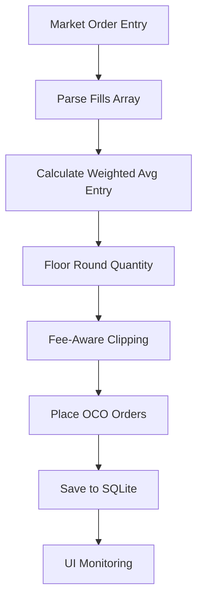
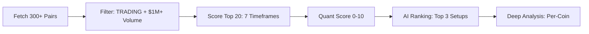

# Application Workflows

This guide describes the core workflows that power the Trading Management System. For complete documentation including installation, architecture, and API details, see [GEMINI.md](GEMINI.md).

## 1. Smart Trade Lifecycle (Set-and-Forget)

Designed to protect capital even when offline.



**Key Steps:**
1. **Entry**: Execute `MARKET` order, parse `fills` for exact entry price and commissions
2. **Calculation**: Apply floor rounding and fee-aware clipping (deduct commissions from sell quantity)
3. **Protection**: Place OCO (One-Cancels-the-Other) orders; fallback to single Limit/Stop if OCO unsupported
4. **Persistence**: Save trade record with Master ID and Binance Order IDs to SQLite database
5. **Monitoring**: UI displays progress bar with real-time P&L against entry price

## 2. Quantum Scanner & AI Ranking Pipeline

Multithreaded analysis with local LLM ranking.



**Process Details:**

### Phase 1: Discovery & Filtering
- Fetch 24hr statistics for all USDT/USDC pairs
- Filter symbols where `status == 'TRADING'` and `24h_volume > $1M`
- Apply market guard to exclude symbols in `BREAK` or `HALT` status

### Phase 2: Multi-Timeframe Scoring
- Analyze top 20 candidates across 7 timeframes (5m to 1M)
- Calculate weighted score:
  - 30% Volume momentum
  - 25% Volatility (ATR)
  - 20% Momentum (RSI)
  - 15% Trend Strength (ADX)
  - 10% Recent price action

### Phase 3: AI Filtering & Ranking
- User clicks "AI Rank" to send scanner table to Qwen 2.5 14B
- LLM identifies top 3 setups with highest technical confluence
- Returns ranked list with reasoning

### Phase 4: Expert Deep Analysis
- Clicking activity icon triggers per-coin deep dive
- Rescans all timeframes for specific symbol
- AI generates precise trade setup: Entry, TP, SL with technical rationale

## 3. Autonomous Reconciliation System

Background task running every 30 seconds to maintain sync with Binance.

**Reconciliation Loop:**
```python
for trade in active_trades:
    for order_id in trade.orders:
        binance_status = query_binance_order(order_id)
        
        if binance_status == "FILLED":
            capture_exit_price_fees()
            mark_trade_closed()
            move_to_history()
            
        elif binance_status == "CANCELLED":
            switch_to_manual_control()
            alert_user()
```

**Key Functions:**
- **Order ID Verification**: Query Binance for each stored Order ID
- **Fill Detection**: Check Binance Trade History if order missing from Open Orders
- **Auto-Closure**: Capture exit price/fees, mark as `CLOSED` in SQLite
- **Manual Control Detection**: Switch to `MANUAL_CONTROL` if orders cancelled externally
- **Fee Accounting**: Record exact commissions from Binance fill data

## 4. Lead (Futures) Trading Engine

Atomic execution for leveraged positions.

### Entry Workflow
```
1. Position Verification → Poll Position Risk endpoint
2. Order Placement → Entry order with verified quantity
3. Protection Orders → SL/TP Algo orders via Binance Futures API
4. Verification Loop → Confirm orders exist on book
5. Rollback Ready → Setup cancellation triggers if verification fails
```

### Exit Workflow
```
1. Panic Sell → One-click liquidation + order cancellation
2. Partial Close → Reduce position size with proportional SL/TP adjustment
3. Take Profit → TP order execution with fee capture
4. Stop Loss → SL trigger with position closure
```

### Safety Features
- **Atomic Rollback**: Cancel all orders + market close on any failure
- **Position Verification**: Pre-trade margin and liquidation price calculation
- **Fee Capture**: Accurate commission tracking from Binance trade history
- **Reconciliation**: Sync with Binance Position Risk every 30 seconds

## 5. System Auditing & Data Flow

### Request Auditing
- All Binance API calls logged to `audit_log` table with request/response payloads
- Internal HTTP requests captured in `endpoint_audit` table
- Timestamp synchronization with `recvWindow=60000` safety buffer

### Data Persistence
- **SQLite Database**: `trading.db` with WAL mode for concurrency
- **Trade Records**: Complete lifecycle from entry to exit with all metadata
- **Audit Trail**: Immutable log of all system interactions
- **Model Persistence**: Ollama models stored in Docker volumes

### Safety Guards
- **Time Sync**: Automatic clock synchronization with Binance server time
- **Quantity Validation**: Floor rounding and balance verification
- **Error Recovery**: Comprehensive rollback mechanisms for failed transactions
- **Connection Resilience**: Retry logic with exponential backoff for API calls

---

*For architecture details, database schema, and API documentation, refer to [GEMINI.md](GEMINI.md).*