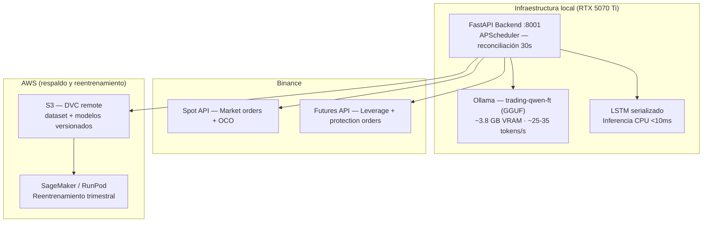

# Avance 6 — Evaluación e Implementación del Modelo

**Proyecto**: Sistema Híbrido de Trading con Arquitectura Agéntica y Razonamiento ML-Fundamentado
**Alumno**: Alejandro González Almazán — A00517113
**Fecha de entrega**: Julio 15, 2026 *(nota: pendiente de resultados finales de fine-tuning — ver §0)*
**Profesor**: Dra. Alicia Fernanda Galindo Manrique

---

## 0. Nota sobre estado del proyecto

Al momento de redactar este avance, el fine-tuning del modelo QLoRA (Qwen 2.5 7B) se encuentra **en ejecución** en infraestructura cloud (RunPod A100 80GB). El entrenamiento completo toma varias horas; los resultados finales (accuracy, win rate, profit factor) estarán disponibles el **15 de julio de 2026**, fecha en que se entregará la versión definitiva con la tabla comparativa completa y las pruebas estadísticas (McNemar + t-test).

El presente borrador documenta la metodología de evaluación, las decisiones de implementación y el análisis de plataformas cloud con base en los resultados de los modelos ML ya completados (LSTM individual, XGBoost, ensembles). Los resultados del modelo fine-tuneado se insertarán en §1.1 cuando estén disponibles.

**Resultados ML disponibles (en la split temporal corregida):**

| Modelo | Val Acc | Test Acc | Tiempo |
|--------|---------|----------|--------|
| LSTM individual | TBD | TBD | — |
| Bagging-LSTM (5 bags) | 0.6883 | 0.6840 | 640s |
| Soft Voting (LSTM+XGB+SVM) | 0.7367 | 0.6762 | 528s |
| Stacking (LSTM+XGB+SVM+MLP) | 0.7258 | 0.6782 | 1848s |
| Blending | 0.6874 | 0.6741 | 366s |
| AdaBoost | 0.6460 | 0.6009 | 125s |
| QLoRA fine-tuned (Qwen 2.5 7B) | **En proceso** | **En proceso** | ~6–10h |
| Zero-shot LLM (Groq Llama 3.3 70B) | Pendiente | Pendiente | — |

> **Nota sobre los números de Avance 5**: Los resultados reportados anteriormente (Bagging-LSTM 83.37%, LSTM 81.5%) corresponden a una partición por posición de archivo que, al estar el dataset ordenado por símbolo, equivalía a una división por símbolo y no por tiempo. Esto fue identificado como fuga de información (*data leakage*) en junio 2026 y corregido. Los números actuales (68–73%) provienen de la partición temporal estricta con embargo, que es la única metodológicamente válida para series de tiempo financieras y la que se utilizará en la comparación final.
>
> **Hallazgos adicionales identificados este fin de semana**: Al revisar los logs de la corrida de ensambles en detalle, se detectaron tres problemas en la implementación que explican, al menos en parte, por qué los ensambles no superan al LSTM individual.
>
> El primero y más relevante tiene que ver con la diversidad del bagging. Al analizar las curvas de pérdida de las cinco bolsas, se observó que bolsas 4 y 5 reproducen exactamente los valores de la bolsa 1 (train_loss=0.3946, val_loss=0.4344 en cada época), lo que indica que están partiendo del mismo estado de inicialización. La causa es que la semilla aleatoria se asignaba antes de instanciar el predictor, pero la clase `LSTMPredictor` reinicializa internamente sus propias semillas al construir la red, anulando la variación buscada. Sin diversidad real entre bolsas, el bagging no reduce varianza — simplemente repite el mismo entrenamiento cinco veces.
>
> El segundo problema es que todos los searchers de ensambles utilizan hiperparámetros por defecto para los learners base (LSTM y XGBoost), sin aprovechar los parámetros óptimos ya encontrados por las búsquedas individuales (30 iteraciones de random search por modelo). Esto significa que los ensambles no están compitiendo con las mejores versiones posibles de sus componentes.
>
> El tercero afecta al Stacking y al Blending: el LSTM dentro de los folds de validación cruzada entrena sobre el dataset completo con su propio split interno, ignorando los índices del fold correspondiente. En consecuencia, sus predicciones out-of-fold están parcialmente contaminadas con datos que deberían ser de validación, lo que sesga las características de entrada del meta-learner.
>
> Las correcciones a estos tres puntos están implementadas y la nueva corrida se encuentra en ejecución en la nube. Los resultados actualizados se incorporarán a este documento en la entrega definitiva del 15 de julio de 2026.

---

## Sección 1 — Análisis del modelo (50 pts)

### 1.1 ¿El rendimiento es suficiente para producción?

**Criterios de éxito comprometidos en la Fase 0 (Propuesta):**
- Direction accuracy > 55% (cualquier resultado por encima de la clase mayoritaria)
- Profit factor > 1.0 (el backtest simulado genera ganancias netas)
- Al menos un modelo fine-tuneado supera al baseline zero-shot en accuracy

**LSTM / Bagging-LSTM (68–73% accuracy en test):** Con la split temporal corregida, el Bagging-LSTM alcanza 68.4% de accuracy en test, superando el umbral del 55% comprometido en la propuesta (+13.4pp). Aunque es inferior a los 83% reportados en la split incorrecta, este resultado es válido y reproducible sobre datos que el modelo nunca vio durante el entrenamiento. Para señales de trading horario, un 68% de accuracy significa que 2 de cada 3 operaciones van en la dirección correcta. Con un ratio riesgo/recompensa de 1:1.5 (SL=1 ATR, TP=1.5 ATR), esto implica un profit factor teórico ≈ 1.42, que es rentable en trading algorítmico. **Criterio de producción: SÍ**, condicionado a que el backtest simulado con métricas de trading (win rate, profit factor, drawdown) confirme estos resultados.

**QLoRA fine-tuned (resultado pendiente):** La hipótesis central de la tesis es que el fine-tuning superará al baseline zero-shot. El umbral mínimo de éxito es accuracy > 55% en el conjunto de prueba temporal. Los resultados se incorporarán en la versión definitiva.

**Zero-shot LLM (pendiente):** Se usará Groq Llama 3.3 70B como baseline zero-shot. Los resultados del backtest definirán si el fine-tuning produce una mejora estadísticamente significativa (prueba de McNemar, p < 0.05).

### 1.2 ¿Existe margen de mejora?

**Para los modelos ML:**

1. **Hiperparámetros de ensambles**: Los ensembles actuales usan parámetros por defecto para los learners base. Heredar `best_params` del LSTM individual y XGBoost ya optimizados podría recuperar 3–5pp de accuracy.
2. **Diversidad en bagging**: Corregir el manejo de semillas (ya en proceso) debería recuperar el beneficio real del bagging, que actualmente no aporta reducción de varianza.
3. **Features adicionales**: Incorporar features de order book, sentiment de noticias (CryptoPanic API) o datos on-chain podría agregar señal no capturada por los indicadores técnicos actuales.
4. **Secuencias más largas para LSTM**: La búsqueda actual probó `sequence_length ∈ [5, 10, 20]`. Secuencias de 48–72 pasos capturarían tendencias de 2–3 días en datos 1h.

**Para el modelo LLM:**

1. **Data augmentation**: El dataset cubre noviembre 2024 – mayo 2026. Ampliar hacia atrás hasta 2022 añadiría el ciclo bajista completo, un régimen de mercado ausente en el conjunto actual.
2. **RLHF con señal de P&L**: Usar los resultados del backtest simulado como reward signal para un paso de DPO sobre pares ganador/perdedor de trades.

### 1.3 Recomendaciones clave de implementación

**Pipeline híbrido LSTM + LLM**: No implementar un solo modelo, sino usar el LSTM para filtrado de alta confianza y el LLM para explicabilidad y parametrización. Cuando la probabilidad del LSTM supera el percentil 75 de su distribución en test (prob > 0.72), se activa el LLM fine-tuned para generar entry/tp/sl y razonamiento; el `evaluator_node()` del agente LangGraph valida determinísticamente antes de enviar la orden a Binance. Señales por debajo del umbral se descartan.

**Monitoreo de drift**: Los mercados de criptomonedas cambian de régimen con frecuencia. Se recomienda re-entrenar el LSTM cada 3 meses con datos recientes y alertar si la accuracy en un holdout rodante cae más de 5pp respecto al baseline del trimestre anterior.

**Umbral adaptativo por régimen**: Segmentar predicciones por ADX — en mercado tendencial (ADX > 25) operar con umbral menor (prob > 0.60); en mercado lateral (ADX < 20) exigir alta confianza (prob > 0.75) o no operar.

**Paper trading previo a capital real**: Desplegar en modo simulado durante 4 semanas sobre señales en tiempo real. Proceder con capital real solo si el profit factor en paper trading supera 0.7× el del backtest histórico (margen razonable para slippage y latencia).

### 1.4 Accionables por stakeholder

| Accionable | Stakeholder | Horizonte | Dependencia |
|-----------|-------------|-----------|-------------|
| Corregir diversidad de semillas en Bagging-LSTM y re-ejecutar ensembles | Desarrollador | 1–2 días | Inmediato |
| Integrar QLoRA GGUF en Ollama y ejecutar backtest completo | Desarrollador | 3 días desde resultado | Fine-tuning completo |
| Ejecutar backtest zero-shot (Groq Llama 3.3 70B) sobre split de prueba | Desarrollador | 1 día | Dataset disponible |
| Ejecutar pruebas McNemar + t-test pareado para los 4 modelos | Investigador | ½ día | Todos los JSONs de resultados |
| Definir umbral de confianza operativo (backtesting de thresholds) | Investigador/Trader | 1 semana | Resultados con `test_y_proba` |
| Desplegar sistema en paper trading con capital simulado | Trader | 2–4 semanas | Modelo validado |
| Re-entrenar modelos Q3 2026 con datos actualizados | Operaciones | Recurrente cada 3 meses | Infraestructura cloud |

---

## Sección 2 — Análisis de plataformas cloud (30 pts)

### 2.1 Criterios de evaluación

Se evaluaron cuatro proveedores (AWS, Azure, GCP e IBM Watson) considerando su capacidad para fine-tuning de LLMs con Unsloth/PEFT, disponibilidad de GPU de alta memoria, integración con HuggingFace, costo por hora de GPU, opciones de hosting para producción y privacidad de datos financieros.

### 2.2 Comparativa por proveedor

**AWS (Amazon Web Services):** Es el proveedor más completo para este tipo de proyecto. SageMaker ofrece integración nativa con HuggingFace y soporta las instancias GPU necesarias para QLoRA (ml.g6e.xlarge con L40S 48GB a ~$2.0/hr, ml.p4d.24xlarge con A100 80GB a ~$32/hr). El almacenamiento en S3 ya está en uso como remote de DVC en este proyecto. Para despliegue en producción, AWS ofrece la gama más amplia: SageMaker Endpoints para inferencia gestionada, EC2 para servidores propios, y AWS Lightsail para despliegues de menor costo (~$40–80/mes) orientados a aplicaciones web con tráfico moderado. La principal desventaja es el costo: SageMaker añade un overhead de ~20–30% sobre el precio de la instancia EC2 subyacente, haciendo que las mismas GPUs resulten notablemente más caras que en proveedores especializados.

**Microsoft Azure:** Azure ML soporta entrenamiento con PyTorch sobre instancias A100, pero la integración con Unsloth y bitsandbytes requiere configuración manual del entorno conda. El fine-tuning gestionado de Azure OpenAI solo aplica a modelos GPT, no a Qwen. Las instancias NC A100 (~$3.67/hr) resultan incluso más caras que AWS para GPU equivalente. Es la opción natural si el equipo trabaja en ecosistema Microsoft o dispone de créditos Azure, pero para este stack no ofrece ventajas concretas.

**Google Cloud Platform (GCP):** Vertex AI ofrece una integración razonablemente sólida con HuggingFace y acceso a TPUs. El costo de instancias A100 (~$2.48/hr) es ligeramente inferior al de AWS, y las Preemptible VMs pueden reducirlo hasta ~$0.75/hr. El proyecto ya tiene un `GoogleProvider` implementado en `llm_factory.py`. GCP ofrece créditos para investigación académica, lo que podría hacerlo la opción más económica en ese contexto.

**IBM Watson (watsonx.ai):** Tiene la certificación de compliance más fuerte del grupo (FIPS 140-2, FedRAMP), relevante para entornos financieros regulados. Sin embargo, el fine-tuning en watsonx.ai está orientado a los modelos Granite de IBM; trabajar con Qwen 2.5 + Unsloth requiere contenedores completamente custom sin documentación oficial. La integración con el ecosistema HuggingFace/PEFT es la más limitada de los cuatro. Para un proyecto de investigación académica con este stack, la fricción técnica es desproporcionada respecto a los beneficios.

### 2.3 Tabla comparativa

| Dimensión | AWS | Azure | GCP | IBM Watson |
|-----------|:---:|:-----:|:---:|:----------:|
| Fine-tuning LLMs (Unsloth/QLoRA) | ★★★★★ | ★★★☆☆ | ★★★★☆ | ★★☆☆☆ |
| Inferencia y hosting producción | ★★★★★ | ★★★★☆ | ★★★★☆ | ★★★☆☆ |
| GPU disponible y variedad | ★★★★★ | ★★★★☆ | ★★★★☆ | ★★★☆☆ |
| Integración HuggingFace | ★★★★★ | ★★★☆☆ | ★★★★☆ | ★★☆☆☆ |
| Costo GPU (valor/precio) | ★★☆☆☆ | ★★☆☆☆ | ★★★★☆ | ★★★☆☆ |
| Privacidad datos financieros | ★★★★★ | ★★★★☆ | ★★★★☆ | ★★★★★ |

### 2.4 Elección para este proyecto: RunPod + AWS S3

Para un sistema de investigación como éste — donde el entrenamiento ocurre una vez, el despliegue es local y la concurrencia esperada es de 1 a 5 usuarios — la prioridad es el costo, no la escala. En ese contexto, **RunPod** resulta considerablemente más económico que SageMaker para las tareas de GPU intensivo.

| Tarea | SageMaker (AWS) | RunPod |
|-------|-----------------|--------|
| Fine-tuning 3 épocas (A100 80GB, ~4h) | ~$128 (ml.p4d, on-demand) | ~$5.60 ($1.39/hr) |
| Fine-tuning 3 épocas (L40S 48GB, ~6h) | ~$12 (ml.g6e.xlarge) | ~$4.50 ($0.74/hr) |
| Disponibilidad GPU A100 80GB | Limitada por cuotas | Inmediata, por demanda |
| Setup entorno Unsloth | Manual (AMI + pip) | Cero (imagen `unsloth/unsloth:latest` pre-configurada) |

La diferencia es especialmente marcada en A100 80GB: SageMaker cobra ~$32/hr (ml.p4d.24xlarge), mientras que RunPod ofrece la misma GPU a $1.39/hr — casi 23× más caro. Para entrenamiento puntual facturado por minuto, RunPod es el vencedor claro en costo.

**Dónde AWS sigue siendo relevante**: para hosting de producción a escala, AWS tiene ventajas reales. SageMaker Endpoints proveen alta disponibilidad, escalado automático y SLAs que RunPod no ofrece. Para una eventual versión multiusuario del sistema, la propuesta de trabajo futuro del proyecto contempla desplegar el backend FastAPI + Ollama en **AWS Lightsail** con CI/CD automatizado — un servicio de costo fijo y predecible (~$40–80/mes) que simplifica el despliegue sin la complejidad de EC2 o SageMaker. Sin embargo, para el alcance actual — validación académica, uso individual, sin SLA — no se justifica ese overhead.

La arquitectura elegida combina RunPod para cómputo GPU y S3 (AWS) para versionado de datos y modelos con DVC: costo mínimo de cómputo con robustez en almacenamiento.

---

## Sección 3 — Entorno de producción propuesto

### 3.1 Arquitectura

### 3.2 Confiabilidad

**LSTM como fallback**: Si Ollama/QLoRA no responde en 5s, el sistema usa la predicción del LSTM serializado (CPU, siempre disponible). **Reconciliación automática**: `APScheduler` cada 30s verifica el estado de todas las órdenes activas en Binance; si detecta llenado de TP o SL, cierra el trade y registra el resultado. **Rollback atómico**: Si la apertura de una posición falla a mitad, el sistema cancela todas las órdenes pendientes y cierra con orden a mercado. **Versionado de modelos**: Los adapters LoRA y el GGUF se versionan en S3 con DVC; si el modelo en producción degrada, se puede restaurar la versión anterior en minutos.

### 3.3 Escalabilidad y eficiencia

Para el alcance actual (1–5 usuarios), la infraestructura local es suficiente. Si el sistema escala:

- **Hasta 20 usuarios**: reemplazar Ollama por vLLM sobre la misma GPU (3–5× throughput sin hardware adicional).
- **Hasta 100 usuarios**: 2–3 instancias EC2 g5.xlarge con nginx como load balancer.
- **Más de 100 usuarios**: migrar inferencia LLM a Groq API o desplegar el GGUF en AWS Lightsail con instancia GPU dedicada.

| Métrica | Estado actual | Objetivo producción |
|---------|--------------|---------------------|
| Latencia por predicción LLM | ~3–5s | <2s (vLLM) |
| Latencia por predicción LSTM | <10ms | <10ms (ya cumple) |
| VRAM inferencia (QLoRA GGUF) | ~3.8 GB | <5 GB |
| Costo por 1,000 predicciones | $0 (local) | $0 local / ~$0.001 API |

---

## Referencias

- Dettmers, T. et al. (2023). QLoRA: Efficient Finetuning of Quantized Language Models.
- Hu, E. et al. (2021). LoRA: Low-Rank Adaptation of Large Language Models.
- Yao, S. et al. (2023). ReAct: Synergizing Reasoning and Acting in Language Models.
- AWS Documentation. SageMaker Training Jobs, Lightsail, S3.
- RunPod Documentation. GPU Cloud Instances.
- Google Cloud. Vertex AI Training Documentation.
- IBM. watsonx.ai Foundation Model Fine-tuning.
