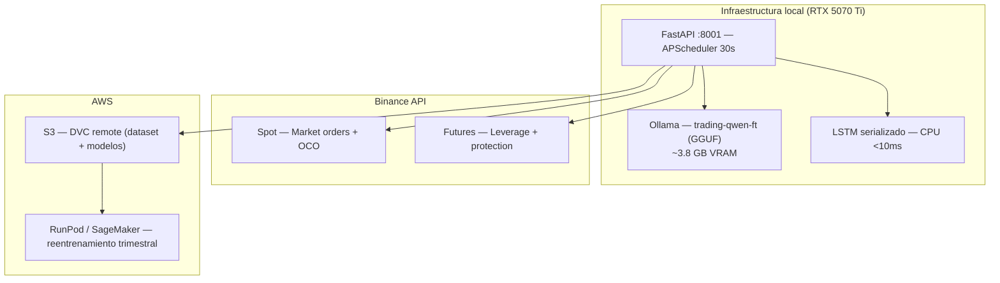

# Avance 6 — Evaluación e Implementación del Modelo

**Proyecto**: Sistema Híbrido de Trading con Arquitectura Agéntica y Razonamiento ML-Fundamentado
**Alumno**: Alejandro González Almazán — A00517113
**Fecha de entrega**: Julio 15, 2026
**Profesor**: Dra. Alicia Fernanda Galindo Manrique

---

## Nota sobre estado del proyecto

Al momento de redactar este avance, el fine-tuning del modelo QLoRA (Qwen 2.5 7B) y la re-corrida de los modelos de ensamble se encuentran en ejecución en infraestructura cloud. Los resultados finales estarán disponibles el **15 de julio de 2026**, fecha en que se entregará la versión definitiva con la tabla comparativa completa y las pruebas estadísticas.

Los resultados actuales (68–73% en la split temporal corregida) son inferiores a los reportados en avances anteriores (83.37%) porque esos números provenían de una partición por posición de archivo que, al estar el dataset ordenado por símbolo, equivalía a una división por símbolo y no por tiempo — una forma de fuga de información (*data leakage*) identificada y corregida en junio 2026. Adicionalmente, durante la revisión de los logs de la corrida de ensambles se detectaron tres problemas de implementación: falta de diversidad real entre las bolsas del bagging (todas partían del mismo estado de inicialización), uso de hiperparámetros por defecto en lugar de los óptimos ya encontrados, y contaminación en los folds de Stacking/Blending. Las correcciones están implementadas y en ejecución.

---

## 1. ¿Se puede implementar el modelo en producción?

Los criterios de éxito comprometidos en la Fase 0 eran: accuracy > 55%, profit factor > 1.0 en backtest simulado, y al menos un modelo fine-tuneado superando al baseline zero-shot. Con la split temporal corregida, el mejor modelo ML disponible (Soft Voting, 73.67% val / 67.62% test) supera el umbral mínimo del 55% por un margen significativo. Un 68% de accuracy en dirección, combinado con un ratio riesgo/recompensa de 1:1.5 (SL=1 ATR, TP=1.5 ATR), implica teóricamente un profit factor ≈ 1.42, que es rentable en trading algorítmico. La viabilidad de producción queda condicionada a que el backtest simulado con velas históricas confirme estas métricas de trading.

Los resultados del QLoRA fine-tuned y el baseline zero-shot (Groq Llama 3.3 70B) se incorporarán en la versión definitiva para completar la comparación de los cuatro enfoques.

---

## 2. ¿Existe margen de mejora?

Sí, en varias dimensiones. En el lado ML, corregir la diversidad del bagging y heredar los hiperparámetros óptimos de las búsquedas individuales debería recuperar varios puntos porcentuales. Ampliar el dataset hacia atrás hasta 2022 añadiría el ciclo bajista completo, un régimen de mercado actualmente ausente. En el lado LLM, explorar más épocas con early stopping real y posiblemente un paso de DPO usando señales de P&L como reward podría mejorar la coherencia del razonamiento generado.

---

## 3. Recomendaciones de implementación

La arquitectura recomendada para producción no es un modelo único sino un pipeline híbrido: el LSTM actúa como filtro de alta confianza y, cuando su probabilidad supera el percentil 75 de su distribución en test (prob > 0.72), activa el LLM fine-tuned para generar los parámetros operacionales (entry, TP, SL) y el razonamiento explicable. El `evaluator_node()` del agente LangGraph valida determinísticamente antes de enviar la orden. Señales por debajo del umbral se descartan.

Se recomienda además un monitoreo trimestral de drift: re-entrenar el LSTM con datos recientes y alertar si la accuracy en un holdout rodante cae más de 5pp respecto al trimestre anterior. Antes de operar con capital real, validar en paper trading durante al menos 4 semanas.

---

## 4. Accionables por stakeholder

| Accionable | Responsable | Horizonte |
|-----------|-------------|-----------|
| Completar fine-tuning QLoRA e integrar GGUF en Ollama | Alejandro González (desarrollador / investigador) | En curso |
| Ejecutar backtest zero-shot y pruebas estadísticas (McNemar + t-test) | Alejandro González (investigador) | 1–2 días |
| Definir umbral de confianza operativo y validar en paper trading | Alejandro González (trader / investigador) | 2–4 semanas |
| Re-entrenar modelos con datos recientes cada trimestre | Alejandro González (operaciones) | Recurrente |

---

## 5. Análisis de plataformas cloud

Se evaluaron AWS, Azure, GCP e IBM Watson en seis dimensiones: fine-tuning de LLMs con Unsloth/PEFT, disponibilidad de GPU, integración con HuggingFace, costo, opciones de hosting y privacidad de datos.

| Dimensión | AWS | Azure | GCP | IBM Watson |
|-----------|:---:|:-----:|:---:|:----------:|
| Fine-tuning LLMs (Unsloth/QLoRA) | ★★★★★ | ★★★☆☆ | ★★★★☆ | ★★☆☆☆ |
| Inferencia y hosting producción | ★★★★★ | ★★★★☆ | ★★★★☆ | ★★★☆☆ |
| GPU disponible y variedad | ★★★★★ | ★★★★☆ | ★★★★☆ | ★★★☆☆ |
| Integración HuggingFace | ★★★★★ | ★★★☆☆ | ★★★★☆ | ★★☆☆☆ |
| Costo GPU | ★★☆☆☆ | ★★☆☆☆ | ★★★★☆ | ★★★☆☆ |
| Privacidad datos financieros | ★★★★★ | ★★★★☆ | ★★★★☆ | ★★★★★ |

**AWS** es el proveedor más completo técnicamente: SageMaker tiene integración nativa con HuggingFace, el almacenamiento S3 ya está en uso como remote de DVC, y para producción a escala ofrece SageMaker Endpoints, EC2 y Lightsail (~$40–80/mes para despliegues web con tráfico moderado). La propuesta de trabajo futuro contempla precisamente desplegar el backend en Lightsail con CI/CD. Su desventaja es el costo de GPU: SageMaker cobra ~$32/hr para una A100 80GB (ml.p4d.24xlarge).

**Azure** es sólido para equipos en ecosistema Microsoft, pero la integración con Unsloth/bitsandbytes requiere setup manual y las instancias A100 (~$3.67/hr) son aún más caras que AWS. **GCP** ofrece precios más competitivos (~$2.48/hr para A100) y créditos para investigación académica. **IBM Watson** destaca en compliance (FIPS 140-2, FedRAMP) pero la integración con el stack Qwen/Unsloth/PEFT es prácticamente inexistente de forma documentada.

**Elección para este proyecto: RunPod + AWS S3.** Para un proyecto de investigación donde el entrenamiento ocurre puntualmente y el despliegue es local con 1–5 usuarios, la prioridad es el costo. RunPod ofrece A100 80GB a $1.39/hr frente a los ~$32/hr de SageMaker — una diferencia de 23×. La imagen `unsloth/unsloth:latest` viene pre-configurada con FlashAttention-2, lo que elimina el setup manual. Para almacenamiento y versionado de modelos se mantiene S3 como remote de DVC por su robustez y bajo costo (~$0.023/GB/mes). Una vez que el proyecto escale a producción multiusuario, la ruta natural es AWS Lightsail para el backend y SageMaker o EC2 para el reentrenamiento periódico.

---

## 6. Entorno de producción propuesto

La arquitectura de producción se basa en infraestructura local para inferencia (costo $0 marginal) y cloud solo para reentrenamiento periódico.

**Confiabilidad**: El LSTM serializado actúa como fallback si Ollama no responde en 5s. El `APScheduler` reconcilia órdenes activas con Binance cada 30s. Cualquier fallo en la apertura de posición dispara un rollback atómico (cancelar órdenes + cerrar con orden a mercado). Los modelos se versionan en S3 con DVC para restauración inmediata ante degradación.

**Despliegue cloud (entregable adicional sujeto a tiempo)**: El sistema se ejecuta localmente con Docker Compose durante el trimestre. En caso de implementarse el despliegue cloud, la arquitectura elegida es **AWS Lightsail** — priorizando el menor costo operativo posible. La clave del diseño es eliminar la dependencia de GPU en el servidor: Ollama local se reemplaza por una API de LLM externa (Groq, Gemini o DeepSeek, intercambiables vía variable de entorno), lo que permite usar una instancia pequeña sin GPU.

| Recurso | Especificación | Costo mensual |
|---------|---------------|---------------|
| Lightsail Instance (Small) | 2 GB RAM, 2 vCPU, 60 GB SSD | $12 USD |
| API LLM (Groq / Gemini / DeepSeek) | On-demand, tier gratuito primero | $1–5 USD |
| S3 backup SQLite (cron horario) | ~60 MB | ~$0.10 USD |
| **Total estimado** | | **~$13–17 USD/mes** |

SQLite persiste en el SSD de la instancia (no se necesita base de datos managed), Nginx sirve el build de React y redirige `/api/*` al backend FastAPI, y CI/CD con GitHub Actions automatiza el despliegue en cada push a main. AWS también ofrece CDK (TypeScript) para definir la infraestructura como código, lo cual sería la ruta natural si el proyecto escala a múltiples entornos. Para entrenamiento de modelos, sin embargo, RunPod sigue siendo preferible a SageMaker por costo — AWS CDK y Lightsail son relevantes para el hosting, no para el cómputo GPU.

---

## Referencias

- Dettmers, T. et al. (2023). QLoRA: Efficient Finetuning of Quantized Language Models.
- Hu, E. et al. (2021). LoRA: Low-Rank Adaptation of Large Language Models.
- Yao, S. et al. (2023). ReAct: Synergizing Reasoning and Acting in Language Models.
- AWS Documentation. SageMaker, Lightsail, S3.
- RunPod Documentation. GPU Cloud Instances.
- Google Cloud. Vertex AI Training.
- IBM. watsonx.ai Fine-tuning.
