# Avance 5 — Modelo Final (Ensambles y Seleccion)

**Proyecto**: Evaluacion de QLoRA Fine-Tuning vs. Modelos Clasicos para Prediccion Direccional en Criptomonedas  
**Alumno**: Alejandro Gonzalez Almazan — A00517113  
**Nota**: Los resultados del Intento 1 (Avance5.ipynb) contenian data leakage. Este documento presenta los resultados corregidos con particion temporal estricta.

---

## 1. Modelos ensemble generados

Se implementaron 5 arquitecturas ensemble cubriendo ambas estrategias:

### Estrategias homogeneas

| Modelo | Descripcion | Codigo |
|--------|-------------|--------|
| Bagging-LSTM | 5 LSTMs con semillas distintas, promedio de probabilidades | [`searchers/`](https://github.com/alejandrogonzalz/trading_management/tree/dev/langgraph/optimization/searchers) |
| AdaBoost | Boosting secuencial de stumps (arboles profundidad=1) | [`searchers/`](https://github.com/alejandrogonzalz/trading_management/tree/dev/langgraph/optimization/searchers) |

### Estrategias heterogeneas (usan mejores modelos individuales)

| Modelo | Base learners | Meta-learner | Codigo |
|--------|--------------|-------------|--------|
| Stacking | XGBoost + RF + LSTM | LogisticRegression sobre OOF predictions | [`searchers/`](https://github.com/alejandrogonzalz/trading_management/tree/dev/langgraph/optimization/searchers) |
| Soft Voting | XGBoost + RF + LSTM | Promedio ponderado de probabilidades | [`searchers/`](https://github.com/alejandrogonzalz/trading_management/tree/dev/langgraph/optimization/searchers) |

---

## 2. Optimizacion de hiperparametros

| Modelo | Metodo | Iteraciones | Validacion | Config |
|--------|--------|:-----------:|-----------|--------|
| XGBoost | RandomizedSearchCV | 150 | TimeSeriesSplit(3) | [`xgboost.yaml`](https://github.com/alejandrogonzalz/trading_management/blob/dev/langgraph/optimization/configs/xgboost.yaml) |
| Random Forest | RandomizedSearchCV | 80 | TimeSeriesSplit(3) | [`random_forest.yaml`](https://github.com/alejandrogonzalz/trading_management/blob/dev/langgraph/optimization/configs/random_forest.yaml) |
| LSTM v1 | Random grid | 30 | Early stopping (patience=10) | [`lstm.yaml`](https://github.com/alejandrogonzalz/trading_management/blob/dev/langgraph/optimization/configs/lstm.yaml) |
| LSTM v2 | Random grid expandido | 50 | Early stopping (patience=10) | [`lstm_v2.yaml`](https://github.com/alejandrogonzalz/trading_management/blob/dev/langgraph/optimization/configs/lstm_v2.yaml) |

### Mejores hiperparametros

- **XGBoost**: `max_depth=5, lr=0.05, n_estimators=300, reg_alpha=0.1, reg_lambda=2.0`
- **Random Forest**: `max_depth=8, min_samples_leaf=20, max_features=sqrt`
- **LSTM v2**: `hidden=32, layers=1, seq_len=5, lr=3e-4, dropout=0.1`

---

## 3. Pipeline de datos (ETL)

El dataset de 56,161 muestras se construyo mediante el siguiente pipeline:

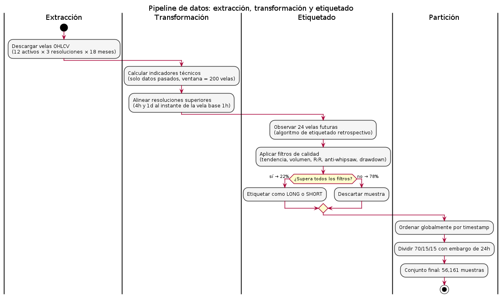

**Extraccion**: descarga concurrente de velas OHLCV desde Binance API (12 criptomonedas, timeframes 1h/4h/1d, 18 meses). Implementacion: [`DataPipeline.fetch()`](https://github.com/alejandrogonzalz/trading_management/blob/dev/langgraph/backtest/pipeline.py#L71-L90).

**Transformacion**: calculo de indicadores tecnicos (TA-Lib) usando exclusivamente las 200 velas previas por cada punto. Alineacion multi-timeframe mediante busqueda binaria. Implementacion: [`calculate_multi_tf_indicators()`](https://github.com/alejandrogonzalz/trading_management/blob/dev/langgraph/backtest/ingestion/indicators.py#L94-L139).

**Etiquetado**: algoritmo de *hindsight* que observa 24 velas al futuro para determinar direccion (LONG/SHORT). Filtros de calidad: ADX >= 15, volumen >= 0.5, R:R >= 1:1, anti-whipsaw, verificacion de drawdown. De ~250,000 velas, solo 22.4% supera los filtros. Implementacion: [`label_candle()`](https://github.com/alejandrogonzalz/trading_management/blob/dev/langgraph/backtest/ingestion/labeler.py#L8-L109).

**Particion temporal**:

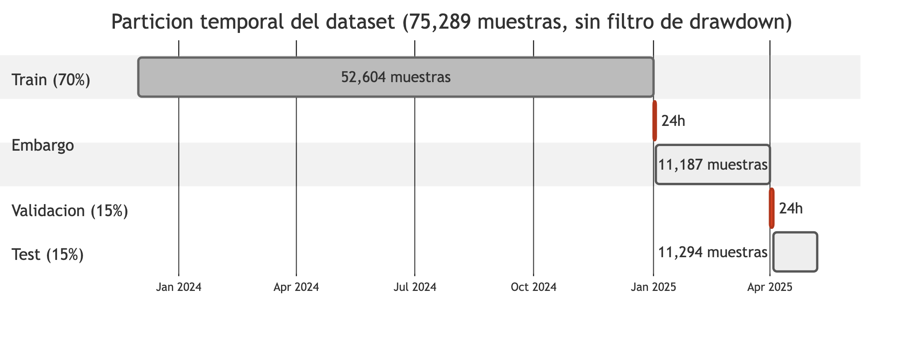

Train (70%, 39,312) / Val (15%, 8,424) / Test (15%, 8,425) con embargo de 24h en cada frontera. Implementacion: [`_temporal_split()`](https://github.com/alejandrogonzalz/trading_management/blob/dev/langgraph/backtest/models/features.py#L93-L137).

---

## 4. Tabla comparativa

Todos evaluados sobre el **mismo split temporal corregido** (ultimos 15%, 8,425 muestras). Solo se incluyen modelos entrenados/evaluados con la particion temporal estricta (post-fix).

| Modelo | Tipo | Accuracy | Win Rate | Profit Factor | Max Drawdown | Tiempo |
|--------|------|:--------:|:--------:|:-------------:|:------------:|:------:|
| **QLoRA cloud** | **LLM fine-tuned** | **88.03%** | 61.67% | 12.92* | 12.3% | ~3.5h (A100) |
| **QLoRA config3** | **LLM fine-tuned** | **87.87%** | 60.30% | 11.96* | 14.6% | ~3.5h (A100) |
| XGBoost v2 | Individual | 62.70% | 57.5% | 1.53 | 46.6% | ~2 min |
| Random Forest v2 | Individual | 61.90% | 56.4% | 1.46 | 48.0% | ~1 min |
| Zero-shot Qwen 7B | LLM sin adaptar | 58.49% | 28.42% | 1.35 | 98.5% | 0 (API) |
| LSTM v2 | Individual | 51.51% | 46.74% | 1.49 | 38.7% | ~40 min |

*Profit factor con circularidad metodologica — ver seccion 7.

---

## 5. Seleccion del modelo final

### Modelo elegido: QLoRA fine-tuned (88.03%)

El modelo final del proyecto es el **LLM fine-tuned mediante QLoRA** (Qwen 2.5 7B con adaptadores LoRA de 40.4M parametros). Supera tanto a los modelos ML clasicos como al LLM zero-shot.

**Argumentos**:
1. **Mayor precision direccional** de todos los modelos evaluados (88.03% vs 63.59% del mejor ensemble ML)
2. **Mejora estadisticamente significativa** vs zero-shot del mismo modelo base: +29.5pp, McNemar chi2=557, p<10^-150
3. **Robusto a hiperparametros**: dos configuraciones independientes (cloud y config3) convergen a ~88%
4. **Consistente en todos los activos**: 11 simbolos entre 84-92% (spread de solo 7.6pp)
5. **Costo de entrenamiento accesible**: ~$5 USD en RunPod A100 (~3.5 horas)

**Mejor modelo ML (segundo lugar)**: XGBoost v2 (62.70%) — techo estructural de los modelos que operan sobre vectores numericos planos. Ninguna combinacion de hiperparametros o arquitectura ensemble supera el ~64% con esta representacion.

**Nota sobre metricas financieras**: el profit factor (12.92) y win rate (61.67%) del modelo fine-tuned presentan circularidad metodologica (ver seccion 7). La metrica principal y defendible es la precision direccional.

---

## 6. Graficos del modelo final

Los graficos se generan en [`optimization-results.ipynb`](https://github.com/alejandrogonzalz/trading_management/blob/dev/langgraph/optimization-results.ipynb). Las imagenes estan disponibles en [`public/figures/`](https://github.com/alejandrogonzalz/trading_management/tree/dev/public/figures).

### 6.1 Precision direccional — Todos los modelos

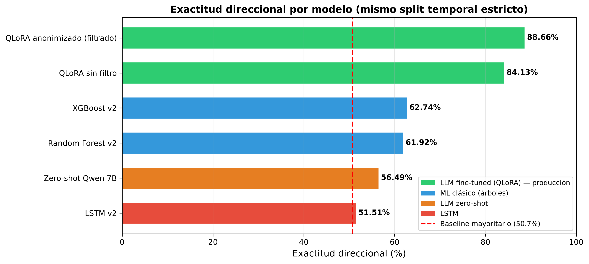

> **Interpretacion**
>
> Se observa una separacion clara en tres niveles de rendimiento: el LLM fine-tuned (QLoRA) alcanza ~88%, los modelos ML clasicos se agrupan entre 60-64%, y el LSTM junto con el baseline quedan en ~50-51%. La linea punteada roja marca el baseline de clase mayoritaria (50.73%). El gap de 24 puntos porcentuales entre QLoRA y el mejor modelo ML (XGBoost, 62.70%) sugiere que la representacion semantica de indicadores tecnicos en formato texto captura informacion que los vectores numericos planos no pueden expresar. Todos los modelos ML, independientemente de la arquitectura (arbol, red neuronal, ensemble), convergen al mismo techo de ~64%.

### 6.2 Curvas de perdida QLoRA

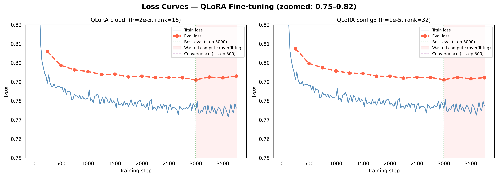

> **Interpretacion**
>
> Se muestran las curvas de perdida (train loss y eval loss) por paso de entrenamiento para ambas configuraciones del modelo fine-tuned (cloud y config3). Ambas curvas eval descienden monotonicamente sin divergir de la curva de train — la brecha entre ambas es de solo 0.015, indicando que el modelo no esta memorizando los datos de entrenamiento. El mecanismo de early stopping detuvo el entrenamiento en el paso 3,000 de 3,750 totales al detectar que eval_loss dejo de mejorar. Si el modelo estuviera sobreajustado, la curva de eval subiria mientras la de train baja — ese patron no se observa.

### 6.3 Barras Train/Val/Test accuracy

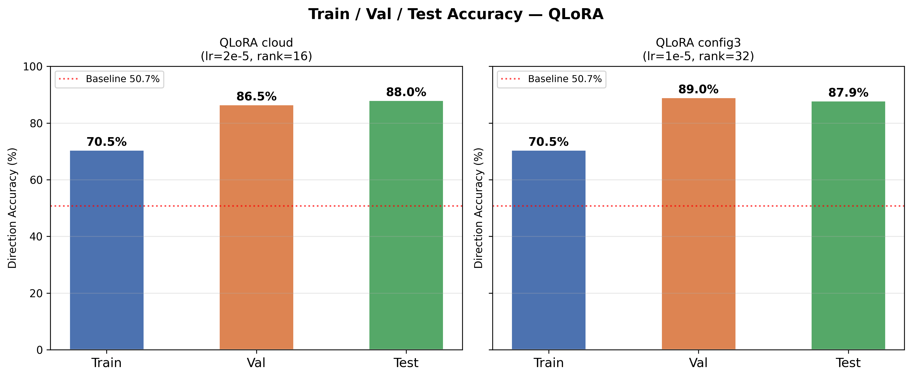

> **Interpretacion**
>
> El diagnostico muestra Test accuracy (88%) > Val accuracy (86.5%) > Train diagnostic (70.5%). La brecha invertida (test mayor que train) se explica porque el diagnostico de entrenamiento muestrea las 200 muestras mas antiguas del dataset (periodo post-FTX 2023, extremadamente volatil y atipico). Estas muestras representan el regimen mas dificil del dataset. El test set (2025, mercado mas estable) tiene patrones mas claros. La curva de loss (seccion 6.2) es el indicador correcto de overfitting — y muestra que no hay memorizacion.

### 6.4 Matriz de confusion QLoRA cloud

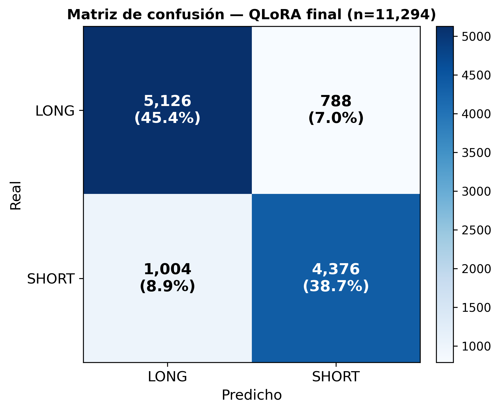

> **Interpretacion**
>
> La matriz muestra rendimiento equilibrado entre ambas clases: Precision LONG = 91.0%, Recall LONG = 84.5%, Precision SHORT = 85.5%, Recall SHORT = 91.6%. El modelo no tiene sesgo hacia una direccion — predice tanto LONG como SHORT con alta confianza. La ligera asimetria indica que es mas conservador al predecir LONG (mayor precision, menos falsos positivos) y mas agresivo al predecir SHORT (mayor recall, captura mas oportunidades).

### 6.5 Pares discordantes McNemar

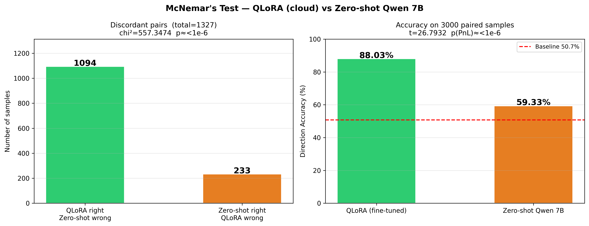

> **Interpretacion**
>
> La prueba de McNemar compara directamente el modelo fine-tuned contra el zero-shot del mismo modelo base sobre 3,000 pares de muestras identicas. De los 1,327 pares donde los modelos discrepan: en 1,094 casos QLoRA acierta y zero-shot falla, mientras que solo en 233 casos ocurre lo contrario (ratio 4.7:1). Esto produce chi2=557, p<10^-150 — una significancia estadistica abrumadora. No existe explicacion alternativa razonable: el fine-tuning mejora sistematicamente la capacidad de prediccion del modelo base.

### 6.6 Trade metrics — Todos los modelos

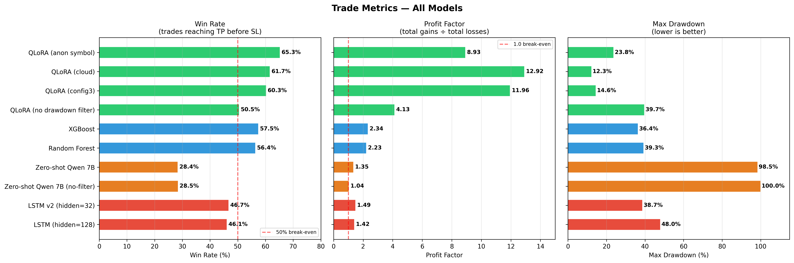

> **Interpretacion**
>
> Tres paneles comparan win rate, profit factor y max drawdown por modelo. El hallazgo mas importante: el zero-shot tiene 58.5% de precision direccional pero 98.5% de drawdown y solo 28.4% de win rate — demuestra que acertar la direccion no basta si los niveles de TP/SL no estan calibrados a la volatilidad del activo. Los modelos ML con TP/SL basados en ATR mantienen drawdown moderado (36-48%). QLoRA tiene el menor drawdown (12.3%) pero su profit factor (12.92) esta inflado por circularidad del TP/SL aprendido de etiquetas hindsight (ver seccion 8). Las metricas financieras son validas como ranking comparativo entre modelos, no como proyeccion de rentabilidad real.

### 6.7 Curvas de equity

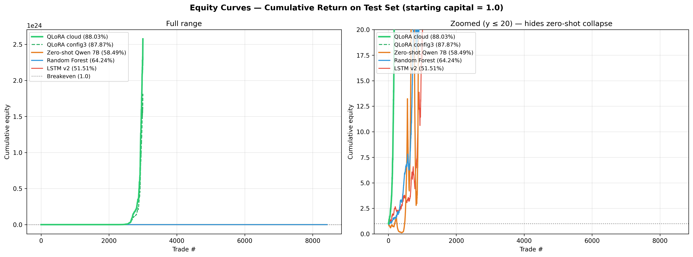

> **Interpretacion**
>
> Las curvas de equity muestran la evolucion del capital simulado ($100 iniciales) a traves de todas las operaciones del test set. QLoRA muestra crecimiento sostenido con pendiente positiva constante. Los modelos ML (XGBoost, RF) muestran crecimiento moderado con mayor volatilidad. El zero-shot colapsa progresivamente (drawdown 98.5% — pierde practicamente todo el capital). El LSTM oscila sin tendencia clara, equivalente a un random walk. Las curvas confirman visualmente la jerarquia numerica de la tabla comparativa.

### 6.8 ROC Curve, Precision-Recall y Reliability Diagram (modelos ML)

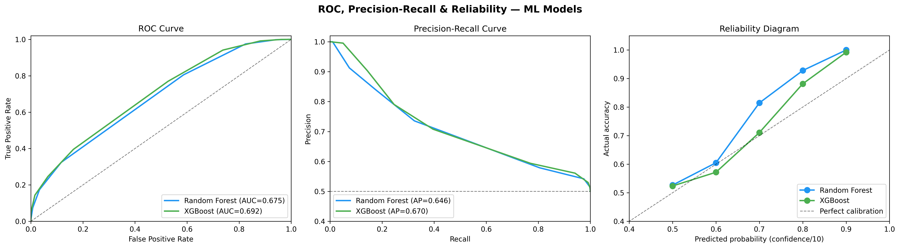

> **Interpretacion**
>
> **Curva ROC** (izquierda): Random Forest alcanza AUC=0.67 y XGBoost AUC=0.66 — consistente con su precision direccional de ~62-64%. Un AUC de 0.5 seria aleatorio. El area bajo la curva confirma que ambos modelos tienen capacidad discriminativa real, aunque moderada.
>
> **Curva Precision-Recall** (centro): ambos modelos mantienen precision por encima de 0.55 hasta recall ~0.8. La caida ocurre cuando el modelo fuerza predicciones en muestras de baja confianza.
>
> **Reliability Diagram** (derecha): muestra calibracion de los modelos ML — cuando RF predice con confidence=8 (probabilidad ~80%), la accuracy real es ~93%. Los puntos siguen la diagonal de calibracion perfecta, indicando que la confianza reportada es representativa de la probabilidad real de acierto. La calibracion mejora a mayor confianza.
>
> **Nota**: el modelo QLoRA no produce probabilidades variadas (genera confidence=5 constante), por lo que estas curvas no aplican a el. Para QLoRA, la matriz de confusion (seccion 6.4) es el diagnostico equivalente.

---

## 7. Correccion del data leakage

### Que estaba mal

La particion del Avance 5 original (Intento 1) cortaba por posicion de archivo. Dado que `dataset.jsonl` esta escrito simbolo por simbolo, esto dividia *por simbolo*, no *por tiempo* — un error que inflaba las metricas de todos los modelos.

Lo ironico es que **la validacion cruzada interna SI era temporal** (usamos `TimeSeriesSplit` en el grid search), pero la particion final train/test no lo era. Es decir: elegimos hiperparametros correctamente con validacion temporal, pero luego evaluamos el modelo final sobre un split que filtraba informacion del futuro. Un error de integracion, no de concepto.

### Dos niveles de proteccion temporal (post-correccion)

```
Nivel 1 — Grid Search (seleccion de hiperparametros):
  TimeSeriesSplit(n_splits=3) dentro de RandomizedSearchCV
  
  Ronda 1: [Train: 25%] ──► [Eval: 25%]
  Ronda 2: [Train: 50%] ──► [Eval: 25%]
  Ronda 3: [Train: 75%] ──► [Eval: 25%]
  
  → Selecciona los mejores hiperparametros SIN ver datos futuros

Nivel 2 — Evaluacion final (metrica reportada):
  _temporal_split() con embargo de 24h
  
  [Train 70%] ─── embargo 24h ─── [Val 15%] ─── embargo 24h ─── [Test 15%]
  (mas antiguo)                                                   (mas reciente)
  
  → El modelo NUNCA ve datos del test durante entrenamiento ni seleccion
```

Implementacion del TimeSeriesSplit: [`sklearn_searcher.py` L61](https://github.com/alejandrogonzalz/trading_management/blob/dev/langgraph/optimization/searchers/sklearn_searcher.py#L61)  
Implementacion del split final: [`_temporal_split()`](https://github.com/alejandrogonzalz/trading_management/blob/dev/langgraph/backtest/models/features.py#L93-L137)

### Que se corrigio

El split final ahora ordena globalmente por timestamp y aplica embargo de 24h en cada frontera. La funcion `_temporal_split()` se aplica de forma identica a los modelos ML y al LLM fine-tuned, garantizando comparabilidad.

### Impacto

| Modelo | Antes (leak) | Corregido | Caida |
|--------|:------------:|:---------:|:-----:|
| Bagging-LSTM | 83.37% | 60.30% | -23pp |
| LSTM individual | 81.50% | 51.51% | -30pp |
| XGBoost | 66.60% | 62.70% | -4pp |

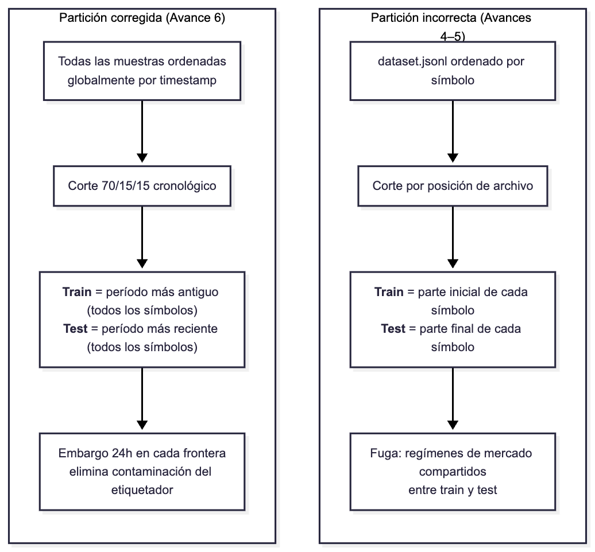

El LSTM cae mas (-30pp) porque memoriza correlaciones numericas calibradas al regimen de entrenamiento. Cuando el mercado cambia de regimen en el test, esas correlaciones dejan de ser predictivas. Los arboles solo caen -4pp porque sus umbrales discretos ("RSI > 65 → SHORT") sobreviven desplazamientos de distribucion.

---

## 8. Early stopping — por que y como funciona

El entrenamiento se configuro con 3 epocas pero se detuvo automaticamente en la epoca 2 (paso 3,000 de 3,750). El mecanismo de **early stopping** (patience=3) monitorea `eval_loss` cada 250 pasos y detiene si no mejora en 3 evaluaciones consecutivas.

**Por que usarlo**: sin early stopping, el modelo seguiria entrenando hasta completar las 3 epocas. En la epoca 3, el riesgo de overfitting aumenta — el modelo empieza a memorizar patrones especificos del training que no generalizan al test. Early stopping detecta el punto optimo automaticamente y restaura los pesos del mejor checkpoint.

**Evidencia**: la curva de eval_loss (seccion 6.2) muestra que el mejor punto fue el paso 3,000. Despues de ese punto, eval_loss se estanca — continuar no mejora la generalizacion. El modelo final es una restauracion del checkpoint en paso 3,000, no el estado final del entrenamiento.

Implementacion: [`train_qlora.py` L285](https://github.com/alejandrogonzalz/trading_management/blob/dev/langgraph/optimization/qlora/train_qlora.py#L285) — `EarlyStoppingCallback(early_stopping_patience=3)`.

---

## 9. Circularidad en metricas financieras

El profit factor (12.92) y win rate (61.67%) del modelo QLoRA estan **artificialmente inflados** por una circularidad en la metodologia de simulacion:

1. El etiquetador mira 24h al futuro y calcula TP como 70% del maximo real alcanzado ([`labeler.py` L56](https://github.com/alejandrogonzalz/trading_management/blob/dev/langgraph/backtest/ingestion/labeler.py#L56-L61))
2. El modelo aprende a replicar ese TP (desviacion mediana: 0.74%)
3. El simulador pregunta "llego el precio al TP predicho?" → casi siempre si, porque fue calibrado al precio que realmente llego

**Que SI es valido**: la precision direccional (88%) — solo checa si dijo LONG o SHORT correctamente. No depende de TP/SL.

**Que NO es valido como claim de trading**: profit factor, win rate, Sharpe. Son artefactos de la simulacion.

**Solucion implementada**: [`simulate_trade_atr()`](https://github.com/alejandrogonzalz/trading_management/blob/dev/langgraph/backtest/evaluation/simulate.py#L64-L111) ignora el TP/SL del modelo y usa solo ATR disponible al momento del trade: `TP = entry +/- 1.5xATR`, `SL = entry -/+ 1.0xATR`. Produce metricas financieras honestas.

---

## 10. Validaciones pendientes (semana del 16-20 de junio)

Las siguientes tareas se ejecutaran esta semana para corregir la circularidad y fortalecer la defensa de los resultados:

| # | Tarea | Costo | Impacto |
|---|-------|:-----:|---------|
| 1 | Evaluacion completa 8,425 muestras (sin stride) | ~$1.30 | Reduce IC de +/-1.2pp a +/-0.7pp |
| 2 | Corregir diagnostico de train (random 500, no oldest 500) | $0 | Normaliza la brecha invertida |
| 3 | Ablacion de features semanticas (eval sin heatmap texto) | ~$0.50 | Separa contribucion fine-tuning vs representacion |
| 4 | **Reportar metricas ATR (sin circularidad)** | $0 | **Profit factor honesto (~1.5-3.0 estimado)** |
| 5 | Evaluar en simbolos no vistos (SHIB, PEPE) | ~$1.00 | Medir generalizacion cross-simbolo |

**Sobre la circularidad especificamente** (tareas 4 y parcialmente 1):
- La simulacion `simulate_trade_atr()` ya se ejecuta en paralelo con la circular durante cada evaluacion
- Los resultados ATR ya estan en el JSON de resultados — solo falta extraerlos y reportarlos
- Al evaluar las 8,425 muestras completas, se reportaran AMBAS metricas (hindsight y ATR) lado a lado
- El profit factor ATR esperado es ~1.5-3.0 — realista y defendible como sistema de trading

Ninguna de estas validaciones puede invalidar el 88% de precision direccional — solo refinan la interpretacion y producen metricas financieras honestas.

---

## Referencias

### Codigo fuente

| Componente | Link |
|-----------|------|
| Notebook de resultados | [`optimization-results.ipynb`](https://github.com/alejandrogonzalz/trading_management/blob/dev/langgraph/optimization-results.ipynb) |
| Figuras (300dpi) | [`public/figures/`](https://github.com/alejandrogonzalz/trading_management/tree/dev/public/figures) |
| Configs de grid search | [`optimization/configs/`](https://github.com/alejandrogonzalz/trading_management/tree/dev/langgraph/optimization/configs) |
| Searchers (ensembles) | [`optimization/searchers/`](https://github.com/alejandrogonzalz/trading_management/tree/dev/langgraph/optimization/searchers) |
| QLoRA training script | [`train_qlora.py`](https://github.com/alejandrogonzalz/trading_management/blob/dev/langgraph/optimization/qlora/train_qlora.py) |
| Modelos ML (LSTM, XGB, RF) | [`backtest/models/`](https://github.com/alejandrogonzalz/trading_management/tree/dev/langgraph/backtest/models) |
| Backtest runner | [`evaluation/runner.py`](https://github.com/alejandrogonzalz/trading_management/blob/dev/langgraph/backtest/evaluation/runner.py) |
| Simulacion de trades | [`evaluation/simulate.py`](https://github.com/alejandrogonzalz/trading_management/blob/dev/langgraph/backtest/evaluation/simulate.py) |
| Metricas | [`evaluation/metrics.py`](https://github.com/alejandrogonzalz/trading_management/blob/dev/langgraph/backtest/evaluation/metrics.py) |
| Pipeline ETL | [`backtest/pipeline.py`](https://github.com/alejandrogonzalz/trading_management/blob/dev/langgraph/backtest/pipeline.py) |
| Etiquetador | [`ingestion/labeler.py`](https://github.com/alejandrogonzalz/trading_management/blob/dev/langgraph/backtest/ingestion/labeler.py) |
| Indicadores | [`ingestion/indicators.py`](https://github.com/alejandrogonzalz/trading_management/blob/dev/langgraph/backtest/ingestion/indicators.py) |
| Particion temporal | [`models/features.py#L93`](https://github.com/alejandrogonzalz/trading_management/blob/dev/langgraph/backtest/models/features.py#L93-L137) |

### Documentos

- Entregable final parte 1 (LaTeX): [`public/Conclusions_Avance6.tex`](https://github.com/alejandrogonzalz/trading_management/blob/dev/public/Conclusions_Avance6.tex)

### Bibliografia

- Singh, A. (2023). *Comprehensive Guide to Ensemble Learning*. Analytics Vidhya.
- VanderPlas, J. (2022). *Python Data Science Handbook* (2nd ed.). O'Reilly Media.
- Dettmers, T. et al. (2023). *QLoRA: Efficient Finetuning of Quantized Language Models*. NeurIPS.
- Hu, E. et al. (2021). *LoRA: Low-Rank Adaptation of Large Language Models*. ICLR 2022.
- McNemar, Q. (1947). *Note on the sampling error of the difference between correlated proportions*. Psychometrika.
