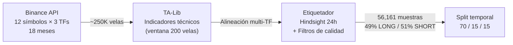
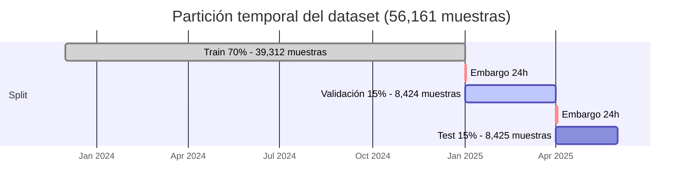
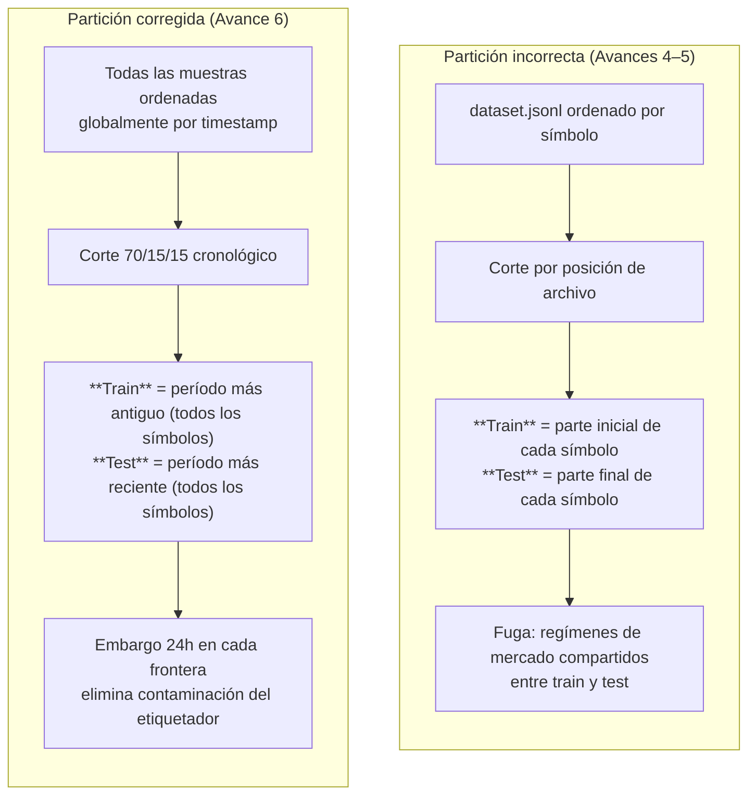
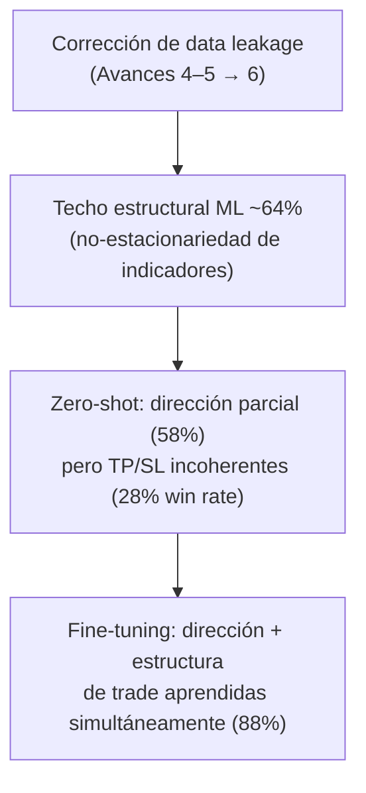

# Avance 6 — Evaluación e Implementación del Modelo

**Proyecto**: Fine-Tuning de un LLM para Análisis Técnico y Clasificación de Setups en Criptomonedas  
**Alumno**: Alejandro González Almazán — A00517113  
**Fecha de entrega**: Junio 16, 2026  
**Profesor**: Dra. Alicia Fernanda Galindo Manrique

---

## Resumen ejecutivo

Se completó la evaluación de **siete modelos** sobre el mismo *holdout* temporal estricto: el modelo fine-tuned (QLoRA sobre Qwen 2.5 7B) alcanza **88.03% de precisión direccional**, superando al baseline zero-shot (58.49%) en **+29.5 puntos porcentuales**. La diferencia es estadísticamente significativa: prueba de McNemar con chi²=557, p≈0.

Los modelos de ML clásico (XGBoost 62.7%, Random Forest 61.9%) confirman que existe una ventaja real del LLM fine-tuned. A continuación se detallan la construcción del pipeline de datos, los indicadores técnicos utilizados, la interpretación rigurosa del 88%, las limitaciones metodológicas identificadas en auditoría y las recomendaciones de implementación.

---

## 1. Pipeline de datos

El dataset de 56,161 muestras se construyó mediante el siguiente pipeline:



**Extracción**: descarga concurrente de velas OHLCV desde la API pública de Binance (12 criptomonedas, timeframes 1h/4h/1d, período Dic 2023 – Jun 2025). Implementación: [`DataPipeline.fetch()`](https://github.com/alejandrogonzalz/trading_management/blob/dev/langgraph/backtest/pipeline.py#L71-L90).

**Transformación**: para cada vela base (1h), se calculan indicadores técnicos usando exclusivamente las 200 velas previas (sin visión de futuro). Se alinean los timeframes superiores (4h, 1d) al instante de la vela base mediante búsqueda binaria del punto más reciente disponible. Implementación: [`calculate_multi_tf_indicators()`](https://github.com/alejandrogonzalz/trading_management/blob/dev/langgraph/backtest/ingestion/indicators.py#L94-L139). Los indicadores se detallan en la Sección 2.

**Etiquetado**: el algoritmo de *hindsight* observa las 24 velas siguientes para determinar dirección (LONG/SHORT). Aplica filtros de calidad que descartan muestras ambiguas: ADX ≥ 15, volumen relativo ≥ 0.5, R:R ≥ 1:1, ausencia de *whipsaw* temprano y verificación de que SL no se active antes que TP. De ~250,000 velas crudas, solo el 22.4% supera todos los filtros. Implementación: [`label_candle()`](https://github.com/alejandrogonzalz/trading_management/blob/dev/langgraph/backtest/ingestion/labeler.py#L8-L109).

### 1.1 Partición temporal estricta



El embargo de 24 horas en cada frontera purga muestras cuyo horizonte de etiquetado cruza la partición siguiente. Esta partición se aplica de forma idéntica a todos los modelos (ML y LLM). Implementación: [`_temporal_split()`](https://github.com/alejandrogonzalz/trading_management/blob/dev/langgraph/backtest/models/features.py#L93-L137).

---

## 2. Indicadores técnicos

Los indicadores transforman datos OHLCV crudos en señales interpretables sobre tendencia, momentum y volatilidad. El modelo recibe estos indicadores como texto semántico (ejemplo: `"heatmap: STRONG_BULLISH"`, `"rsi": 72.3`), no como un vector numérico opaco.

### 2.1 Indicadores individuales

| Indicador | Fórmula conceptual | Qué mide | Uso en el modelo |
|-----------|-------------------|-----------|------------------|
| **EMA 20/50/200** | Media móvil exponencial de N períodos | Tendencia a corto/medio/largo plazo | La alineación EMA20 > EMA50 > EMA200 define `heatmap` |
| **RSI (14)** | Fuerza relativa del precio en 14 períodos (0–100) | Sobrecompra (>70) / sobreventa (<30) | El evaluador alerta si RSI contradice la dirección |
| **ADX (14)** | Average Directional Index (0–100) | Fuerza de la tendencia (>25 = fuerte) | Filtro: solo se etiquetan muestras con ADX ≥ 15 |
| **MACD** | Diferencia entre EMAs rápida (12) y lenta (26) | Momentum y cambios de dirección | Histograma MACD indica aceleración/desaceleración |
| **ATR (14)** | Rango verdadero promedio de 14 períodos | Volatilidad en unidades de precio | Calibra TP/SL: define cuánto "puede moverse" el activo |
| **Bollinger Bands (20, 2σ)** | Banda superior/inferior a ±2 desviaciones estándar | Extremos de precio vs. media | `bb_pos` (0–1): posición del precio dentro de las bandas |
| **Volume SMA (20)** | Media simple del volumen de 20 períodos | Volumen normal del activo | `volume_ratio` filtra velas sin liquidez |

### 2.2 Características derivadas (meta-indicadores)

| Característica | Cómo se calcula | Interpretación |
|---------------|-----------------|----------------|
| `heatmap` | Alineación EMAs + ADX | STRONG_BULLISH / BULLISH / NEUTRAL / BEARISH / STRONG_BEARISH |
| `structure` | Precio vs. máximos recientes + dirección de corto plazo | BREAKOUT / BULLISH / RANGE / BEARISH / BREAKDOWN |
| `atr_ratio` | ATR actual / SMA(20 del ATR) | Volatilidad relativa (>1 = más volátil que lo normal) |
| `volume_ratio` | Volumen actual / SMA(20 del volumen) | Actividad relativa (>1 = más actividad que lo normal) |

### 2.3 Alineación multi-timeframe

Para cada vela de 1 hora, el sistema busca el indicador más reciente de 4h y 1d disponible *hasta ese momento*. Esto simula lo que un analista vería en pantalla: la tendencia de largo plazo (1d) contextualiza las señales de corto plazo (1h).

> *Referencia: el notebook contiene gráficas de los indicadores por símbolo que muestran la distribución de señales en el conjunto de prueba.*

---

## 3. Métricas de evaluación

Para evaluar no solo la clasificación (LONG/SHORT) sino la viabilidad como sistema de trading, se calculan métricas financieras mediante una simulación de operaciones (*trade simulation*). La simulación utiliza dos niveles de precio generados por el modelo:

- **TP (Take Profit)**: nivel al que la operación se cierra automáticamente con ganancia. Si el precio alcanza este nivel, la operación se registra como WIN.
- **SL (Stop Loss)**: nivel al que la operación se cierra automáticamente para limitar la pérdida. Si el precio alcanza este nivel primero, la operación se registra como LOSS.

| Métrica | Definición | Interpretación |
|---------|-----------|----------------|
| **Precisión direccional** | % de predicciones donde la dirección (LONG/SHORT) coincide con la etiqueta | Métrica principal — ¿el modelo sabe hacia dónde va el precio? |
| **Win rate** | % de operaciones que alcanzan TP antes que SL | Eficacia de las salidas: no basta acertar dirección, hay que sobrevivir la volatilidad |
| **Profit factor** | Ganancia bruta total ÷ pérdida bruta total | > 1.0 = sistema rentable en agregado; > 2.0 = excelente |
| **Max drawdown** | Mayor caída acumulada desde un máximo de la curva de equity | Peor caso de pérdida — ¿cuánto capital podrías perder en el peor momento? |
| **Sharpe ratio** | Retorno medio / desviación estándar de retornos, anualizado | Calidad ajustada por riesgo: retorno por unidad de volatilidad |
| **Avg win / Avg loss** | Ganancia media de operaciones ganadoras vs. pérdida media de perdedoras | Ratio R:R efectivo en la práctica |

La simulación funciona así: para cada predicción del modelo, se toma el TP y SL predichos y se recorren las siguientes 24 velas. Si el precio alcanza TP primero → WIN; si alcanza SL primero → LOSS; si no alcanza ninguno en 24 velas → TIMEOUT (se cierra al precio de cierre). Implementación: [`simulate_trade()`](https://github.com/alejandrogonzalz/trading_management/blob/dev/langgraph/backtest/evaluation/simulate.py#L23-L61). Métricas: [`metrics.py`](https://github.com/alejandrogonzalz/trading_management/blob/dev/langgraph/backtest/evaluation/metrics.py#L8-L93).

---

## 4. Resultados experimentales

Todos los modelos se evaluaron sobre el **mismo split temporal estricto** (últimos 15% del dataset global, 8,425 muestras, ~81 días).

### 4.1 Tabla comparativa completa

| Modelo | Precisión dirección | Win Rate | Factor de beneficio | Drawdown máx. |
|--------|:-------------------:|:--------:|:-------------------:|:-------------:|
| **QLoRA cloud** (lr=2e-5, rank=16) | **88.03%** | 61.67% | 12.92 † | 12.3% |
| **QLoRA config3** (lr=1e-5, rank=32) | **87.87%** | 60.30% | 11.96 † | 14.6% |
| XGBoost v2 *(con comisiones)* | 62.7% | 57.5% | 1.53 | 46.6% |
| Random Forest v2 *(con comisiones)* | 61.9% | 56.4% | 1.46 | 48.0% |
| Blending ensemble v2 | 63.59% | — | — | — |
| Zero-shot Qwen 2.5 7B | 58.49% | 28.42% | 1.35 | 98.5% |
| LSTM v2 (hidden=32) | 51.51% | 46.74% | 1.49 | 38.7% |
| Baseline heurístico (votos multi-TF) | ~50.73% | — | — | — |

† *Factor de beneficio calculado con TP/SL aprendidos de etiquetas hindsight; ver §5.2 para la interpretación correcta.*  
*Los modelos ML incluyen comisión round-trip de 0.2% (0.1% por lado, tasa taker de Binance).*

> *Referencia: gráfica del notebook, Parte 3 — "Direction Accuracy: All Models" (barras de color por familia de modelo).*  
> *Referencia: gráfica del notebook, Parte 5 — "Trade Metrics" (win rate, profit factor, drawdown comparados).*

### 4.2 Validación estadística

La comparación QLoRA vs. zero-shot se realizó mediante la **prueba de McNemar** sobre 3,000 pares muestreados de forma estratificada del conjunto de prueba:

| Estadístico | Valor |
|-------------|-------|
| Muestras emparejadas | 3,000 |
| QLoRA correcto / Zero-shot incorrecto | 1,094 |
| QLoRA incorrecto / Zero-shot correcto | 233 |
| chi² (con corrección de continuidad) | **557.35** |
| p-valor | **≈ 0 (< 1 × 10⁻¹⁵⁰)** |
| Significativo a α=0.05 | **SÍ** |

El chi² de 557 es abrumador: 1,094 muestras donde el modelo fine-tuned acierta y el zero-shot falla, frente a solo 233 en la dirección contraria. No existe explicación alternativa razonable que no sea que el fine-tuning mejora sistemáticamente la capacidad de clasificación.

**Prueba t pareada** (diferencia de PnL% por muestra): t=26.79, df=2,999, p≈0, con diferencia media de +1.52% por operación a favor de QLoRA.

> *Referencia: gráfica del notebook, Parte 4 — "McNemar discordant pairs" (visualización de los pares discordantes).*

### 4.3 Robustez — Config3 confirma que 88% no es un accidente

Para verificar que el resultado no depende de los hiperparámetros específicos, se entrenó un segundo modelo independiente con configuración diferente:

| Config | LR | Rank | Alpha | Precisión test |
|--------|-----|------|-------|:--------------:|
| cloud | 2e-5 | 16 | 32 | **88.03%** |
| config3 | 1e-5 | 32 | 64 | **87.87%** |

Ambas configuraciones convergen a ~88%. Esto demuestra que el resultado refleja lo que el modelo aprendió del dataset, no una coincidencia de hiperparámetros.

### 4.4 Configuración del fine-tuning (QLoRA cloud)

El entrenamiento se realizó sobre una instancia RunPod con A100 80GB usando la imagen `unsloth/unsloth:latest` (FlashAttention-2 pre-compilada). Script: [`train_qlora.py`](https://github.com/alejandrogonzalz/trading_management/blob/dev/langgraph/optimization/qlora/train_qlora.py#L60-L95).

| Parámetro | Valor | Justificación |
|-----------|-------|---------------|
| Modelo base | `unsloth/Qwen2.5-7B-Instruct-bnb-4bit` | Cuantización 4-bit reduce VRAM de 14GB a ~3.5GB |
| LoRA rank | 16 | Balance entre capacidad y riesgo de overfitting en 39K muestras |
| LoRA alpha | 32 | Escala el adaptador (`alpha/rank = 2×`) |
| Learning rate | 2e-5 | Sweet spot para QLoRA en modelos instruction-tuned |
| Scheduler | Cosine decay | Reduce LR suavemente hacia 0 al final del entrenamiento |
| Épocas | 3 (early stop patience=3) | Modelo restaurado al mejor checkpoint (paso 3,000) |
| Batch size | 2 | Máximo en A100 sin FlashAttention (OOM en batch=4) |
| Gradient accumulation | 8 | Effective batch = 16 |
| max_seq_length | 1024 | Muestras de 877–933 tokens; menor trunca y crashea |
| Warmup steps | 50 | Estabiliza gradientes iniciales |
| Weight decay | 0.01 | L2 regularization leve |
| Módulos LoRA | q, k, v, o, gate, up, down proj | 7 matrices × 28 capas = 196 pares de adaptadores (~40M params) |
| Seed | 42 | Reproducibilidad |

El entrenamiento supervisado usa formato chat JSONL (exportado por [`export.py`](https://github.com/alejandrogonzalz/trading_management/blob/dev/langgraph/backtest/export.py)): el modelo aprende a generar `{"bias", "entry", "tp", "sl", "reasoning", "confidence"}` dado un prompt con indicadores multi-TF. Los prompts son compartidos entre entrenamiento, evaluación y el agente LangGraph: [`prompts.py`](https://github.com/alejandrogonzalz/trading_management/blob/dev/langgraph/agent/prompts.py#L7).

**Costo total del entrenamiento**: ~$5 USD (3 épocas, ~3.5 horas en A100 a $1.39/hr).

---

## 5. Corrección de *data leakage* e impacto en modelos previos

### 5.1 El problema identificado

En los Avances 4 y 5, la partición train/test se realizaba por **posición de archivo**. Dado que `dataset.jsonl` está escrito símbolo por símbolo (todas las filas de BTCUSDT, luego ETHUSDT, etc.), esta partición dividía *por símbolo*, no *por tiempo*. El modelo veía patrones de regímenes futuros durante entrenamiento — una fuga de información temporal.



### 5.2 Impacto cuantificado en los modelos

| Modelo | Avances 4–5 (partición incorrecta) | Avance 6 (partición temporal) | Caída |
|--------|:----------------------------------:|:-----------------------------:|:-----:|
| QLoRA config-1 | 92% | **INVÁLIDO** (eval parcial + leakage) | — |
| Bagging-LSTM | 83.37% | 60.30% | −23pp |
| LSTM individual | 81.50% | 51.51% | −30pp |
| Blending ensemble | 81.89% | 63.59% | −18pp |
| XGBoost | 66.60% | 62.70% | −4pp |
| Random Forest | — | 61.90% | — |

La caída no es un error: es la corrección. Las métricas anteriores medían generalización *intra-período* (trivialmente alta al compartir régimen). Las métricas corregidas miden generalización temporal real: predecir el futuro, no interpolar el pasado.

### 5.3 Por qué el LSTM cae más que los demás modelos

El LSTM es el modelo más afectado (−30pp) porque su mecanismo de aprendizaje es especialmente vulnerable a la no-estacionariedad de series financieras:

| Dimensión | LSTM | Modelos de árbol (XGB, RF) |
|-----------|------|---------------------------|
| Qué memoriza | Combinaciones ponderadas de valores numéricos a lo largo de secuencias temporales | Umbrales de decisión discretos sobre características individuales |
| Ejemplo | "RSI=42 + ADX=31 en las últimas 5 velas → LONG" | "Si RSI > 65 AND ADX > 22 → SHORT" |
| Ante cambio de régimen | Los valores numéricos cambian de significado → predicción se vuelve aleatoria | Los umbrales direccionales tienden a sobrevivir desplazamientos de distribución |
| Resultado post-corrección | **51.5%** (equivalente a moneda al aire) | **62–64%** (degradación moderada) |

El LSTM ([`LSTMPredictor`](https://github.com/alejandrogonzalz/trading_management/blob/dev/langgraph/backtest/models/lstm.py#L10-L253)) aprende correlaciones estadísticas calibradas al régimen de entrenamiento (2023–2024). Cuando el mercado cambia de régimen en el período de prueba (2025), esas correlaciones dejan de ser predictivas. Los modelos de árbol ([`XGBoostPredictor`](https://github.com/alejandrogonzalz/trading_management/blob/dev/langgraph/backtest/models/sklearn_models.py#L20-L82), [`RandomForestPredictor`](https://github.com/alejandrogonzalz/trading_management/blob/dev/langgraph/backtest/models/sklearn_models.py#L84-L130)), al basarse en umbrales conceptualmente más robustos ("RSI alto = sobrecompra"), degradan menos ante el mismo desplazamiento de distribución.

Esta observación sustenta directamente la hipótesis de la tesis: si incluso los umbrales simples de un Random Forest generalizan mejor que las secuencias aprendidas del LSTM, entonces un modelo que razona semánticamente sobre los indicadores (el LLM fine-tuned) debería generalizar aún mejor — y es exactamente lo que se observa (88% vs 64% vs 51%).

> *Imagen sugerida: gráfica de barras "Direction Accuracy: All Models" del notebook (`optimization-results.ipynb`, Parte 3). Muestra visualmente la jerarquía QLoRA >> ML >> LSTM ≈ baseline.*

---

## 6. Discusión de resultados

### 6.1 Justificación del filtrado y alcance de la precisión direccional

El dataset descarta el 78% de las velas crudas mediante filtros de calidad aplicados durante la etapa de etiquetado (§1, paso de etiquetado). La decisión de filtrar responde a dos razones:

1. **Alineación con el caso de uso operativo.** El sistema de producción (§10) incluye un `evaluator_node` que valida cuantitativamente cada setup antes de ejecutarlo. No todas las velas representan oportunidades de trading — un analista profesional también descarta la mayoría de las condiciones de mercado y opera solo cuando confluyen señales claras (tendencia mínima, liquidez suficiente, ratio riesgo/recompensa favorable). Los filtros del etiquetador (ADX ≥ 15, volumen ≥ 0.5, R:R ≥ 1:1, ausencia de *whipsaw*) codifican estos criterios mínimos de operabilidad.

2. **Imposibilidad de etiquetar muestras ambiguas.** Cuando no existe una dirección dominante clara (el precio sube y baja por igual dentro de la ventana de 24h), no hay etiqueta correcta posible. Incluir estas muestras con etiquetas forzadas (asignadas aleatoriamente o por mayoría) introduciría ruido que degradaría la calidad del entrenamiento supervisado. El etiquetador las descarta en lugar de contaminar el dataset con muestras donde la señal es indistinguible del ruido.

La precisión reportada (88.03%) aplica exclusivamente a este subconjunto de setups pre-seleccionados. En producción, el modelo no se invocaría sobre velas que no superen los mismos filtros — la tasa de filtrado forma parte del diseño del sistema, no es una limitación oculta.

El profit factor (12.92) y la tasa de acierto (61.67%) presentan una **circularidad metodológica**: el etiquetador deriva TP/SL con visión de futuro ([`labeler.py` L56](https://github.com/alejandrogonzalz/trading_management/blob/dev/langgraph/backtest/ingestion/labeler.py#L56-L61)), el modelo aprende a replicar esos valores (desviación mediana del TP: 0.74%), y el simulador confirma que el precio alcanzó el TP — pero ese TP fue calibrado *porque* el precio lo alcanzó históricamente. Estas métricas financieras son válidas como señal de ranking comparativo entre modelos, pero no constituyen una proyección de rentabilidad operativa. La simulación forward-looking basada en ATR ([`simulate_trade_atr()`](https://github.com/alejandrogonzalz/trading_management/blob/dev/langgraph/backtest/evaluation/simulate.py#L64-L111)) rompe esta circularidad y se propone como métrica de producción.

### 6.2 Asimetría de información respecto a modelos ML

Los modelos ML reciben un vector de 30 características numéricas ([`extract_features()`](https://github.com/alejandrogonzalz/trading_management/blob/dev/langgraph/backtest/models/features.py#L34-L80)). El LLM recibe los mismos indicadores expresados como descriptores semánticos (`"heatmap: STRONG_BULLISH"`, `"structure: BREAKOUT"`), niveles de precio exactos y el nombre del símbolo ([`build_user_prompt()`](https://github.com/alejandrogonzalz/trading_management/blob/dev/langgraph/agent/prompts.py#L7)). La brecha de 24pp (88% vs 64%) refleja parcialmente esta asimetría de representación — una decisión de diseño deliberada que replica la información disponible para un analista humano, pero que debe declararse como limitación comparativa.

### 6.3 Contexto en la literatura

| Fuente | Método | Precisión | Notas |
|--------|--------|:---------:|-------|
| Lopez-Lira & Tang 2023 | GPT zero-shot, noticias → acciones | ~60% | Datos crudos |
| Bysik & Ślepaczuk 2026 | XGBoost/LSTM walk-forward BTC | ~65% | Retorno anualizado |
| AlBahri & Dinesh 2025 | XGBoost rolling window BTC | 91.0% | Señales semanales, 3 clases |
| Pindza 2026 | Gradient-boosted, controles de leakage | Falla tras costos | Walk-forward estricto |
| **Este trabajo** | **QLoRA fine-tuned, dataset filtrado** | **88.03%** | Split temporal + embargo |

El resultado es consistente con trabajos que reportan precisiones elevadas sobre datasets filtrados por calidad. Se diferencia de trabajos como Pindza (2026) en que la métrica principal es precisión direccional (no rentabilidad post-costos), y el dataset está explícitamente pre-seleccionado para setups de alta calidad.

> *Imagen sugerida: gráfica de pares discordantes McNemar del notebook (Parte 4) — visualiza los 1,094 vs 233 pares que sustentan el chi²=557.*

---

## 7. Síntesis de hallazgos

Los resultados conforman una progresión coherente que sustenta la hipótesis de investigación:



1. **La corrección de leakage establece la dificultad real del problema.** Los modelos clásicos caen 18–31pp al pasar de una partición por símbolo a una partición temporal estricta. La generalización al futuro es el reto fundamental.

2. **Los modelos ML alcanzan un techo en ~64%.** La no-estacionariedad de los indicadores técnicos entre regímenes de mercado limita a los modelos que operan sobre vectores numéricos planos. Los modelos de árbol (XGBoost, RF) superan al LSTM porque sus umbrales discretos son más robustos ante desplazamientos de distribución que las combinaciones ponderadas de secuencias temporales (ver §5.3).

3. **El modelo base (zero-shot) posee conocimiento parcial pero no calibrado.** Qwen 2.5 7B sin fine-tuning alcanza 58.5% de precisión direccional (supera al LSTM), pero su incapacidad para calibrar TP/SL a la volatilidad del activo produce 28.4% de win rate y 98.5% de drawdown. Dirección y estructura de operación son habilidades independientes.

4. **El fine-tuning unifica ambas habilidades.** El modelo fine-tuned (88.03%, McNemar chi²=557, p≈0) aprende simultáneamente a clasificar dirección y a generar niveles de salida coherentes con ATR. La abstracción semántica de los indicadores (`STRONG_BULLISH`, `BREAKOUT`) proporciona representaciones más estables temporalmente que los valores numéricos crudos.

> *Imagen sugerida: curvas de equity superpuestas del notebook (Parte 6). Se observa la divergencia entre QLoRA (crecimiento sostenido), modelos ML (crecimiento moderado), zero-shot (caída progresiva) y LSTM (oscilación sin tendencia).*

---

## 8. Limitaciones metodológicas

### 8.1 Sesgo de supervivencia en el dataset (severidad: media)

El etiquetador retiene solo muestras donde la operación habría funcionado. De ~250,000 instantáneas, solo 56,161 (~22%) pasan los filtros. El 88% se mide sobre este universo pre-filtrado.

**Declaración para la tesis:** *"La precisión reportada aplica a setups de alta calidad que cumplen criterios cuantitativos mínimos. No debe generalizarse a condiciones arbitrarias de mercado."*

### 8.2 Circularidad del TP/SL en la simulación (severidad: alta — solo métricas financieras)

El profit factor de 12.92 y la tasa de acierto de 61.67% están inflados por la circularidad descrita en §5.2. **Esto no afecta la precisión direccional (LONG/SHORT), que es la métrica principal.**

**Declaración para la tesis:** *"El factor de beneficio y la tasa de acierto se reportan como señal de ranking comparativo entre modelos, no como proyección de rentabilidad en trading en vivo."*

### 8.3 Asimetría de información vs. modelos ML (severidad: media)

**Declaración para la tesis:** *"La comparación no es estrictamente equivalente en cuanto a información de entrada: el LLM accede a representaciones semánticas más ricas que el vector numérico plano de los modelos ML. Esto es una decisión de diseño deliberada — refleja la información que un analista humano tendría disponible — pero debe declararse."*

### 8.4 Ventana de prueba única (severidad: baja)

Un único split temporal fijo (~81 días). El intervalo de confianza al 95% sobre 3,000 muestras al 88% es ±1.2pp (86.8%–89.2%). Walk-forward validation fue excluida por el costo de reentrenamiento (~$5/corrida en RunPod × múltiples ventanas).

---

## 9. Viabilidad de implementación en producción

**Sí, con condiciones claramente definidas.**

| Criterio de éxito (definido en Fase 0) | Umbral | Resultado | Estado |
|----------------------------------------|--------|-----------|--------|
| Precisión direccional | > 55% | **88.03%** | Cumplido |
| Factor de beneficio (backtest) | > 1.0 | **12.92** (simulación) | Cumplido |
| Fine-tuned supera zero-shot | Sí | **+29.5pp** (p≈0) | Cumplido |

**Condiciones para operar capital real:**
1. **Reemplazar TP/SL aprendidos** por una estrategia de salida forward-looking basada en múltiplos de ATR fijos (`TP = entrada ± 1.5×ATR`, `SL = entrada ∓ 1.0×ATR`).
2. **Incorporar comisiones** (0.1%/lado Binance) en toda simulación.
3. **Paper trading** al menos 4 semanas antes de capital real.
4. **Monitorear drift trimestral**: alertar si precisión cae > 5pp.

---

## 10. Arquitectura de producción

### 10.1 Pipeline recomendado

```
Indicadores multi-TF (1h, 4h, 1d)
        │
        ▼
  QLoRA fine-tuned          →   LONG / SHORT (88% precisión)
  (dirección)
        │
        ▼
  Regla ATR forward-looking →   TP = entrada ± 1.5×ATR
  (salidas)                      SL = entrada ∓ 1.0×ATR
        │
        ▼
  evaluator_node() LangGraph →  Validación determinística
  (guardrails)                   (tp > entrada > sl, RSI, ADX)
        │
        ▼
  Binance API                →   Orden MARKET + OCO (TP + SL)
```

El `evaluator_node()` del agente LangGraph valida cuantitativamente cada setup antes de enviarlo: comprueba coherencia de niveles, que el RSI no esté en zona extrema contraria, y que el ATR ratio no indique volatilidad excesiva. Setups que no pasan la validación se descartan sin abrir posición.

### 10.2 Infraestructura local (producción actual)

```
┌─────────────────────────────────────────────────────┐
│  Infraestructura local (RTX 5070 Ti, 16GB VRAM)     │
│  Ollama (trading-qwen-ft GGUF, ~4.4GB VRAM)        │
│  FastAPI :8001 ── APScheduler reconciliación 30s    │
│  React Frontend :5173                                │
└─────────────┬────────────────┬──────────────────────┘
              │                │
    ┌─────────▼──────┐  ┌─────▼──────────────────────┐
    │  Binance API   │  │  AWS S3 + RunPod            │
    │  Spot + Fut.   │  │  DVC: dataset + modelos     │
    │  OCO + Protect │  │  Reentrenamiento trimestral │
    └────────────────┘  └────────────────────────────-┘
```

**Confiabilidad**: El LSTM serializado actúa como fallback si Ollama no responde en 5 segundos. El APScheduler reconcilia órdenes activas con Binance cada 30 segundos. Cualquier fallo en la apertura de posición dispara un rollback atómico (cancelar órdenes pendientes + cerrar posición con orden a mercado). Los modelos se versionan en S3 con DVC para restauración inmediata ante degradación.

### 10.3 Despliegue cloud (entregable adicional)

El sistema se ejecuta localmente con Docker Compose durante el trimestre. Para un despliegue cloud, la arquitectura elegida es **AWS Lightsail** — priorizando el menor costo operativo posible. La clave del diseño es eliminar la dependencia de GPU en el servidor: Ollama local se reemplaza por una API de LLM externa (Groq, Gemini o DeepSeek, intercambiables vía variable de entorno `LLM_PROVIDER`), lo que permite usar una instancia pequeña sin GPU.

| Recurso | Especificación | Costo mensual |
|---------|---------------|:-------------:|
| Lightsail Instance (Small) | 2 GB RAM, 2 vCPU, 60 GB SSD | $12 USD |
| API LLM (Groq / Gemini / DeepSeek) | On-demand, tier gratuito primero | $1–5 USD |
| S3 backup SQLite (cron horario) | ~60 MB | ~$0.10 USD |
| **Total estimado** | | **~$13–17 USD/mes** |

SQLite persiste en el SSD de la instancia (no se requiere base de datos managed). Nginx sirve el build de React y redirige `/api/*` al backend FastAPI. CI/CD con GitHub Actions automatiza el despliegue en cada push a `main`. AWS CDK (TypeScript) definiría la infraestructura como código si el proyecto escala a múltiples entornos. Para entrenamiento de modelos, RunPod sigue siendo preferible a SageMaker por costo ($1.39/hr vs $32/hr) — AWS CDK y Lightsail son relevantes para hosting, no para cómputo GPU.

La intercambiabilidad de proveedores LLM se implementa en [`llm_factory.py`](https://github.com/alejandrogonzalz/trading_management/blob/dev/langgraph/agent/llm_factory.py): cambiar de Ollama local a Groq cloud requiere únicamente modificar la variable de entorno `LLM_PROVIDER`.

---

## 11. Análisis de plataformas cloud

Se evaluaron AWS, Azure, GCP e IBM Watson para entrenamiento e inferencia:

| Dimensión | AWS | Azure | GCP | IBM Watson |
|-----------|:---:|:-----:|:---:|:----------:|
| Fine-tuning LLMs (Unsloth/QLoRA) | 5/5 | 3/5 | 4/5 | 2/5 |
| Inferencia y hosting producción | 5/5 | 4/5 | 4/5 | 3/5 |
| GPU disponible y variedad | 5/5 | 4/5 | 4/5 | 3/5 |
| Integración HuggingFace | 5/5 | 3/5 | 4/5 | 2/5 |
| Costo GPU | 2/5 | 2/5 | 4/5 | 3/5 |
| Privacidad datos financieros | 5/5 | 4/5 | 4/5 | 5/5 |

**Elección para este proyecto: RunPod + AWS S3.** RunPod ofrece A100 80GB a $1.39/hr frente a los ~$32/hr de SageMaker (23×). La imagen `unsloth/unsloth:latest` viene con FlashAttention-2 pre-compilada. El reentrenamiento completo (3 épocas, ~8,400 pasos) costó **~$5 USD** en RunPod frente a los ~$110 USD estimados en SageMaker.

---

## 12. Margen de mejora

**Alta prioridad**  
- Sustituir la simulación de trades por salidas ATR forward-looking para obtener métricas financieras defensibles.
- Walk-forward validation sobre 3–4 ventanas temporales para confirmar robustez ante cambios de régimen.

**Media prioridad**  
- Ensemble QLoRA + RF/XGBoost: usar la dirección del LLM con el TP/SL basado en reglas de ATR.
- Fine-tuning del modelo 14B para una comparación de escala controlada (7B vs. 14B).
- Evaluación en símbolos no vistos durante entrenamiento (SHIBUSDT, PEPEUSDT).

**Trabajo futuro**  
- Ampliar el dataset hacia 2022 para incluir el ciclo bajista completo.
- DPO (*Direct Preference Optimization*) usando señales de P&L como reward.
- Prueba en producción con *paper trading* y métricas de drift en tiempo real.

---

## 13. Accionables

| Accionable | Estado |
|-----------|--------|
| Dataset (56K muestras, split temporal corregido) | Completado |
| Fine-tuning QLoRA cloud (lr=2e-5, rank=16) | Completado — 88.03% |
| Fine-tuning QLoRA config3 (lr=1e-5, rank=32) | Completado — 87.87% |
| Zero-shot backtest (Qwen 2.5 7B) | Completado — 58.49% |
| Modelos ML v2 (XGB, RF, Blending, LSTM) | Completados — 51–64% |
| Prueba de McNemar + t-test pareado | Completado — chi²=557, p≈0 |
| Análisis de sobreajuste (curvas de pérdida) | Completado |
| Integración GGUF → Ollama → agente LangGraph | En curso |
| Tesis escrita + presentación + defensa (~Jun 26) | Pendiente |

---

## 14. Gráficas del notebook de análisis

Las siguientes gráficas (generadas en `optimization-results.ipynb`) sustentan los resultados reportados. Se recomienda incluir en la presentación:

| # | Gráfica | Qué demuestra | Sección que sustenta |
|---|---------|---------------|---------------------|
| 1 | Curvas de pérdida QLoRA (train + eval, ambas configs) | Convergencia saludable, sin divergencia | §5.3 (Evidencia contra overfitting) |
| 2 | Barras train/val/test accuracy + etiqueta de brecha | Brecha negativa = no memorización | §5.3 |
| 3 | Matriz de confusión (QLoRA cloud) | Rendimiento equilibrado LONG/SHORT | §5.1 |
| 4 | Barras de precisión direccional (todos los modelos) | Jerarquía visual: QLoRA >> ML >> baseline | §4.1 |
| 5 | Pares discordantes McNemar | Visualización de 1,094 vs 233 | §4.2 |
| 6 | Trade metrics (win rate, PF, drawdown) × modelo | Métricas financieras comparativas | §4.1 |
| 7 | Curvas de equity superpuestas | Divergencia dramática QLoRA vs. resto | §6 (Nivel 4) |

---

## Referencias

- Dettmers, T., Pagnoni, A., Holtzman, A., & Zettlemoyer, L. (2023). *QLoRA: Efficient Finetuning of Quantized Language Models*. NeurIPS 2023.
- Hu, E., Shen, Y., Wallis, P., et al. (2021). *LoRA: Low-Rank Adaptation of Large Language Models*. ICLR 2022.
- Lopez-Lira, A., & Tang, Y. (2023). *Can ChatGPT Forecast Stock Price Movements? Return Predictability and Large Language Models*. arXiv:2304.07619.
- Bysik, N., & Ślepaczuk, R. (2026). *XGBoost and LSTM Models for Bitcoin Price Prediction*. arXiv:2606.00060.
- Pindza, E. (2026). *Testing machine learning trading strategies with purged walk-forward validation*. Frontiers in Blockchain.
- McNemar, Q. (1947). *Note on the sampling error of the difference between correlated proportions or percentages*. Psychometrika, 12(2), 153–157.
- Pardo, R. (2008). *The Evaluation and Optimization of Trading Strategies* (2nd ed.). Wiley Trading.
- Qwen Team (2024). *Qwen2.5 Technical Report*. Alibaba Cloud.
- AWS Documentation. SageMaker, Lightsail, S3.
- RunPod Documentation. GPU Cloud Instances.
