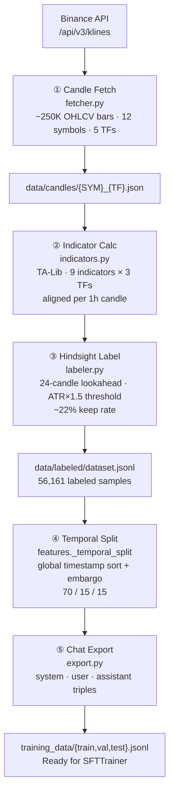
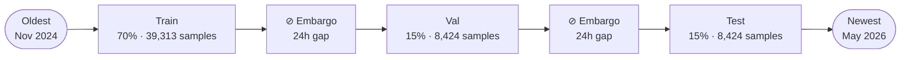

# Data Pipeline — Candles to Training Examples

Explains where the two data artifacts come from, what each one is used for, and
how all five pipeline stages work.

---

## Overview — The Two Artifacts

Every model in this project depends on two DVC-tracked files:

| Artifact | Path | Size | Content |
|----------|------|------|---------|
| **Raw candles** | `backtest/data/candles/` | ~21 MB | One JSON per symbol × TF: raw OHLCV bars from Binance. No indicators, no labels. |
| **Labeled dataset** | `backtest/data/labeled/dataset.jsonl` | ~51 MB | 56,161 samples. Each sample has multi-TF indicators + hindsight label (LONG / SHORT). Derived from candles. |

```
candles/  (raw OHLCV)
   │  pipeline.py: indicators → hindsight labels
   ▼
dataset.jsonl  (indicators + label per sample)
```

**Why you need both in the backtest:**

- **Direction accuracy** — compares the model's predicted `bias` against the
  `label` in `dataset.jsonl`. Only `dataset.jsonl` is needed.
- **Financial metrics** (win rate, profit factor, Sharpe ratio) — `simulate_trade()`
  walks future OHLCV bars to check whether TP or SL was hit first. This requires
  `candles/`.

> `win_rate=0.0` after the old config-1 run was not a code bug — it was a missing
> `dvc pull` for `candles/`. The direction accuracy (92%) was real because it only
> reads `dataset.jsonl`. Always run `dvc pull backtest/data/labeled/dataset.jsonl
> backtest/data/candles` before any evaluation run.

---

## Pipeline at a Glance



---

## Stage 1 — Candle Fetch (`backtest/ingestion/fetcher.py`)

Downloads 18 months of OHLCV bars from `GET /api/v3/klines`.

```python
# Fetches all candles for a symbol+timeframe, paginating 1000-bar chunks
fetch_candles(symbol="BTCUSDT", interval="1h", start_date=..., end_date=...)
```

For each of the 12 symbols × 5 timeframes (15m / 1h / 4h / 1d / 1w), the result
is cached as `data/candles/BTCUSDT_1h.json`. Total: ~250,000 raw candles.

All fetches run concurrently (`asyncio.Semaphore(4)`) with exponential backoff.

---

## Stage 2 — Indicator Calculation (`backtest/ingestion/indicators.py`)

For every 1h candle, computes all indicators and aligns the matching 4h and 1d
snapshots to that timestamp.

**Indicators computed (via TA-Lib):**

| Indicator | Period | What it measures |
|-----------|--------|-----------------|
| EMA | 20 / 50 / 200 | Trend direction via moving average alignment |
| ADX | 14 | Trend strength (0 = flat, 100 = strong trend) |
| RSI | 14 | Momentum oscillator — overbought (>70) / oversold (<30) |
| MACD | 12/26/9 | Momentum crossover signal |
| ATR | 14 | Average true range — volatility in price units |
| Bollinger Bands | 20, 2σ | Price position relative to volatility envelope |
| Volume SMA | 20 | Baseline volume for ratio calculation |

**Derived signals computed from the raw indicators:**

- `heatmap`: `STRONG_BULLISH | BULLISH | NEUTRAL | BEARISH | STRONG_BEARISH`
  — EMA alignment (short vs long), RSI zone, MACD direction
- `structure`: `BREAKOUT | BULLISH | RANGE | BEARISH | BREAKDOWN`
  — whether price is above/below key EMAs and breaking out of range
- `atr_ratio`: ATR / rolling_mean(ATR, 20) — is volatility high or normal?
- `volume_ratio`: volume / volume_SMA_20 — is this a high-volume candle?
- `bb_pos`: (price - lower_band) / (upper_band - lower_band) — 0 = bottom of bands, 1 = top

The key function:
```python
calculate_multi_tf_indicators(candles_by_tf, base_tf="1h", lookback=200)
# For each 1h candle at timestamp T:
#   - Computes 1h indicators from the preceding 200 bars
#   - Finds the most recent 4h candle where close_time ≤ T, computes its indicators
#   - Same for 1d
# Returns a list of indicator "points" — one per 1h candle
```

Each output point looks like:
```json
{
  "timestamp": 1719000000,
  "atr_raw": 312.4,
  "indicators": {
    "1h": {"rsi": 48.3, "adx": 22.1, "ema_20": 67100, "heatmap": "NEUTRAL", "...": "..."},
    "4h": {"rsi": 55.6, "adx": 30.4, "ema_20": 66800, "heatmap": "BULLISH", "...": "..."},
    "1d": {"rsi": 61.2, "adx": 18.7, "ema_20": 65000, "heatmap": "BULLISH", "...": "..."}
  }
}
```

---

## Stage 3 — Hindsight Labeling (`backtest/ingestion/labeler.py`)

For each 1h candle, look into the future (next 24 candles) to determine whether a
trade opened at that candle would have won.

**The algorithm, step by step:**

```
Given: indicator_point at timestamp T (entry price = current close)

1. Compute threshold:
   threshold = ATR × 1.5
   (e.g. if ATR = 300 USDT → threshold = 450 USDT ≈ 0.67% on BTC)

2. Look at the next 24 candles (24h forward):
   max_up   = (max_high - entry) / entry     # best-case bullish move
   max_down = (entry - min_low)  / entry     # best-case bearish move

3. Quality pre-filter (discard if any fail):
   - volume_ratio >= 0.5  (not a dead-volume candle)
   - ADX >= 15            (some trend present)
   - Anti-whipsaw: if the first 4 candles reverse > threshold → discard
     (price went up then came back = no clean trade)

4. Label direction:
   LONG  if max_up   > threshold  AND  max_up   > max_down × 1.5
   SHORT if max_down > threshold  AND  max_down > max_up   × 1.5
   discard if ambiguous (both directions similar, or neither big enough)

5. Compute R:R and discard if reward / risk < 1.0

6. For LONG:
   TP = entry × (1 + max_up × 0.7)    # 70% of the actual move (conservative)
   SL = entry - 1 × ATR               # one ATR below entry

7. Confidence 1–10: based on R:R ratio + ADX strength
   Quality: "HIGH" if R:R ≥ 2:1, else "MEDIUM"
```

From ~250,000 raw candles, ~56,161 pass all filters (≈22% keep rate). Ambiguous
and choppy candles are discarded — they make poor training examples.

Output: each labeled sample in `dataset.jsonl`:
```json
{
  "symbol": "BTCUSDT",
  "timestamp": 1719000000,
  "label": "LONG",
  "entry": 67420.5,
  "tp": 68890.2,
  "sl": 67108.1,
  "confidence": 7,
  "quality": "HIGH",
  "indicators": { "1h": {"...": "..."}, "4h": {"...": "..."}, "1d": {"...": "..."} }
}
```

---

## Stage 4 — Temporal Split (`backtest/models/features.py: _temporal_split`)

The 56,161 samples are split into train / val / test **by time**, never shuffled.



**Why the embargo?** The labeling algorithm looks 24 candles forward. A sample at
timestamp T uses price data up to T+24h. If T is near the train/val boundary, its
label bleeds into the val period. The embargo (24 bars × 1h base TF = 24h gap)
removes any sample whose lookahead window crosses the boundary.

**Why global sort instead of per-symbol?** `dataset.jsonl` is grouped by symbol
(all BTCUSDT rows first, then all ETHUSDT, etc.). A positional cut trains on all
of BTC's 2024 and tests on BTC's 2025 while never seeing recent BTC — not a true
time-based holdout. Global sort interleaves all symbols chronologically so the
split is a genuine time holdout across all markets.

This was the original leakage bug: `_temporal_split` previously cut by file
position, which was a per-symbol split. It is now fixed. All models — LSTM,
XGBoost, QLoRA — use the same `_temporal_split` call, so their test sets are
directly comparable.

---

## Stage 5 — Chat Export (`backtest/export.py`)

Each labeled sample becomes a 3-message conversation in chat format — the same
format used at inference, so the model trains on exactly what it will see in
production.

```python
# System message: the trading analyst persona + output format rules
system = build_system_prompt(mode="SPOT")

# User message: the indicator snapshot for this candle
user = build_user_prompt(symbol="BTCUSDT", indicators={...})

# Assistant message: the correct answer (from hindsight labeling)
assistant = json.dumps({
    "bias": "LONG",
    "entry": 67420.5,
    "tp": 68890.2,
    "sl": 67108.1,
    "reasoning": "RSI at 48 with ADX 22 and BULLISH 4h structure...",
    "confidence": 7
})
```

Stored as JSONL, one object per line:
```json
{"messages": [
  {"role": "system",    "content": "You are a Senior Technical Analyst..."},
  {"role": "user",      "content": "Symbol: BTCUSDT\nIndicators:\n1h: RSI=48.3, ADX=22.1..."},
  {"role": "assistant", "content": "{\"bias\": \"LONG\", \"entry\": 67420.5, ...}"}
]}
```

The train split (39,313 samples) feeds the SFTTrainer. Val (8,424) is used for
early stopping. Test (8,424) is the held-out evaluation set — none of these were
seen during training.

The prompt templates (`build_system_prompt`, `build_user_prompt`) live in
`agent/prompts.py` and are shared between the data export, the agent graph, and the
backtest runner, ensuring consistency across all paths.

---

## Glossary

| Term | Definition |
|------|-----------|
| **candle / bar** | One OHLCV data point (open, high, low, close, volume) for a given symbol and timeframe |
| **dataset.jsonl** | Processed, labeled samples derived from candles — each line has multi-TF indicators plus a hindsight label |
| **hindsight label** | The correct direction (LONG / SHORT), determined by looking 24 candles into the future |
| **temporal split** | Dividing the dataset into train / val / test strictly by timestamp, not by file position |
| **embargo** | A time gap removed at each split boundary to prevent the labeler's 24-candle lookahead from leaking across the boundary |
| **backtest** | Running a model over the test split and simulating trades against future candles to compute financial metrics |
| **direction accuracy** | The fraction of samples where the model's predicted `bias` matches the hindsight label |
| **win rate** | The fraction of simulated trades where TP was hit before SL |
| **profit factor** | Gross gains / gross losses across all simulated trades |
| **DVC** | Data Version Control — tracks large files in S3 (`s3://trading-management-dvc/`); `dvc pull` downloads them to disk |
| **OHLCV** | Open, High, Low, Close, Volume — the raw price fields in each candle |
| **heatmap** | A derived categorical signal summarizing multi-TF EMA alignment and RSI zone into one label (e.g. `STRONG_BULLISH`) |
| **ATR** | Average True Range — a measure of volatility in price units; used as the labeling threshold and for SL sizing |

---

## Files Referenced

| File | Role |
|------|------|
| `backtest/ingestion/fetcher.py` | Downloads candles from Binance |
| `backtest/ingestion/indicators.py` | TA-Lib indicator calculation + multi-TF alignment |
| `backtest/ingestion/labeler.py` | Hindsight labeling algorithm |
| `backtest/models/features.py` | `_temporal_split` + feature extraction for ML models |
| `backtest/export.py` | Converts `dataset.jsonl` → chat-format JSONL |
| `backtest/pipeline.py` | `DataPipeline` class — orchestrates fetch → indicators → labels |
| `agent/prompts.py` | System + user prompt templates (shared with training and inference) |
| `optimization/qlora/train_qlora.py` | Loads chat JSONL, runs SFTTrainer, evaluates |
| `backtest/data/labeled/dataset.jsonl` | 56,161 labeled samples (DVC-tracked) |
| `backtest/data/candles/*.json` | Raw OHLCV candles per symbol × TF (DVC-tracked) |
| `backtest/data/models/qlora_cloud/` | Trained adapter weights + GGUF (DVC-tracked) |
