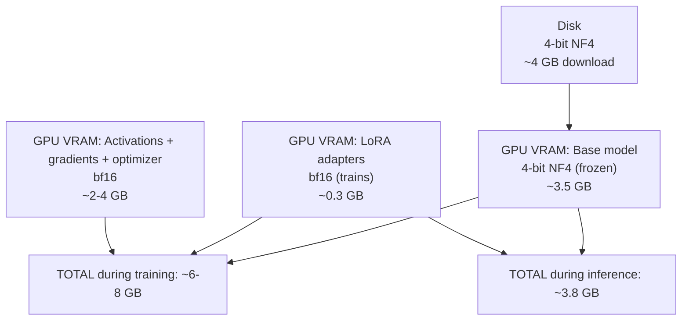
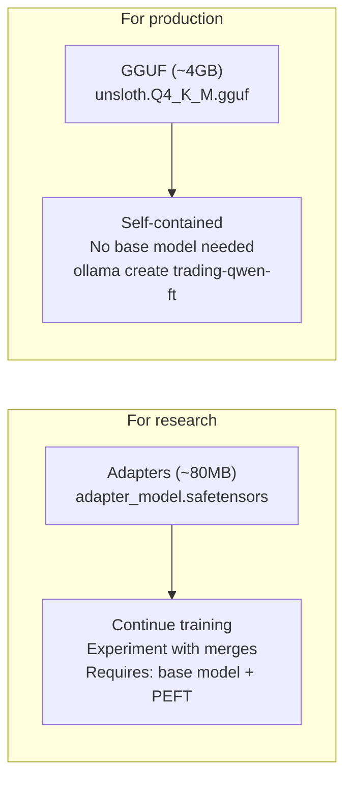
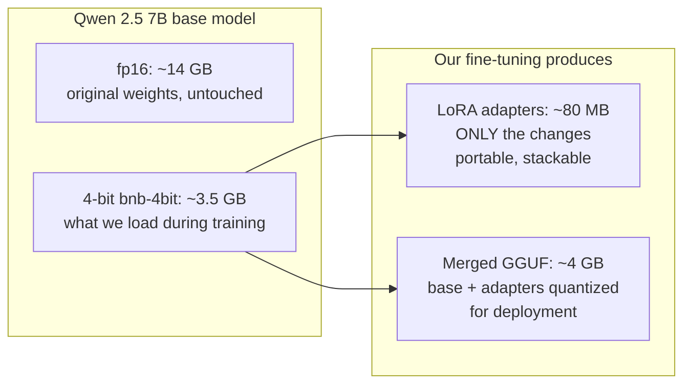
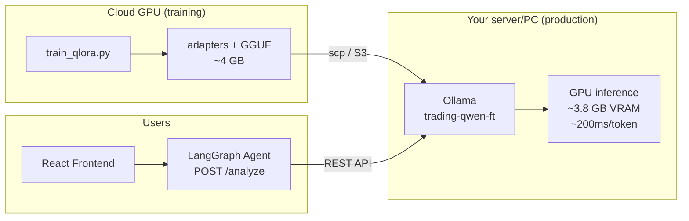
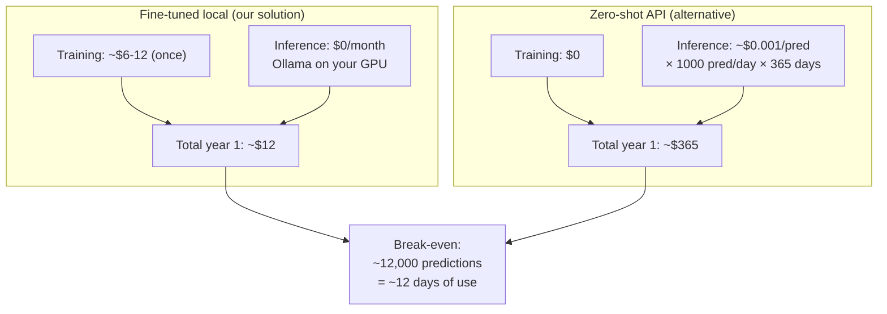
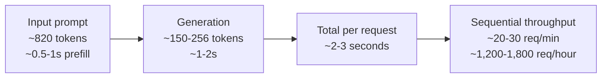
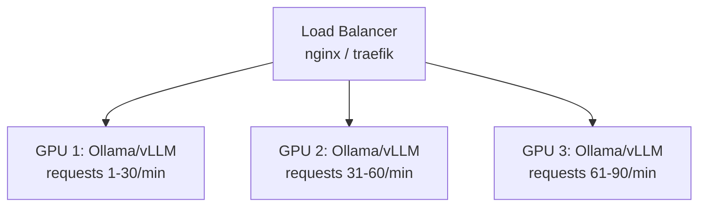
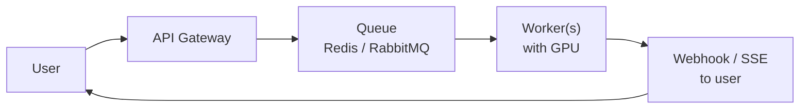
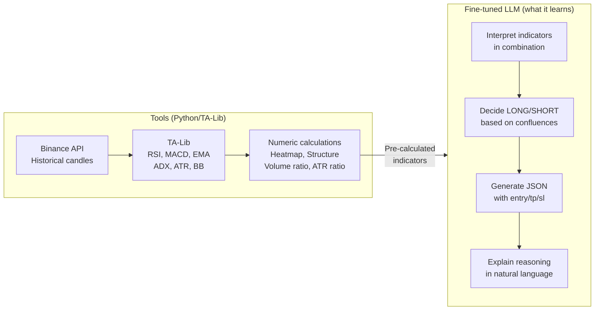
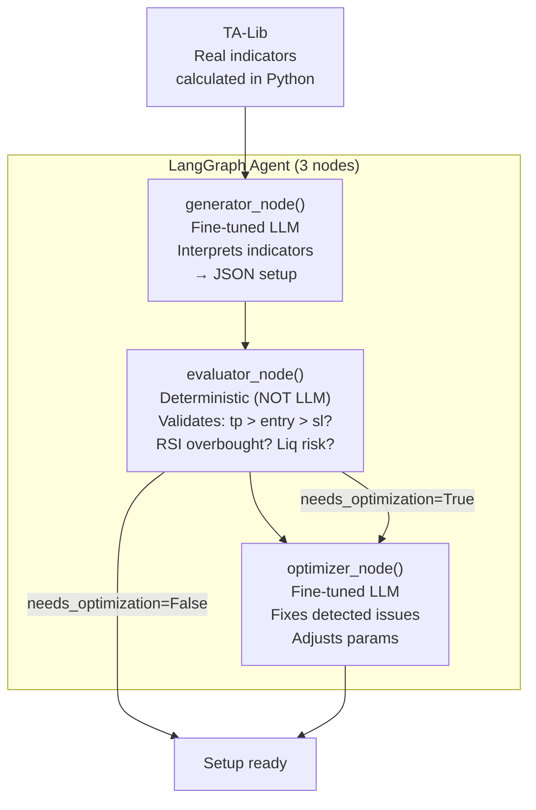

# QLoRA Fine-Tuning — Frequently Asked Questions

---

## Why do we use `unsloth/Qwen2.5-7B-Instruct-bnb-4bit`?

### Short answer

It is the Qwen 2.5 7B model **pre-quantized to 4 bits** by the Unsloth team.
We use it because QLoRA *requires* the base model to be in 4 bits — that is
literally the technique. Loading a model in full precision (fp16/bf16) and
quantizing it on-the-fly is slower and uses more VRAM than loading one that is
already quantized.

### What "bnb-4bit" means

`bnb` = **bitsandbytes**, the library that implements NF4 (Normal Float 4-bit) quantization.
`4bit` = each base model weight is stored in 4 bits instead of 16.

```
Original model (fp16):  7B params × 16 bits = ~14 GB VRAM
4-bit model (bnb-4bit): 7B params × 4 bits  = ~3.5 GB VRAM
```

That difference (14 GB vs 3.5 GB) is what makes it possible to train a 7B model
on a 16 GB GPU (RTX 5070 Ti) or with batch_size=8 on a 48 GB GPU (L40S).

### Why not train the full model in fp16?

| Aspect | fp16 (full fine-tuning) | 4-bit + LoRA (QLoRA) |
|--------|------------------------|----------------------|
| VRAM for the model alone | ~14 GB | ~3.5 GB |
| VRAM with gradients + optimizer | ~56 GB (Adam states) | ~5–8 GB (LoRA params only) |
| Minimum GPU | A100 80GB / 2× A10G | RTX 3090 16GB / A10G 24GB |
| Parameters updated | 7B (100%) | ~40M (0.6%) |
| Final quality | Marginally better | Comparable (within 1–2%) |
| Cloud cost (3 epochs) | ~$100–300 | ~$6–12 |
| Overfitting risk | High (too much capacity) | Low (rank is the bottleneck) |

For a 39K-sample dataset with a well-defined task (indicators → JSON), QLoRA
produces results comparable to full fine-tuning at a fraction of the cost.
Full fine-tuning is only justified with millions of samples or very complex tasks.

### What does "Instruct" mean in the name?

`Qwen2.5-7B-Instruct` (vs `Qwen2.5-7B` base) has already gone through alignment post-training:
- Understands the chat format (system/user/assistant)
- Follows instructions
- Produces structured JSON when asked

This matters because our dataset is in chat format. If we used the base model
(without Instruct), we would also have to teach it to follow instructions and
format JSON — not just the trading task.

### What does Unsloth do with this model?

Unsloth takes the official Qwen model (from HuggingFace) and:
1. Quantizes it to NF4 with double quantization
2. Packages it in an optimized format for fast loading
3. Publishes it to HuggingFace Hub under `unsloth/`

When we call `FastLanguageModel.from_pretrained("unsloth/Qwen2.5-7B-Instruct-bnb-4bit")`:
- Downloads ~4 GB (instead of ~14 GB for fp16)
- Loads directly to GPU in 4-bit (no on-the-fly conversion)
- Weights are **frozen** — they are never modified during training

The only parameters that train are the **LoRA adapters** we inject on top:
```
Effective weight = 4-bit base weight (frozen) + LoRA adapter (trains in bf16)
```

### Full precision flow



### Does 4-bit lose quality?

Yes — but surprisingly little:
- NF4 is optimized for the normal distribution of LLM weights
- Double quantization reduces additional error by quantizing the scale constants
- Gradients flow through the LoRA adapters in bf16 (full precision)
- The frozen base weights are only used for the forward pass, where 4-bit is sufficient

In practice, QLoRA (4-bit base + LoRA bf16) achieves >99% of full fp16 fine-tuning
performance on standard benchmarks (see QLoRA paper, Dettmers et al. 2023).

### Could we use a larger model?

| Model | VRAM 4-bit | Fits on L40S 48GB? | Advantage |
|-------|-----------|-------------------|-----------|
| Qwen 2.5 3B | ~2 GB | Yes (batch 16+) | Fast but less capable |
| **Qwen 2.5 7B** | **~3.5 GB** | **Yes (batch 8)** | **Optimal balance for the thesis** |
| Qwen 2.5 14B | ~7 GB | Yes (batch 4) | Better reasoning, slower |
| Qwen 2.5 32B | ~16 GB | Yes (batch 1–2) | Overkill, slow, expensive |
| Qwen 2.5 72B | ~36 GB | Barely (batch 1) | Research only |

7B is the sweet spot: enough capacity for the task, fast to train, cheap in the
cloud, and produces a ~4 GB GGUF that runs on the RTX 5070 Ti for production.

---

## What is LoRA?

### The analogy

Imagine you have a 7,000-page textbook (the base model). Instead of rewriting the
entire book to adapt it to trading, you stick **sticky notes** on the relevant pages
with specific corrections. The sticky notes are the LoRA adapters — small, removable,
and cheap to produce.

### The technique (Low-Rank Adaptation)

LoRA observes that the changes needed to adapt a large model to a new task live in a
**low-dimensional subspace**. You do not need to modify all 7B parameters — a "summary"
of changes with rank=16 captures the essence.

Mathematically, for each transformer layer:

```
Original weight:  W          (matrix of [4096 × 4096] = 16.7M params, frozen)
LoRA adapter:     ΔW = A × B (A is [4096 × 16], B is [16 × 4096] = 131K params, trains)

Forward pass:     output = input × (W + ΔW)
                         = input × W + input × A × B
                                  ^            ^
                           frozen         the adapter
```

The rank (16) is the bottleneck: it compresses 16.7M possible changes into just
131K parameters. It is a low-rank factorization — hence the name.

### Why does it work?

The original paper (Hu et al. 2021) showed that the changes needed to adapt an LLM
to a new task have **intrinsically low rank** — most of the 4096 dimensions of the
weight space do not need to change. With rank=16 you capture 95%+ of the necessary
adaptation.

### What gets saved after training

#### `save_model()` — Adapters only (~80–100 MB)

```python
self.model.save_pretrained(output_dir)     # adapter_model.safetensors (~80MB)
self.tokenizer.save_pretrained(output_dir) # tokenizer files (~7MB)
```

What is saved is ONLY the delta (the A and B matrices for each layer). The 7B base
weights **are not copied** — they weigh ~4 GB and did not change. To use the fine-tuned
model you need: the base model (downloaded from HuggingFace) + the adapters (your 80 MB).

```
On disk:
  adapter_config.json          (~1 KB)  — metadata: rank, alpha, target modules
  adapter_model.safetensors    (~80 MB) — the 196 trained A and B matrices
  tokenizer.json + configs     (~7 MB)
```

#### `save_gguf()` — Merged model for production (~4 GB)

```python
self.model.save_pretrained_gguf(gguf_path, tokenizer, quantization_method="q4_k_m")
```

This step does something different:
1. **Merge**: fuses adapters with the base model → 7B weights in bf16 (~14 GB temporary)
2. **Quantize**: compresses the 14 GB bf16 → ~4 GB in Q4_K_M format (GGUF for llama.cpp)
3. **Result**: a single `.gguf` file that Ollama can load directly

The GGUF is for **production** (fast inference, no need to load adapters separately).
The raw adapters are for **research** (retrain, compare, experiment with different merges).



### Why the GGUF step is the risky one

The temporary merge to bf16 needs ~15 GB of additional RAM/VRAM, and the GGUF
conversion depends on `llama.cpp` compiling correctly on the instance (cmake, build tools).
If it fails:
- The **adapters are already saved** (previous step) — nothing is lost
- You can convert to GGUF **later** on another machine with more resources
- That is why in our script `save_gguf()` is non-fatal (try/except) and runs last

### Adapters vs full model — size comparison



80 MB of adapters vs 14 GB for the full model — that is the magic of LoRA. You can
have 10 fine-tuned versions of the same model and only spend 800 MB of extra disk space.

---

## How is the fine-tuned model deployed to production?

### The flow: training → deploy → users



### Step 1: Copy the GGUF from the cloud instance

```bash
# Option A: scp directly (if you have SSH to the server)
scp ec2-user@<instance-ip>:~/trading_management/langgraph/backtest/data/models/qlora_cloud/gguf/unsloth.Q4_K_M.gguf ./

# Option B: via S3
# On the cloud instance:
aws s3 cp backtest/data/models/qlora_cloud/gguf/unsloth.Q4_K_M.gguf s3://trading-management-dvc/models/
# On your local machine:
aws s3 cp s3://trading-management-dvc/models/unsloth.Q4_K_M.gguf ./
```

### Step 2: Register the model in Ollama

```bash
# Create a Modelfile
cat > Modelfile << 'EOF'
FROM ./unsloth.Q4_K_M.gguf
PARAMETER temperature 0.1
PARAMETER top_p 0.9
PARAMETER num_ctx 1024
SYSTEM "You are a Senior Technical Analyst specializing in cryptocurrency markets..."
EOF

# Register in Ollama
ollama create trading-qwen-ft -f Modelfile

# Verify it works
ollama run trading-qwen-ft "What is BTC doing?"
```

### Step 3: Point the agent to the new model

```bash
# In your .env or docker-compose.yml:
LLM_MODEL=trading-qwen-ft

# That is all — llm_factory.py reads LLM_MODEL and uses OllamaProvider automatically
# No code changes needed
```

### Before vs after deployment

| Aspect | Before (zero-shot) | After (fine-tuned) |
|--------|-------------------|---------------------|
| Model | Qwen 2.5 14B | Qwen 2.5 7B fine-tuned |
| VRAM | ~10 GB | ~3.8 GB |
| Tokens/second | ~15–20 | ~25–35 (smaller model) |
| Trading accuracy | ~50–55% (zero-shot) | TBD on fixed test split |
| API cost | $0 (local) | $0 (local) |
| Latency per prediction | ~3–5s | ~1–3s |

---

## Cloud costs: training vs serving

### TRAINING cost (one-time)

| Option | GPU | Time (3 epochs) | Cost |
|--------|-----|-----------------|------|
| Local RTX 5070 Ti | 16 GB | ~2 days | $0 (electricity) |
| SageMaker ml.g5.xlarge | A10G 24 GB | ~6–9h | ~$8–13 |
| **RunPod A100 80GB** | **A100 80GB** | **~3–4h** | **~$5–6** |
| **SageMaker ml.g6e.xlarge** | **L40S 48 GB** | **~3–6h** | **~$6–12** |
| SageMaker ml.p4d.24xlarge | A100 40 GB | ~1–2h | ~$32–64 |
| Lambda Labs | A10G 24 GB | ~6–9h | ~$5–8 |

### INFERENCE cost (ongoing, per prediction)

#### Option A: Self-hosted (Ollama local or on EC2)

| Infrastructure | VRAM | Monthly cost | Predictions/month | Cost/prediction |
|----------------|------|-------------|-------------------|-----------------|
| **Your RTX 5070 Ti** | 16 GB | **$0** | Unlimited | **$0** |
| EC2 g5.xlarge (on-demand) | 24 GB | ~$1,000 | Unlimited | ~$0.001 (at >1M/month) |
| EC2 g5.xlarge (spot) | 24 GB | ~$400–500 | Unlimited | ~$0.0005 |
| RunPod serverless | Variable | Pay-per-use | Variable | ~$0.002–0.005 |

#### Option B: External API (zero-shot, no fine-tuning)

| Provider | Model | Cost/1K tokens | Cost/prediction (~1.2K tokens) |
|----------|--------|----------------|-------------------------------|
| Groq | Llama 3.3 70B | $0.0006 | ~$0.0007 |
| OpenAI | GPT-4o-mini | $0.0015 | ~$0.002 |
| Anthropic | Claude Sonnet | $0.003 | ~$0.004 |
| Google | Gemini 1.5 Pro | $0.00125 | ~$0.0015 |

#### Cost conclusion for the thesis



---

## Concurrency: how many users can the model serve?

### The bottleneck: GPU is single-stream by default

A 7B model in Ollama processes **one request at a time**. While generating tokens
for user A, user B waits in the queue. This is not a bug — it is how LLMs work on GPU.

### Capacity of a single GPU (RTX 5070 Ti / A10G)



### Concurrency scenarios

| Concurrent users | Experience | Solution |
|-----------------|-------------|----------|
| 1–5 | Response in 2–5s (good) | Single GPU is sufficient |
| 5–15 | Response in 5–30s (acceptable) | Single GPU with queue; vLLM for batching |
| 15–50 | Long queue (>30s, poor UX) | Multiple GPUs with load balancer |
| 50+ | Serious infrastructure needed | GPU cluster or external API |

### Techniques to improve concurrency

#### 1. Continuous batching (vLLM) — 3–5× more throughput with the same GPU

Instead of Ollama (sequential), use vLLM which processes multiple requests in parallel:

```bash
pip install vllm
vllm serve ./unsloth.Q4_K_M.gguf --max-model-len 1024 --gpu-memory-utilization 0.9
# Throughput: ~60-100 requests/minute on a single GPU (vs 20-30 with Ollama)
```

#### 2. Horizontal replicas — linear scaling



Each additional GPU adds ~20–30 req/min (Ollama) or ~60–100 req/min (vLLM).

#### 3. Prediction caching — avoid repeating work

If the same symbol with the same indicators is queried multiple times in a short
window (e.g., multiple users looking at BTC at the same time):

```python
# Redis cache with 5-minute TTL
key = f"{symbol}:{hash(indicators)}"
cached = redis.get(key)
if cached:
    return cached  # 0ms, no GPU
# ... call the model only if not cached
```

This can reduce actual GPU load by 50–80% depending on usage patterns.

#### 4. Async queues — tolerable UX under high load



The user sees "Analyzing..." and receives the response via Server-Sent Events when
ready. Handles traffic spikes without timeouts.

### Cost to scale to N users

| Concurrent users | Infrastructure needed | Monthly cost (cloud) | Monthly cost (self-hosted) |
|-----------------|----------------------|---------------------|--------------------------|
| 1–5 | 1× RTX 5070 Ti | — | $0 (already owned) |
| 5–20 | 1× EC2 g5.xlarge + vLLM | ~$1,000 | ~$300 (spot) |
| 20–50 | 2× EC2 g5.xlarge + LB | ~$2,000 | ~$600 (spot) |
| 50–100 | 3–4× GPU + Redis cache | ~$3,000–4,000 | ~$1,000 (spot) |
| 100+ | Use external API (Groq) | ~$0.001/req | Infinite scale |

### For this project

With **1–5 users** (you + evaluators + demo), a single RTX 5070 Ti with Ollama is
more than sufficient. No vLLM, load balancers, or caches needed. The model responds
in 2–3 seconds and can handle 20–30 requests per minute.

If asked at the defense "what if it scales to production?":
- Up to 20 users: vLLM on a single GPU ($0 if local)
- Up to 100: 2–3 GPUs with load balancer (~$1,000–2,000/month in cloud)
- Beyond: migrate to API (Groq at $0.001/req) — the fine-tuning is not lost, it can be uploaded to a serverless endpoint

---

## Fine-tuning does NOT predict prices — it interprets indicators

### The anti-pattern (what we do NOT do)

```
Input:  "BTC Day 1: $60,000. Day 2: $61,200. Day 3: $60,800. Predict Day 4."
Output: "$62,100"  ← HALLUCINATION — the LLM invents a plausible-sounding number
```

LLMs are probabilistic text engines, NOT time-series models. They are terrible at
pure math and direct price prediction. If you feed them price sequences, they will
"hallucinate" a number that sounds reasonable but has no statistical basis.

### What we DO (correct approach)

```
Input:  "Symbol: BTCUSDT
         Indicators: {
           '1h': {rsi: 42, adx: 31, heatmap: 'BULLISH', ema_alignment: 'ALIGNED_UP', ...},
           '4h': {rsi: 55, adx: 28, structure: 'BREAKOUT', ...},
           '1d': {rsi: 48, trend: 'BULLISH', ...}
         }"

Output: {"bias": "LONG", "entry": 67500, "tp": 69200, "sl": 66800,
         "reasoning": "Bullish heatmap on 1h with ADX confirming trend strength.
                       4h shows breakout structure. Multi-TF alignment bullish.",
         "quality": "HIGH", "confidence": 8}
```

### Division of responsibilities



### What the model learns through fine-tuning

| It DOES learn (correct) | It does NOT learn (would be wrong) |
|------------------------|-----------------------------------|
| RSI < 30 + EMA aligned = probable long | Predict tomorrow's price |
| High ATR + low ADX = do not trade | Extrapolate price trends |
| Multi-TF alignment = high confidence | Calculate percentages or ratios |
| Always format JSON correctly | Replace TA-Lib/numpy |
| SL sizing based on ATR | Invent indicators that don't exist |

### How it connects with the ReAct agent (LangGraph)



The fine-tuned LLM is the "brain" that interprets and decides. Numeric calculations
(indicators, price validation, risk management) are handled by deterministic Python
tools. The `evaluator_node` does not even use an LLM — it is pure logic.

### For the thesis defense

*"The fine-tuning is not applied to price prediction or time series. The model receives
pre-calculated technical indicators from TA-Lib (RSI, ADX, MACD, market structure,
multi-timeframe heatmap) and learns to: (1) interpret the confluence across multiple
indicators and timeframes, (2) decide the trade direction (LONG/SHORT) based on
technical patterns, (3) produce a structured JSON response with entry/tp/sl and
explainable reasoning.*

*Numeric calculations are the responsibility of deterministic tools (TA-Lib, numpy),
not the LLM. The model acts as the evaluator that connects tool outputs to a justified
trading decision — exactly the ReAct agent pattern where the LLM is an orchestrator,
not a calculator."*

---

## What is SFTTrainer and why do we use it?

### The concept

**SFT** = Supervised Fine-Tuning. It is the simplest type of fine-tuning:
- You have pairs of (input, expected output)
- The model learns to generate the correct output given the input
- It is "supervised" because every example has the correct answer

`SFTTrainer` is the class from HuggingFace's **TRL** (Transformer Reinforcement
Learning) library that handles all the boilerplate:
- Dataset tokenization
- Chat formatting (system/user/assistant)
- Training loop with gradients
- Checkpointing and evaluation

### Alternatives to SFT (what we do NOT use and why)

| Method | What it does | Why we don't use it |
|--------|-------------|---------------------|
| **SFT** (ours) | Learns from correct examples | Simple, fast, ideal for tasks with a single right answer |
| RLHF | Reward model + PPO | Needs human preference data (A is better than B) — we don't have it |
| DPO | Direct Preference Optimization | Also needs preference pairs |
| Pretraining | Learns from unlabeled text | For creating a model from scratch — we adapt an existing one |

SFT is the correct choice when you have data with a defined "correct" answer —
exactly our case (the labeler already decided LONG/SHORT with entry/tp/sl).

---

## Why these hyperparameter configs and not others?

### The configurations

| Config | LR | Rank | Alpha | Epochs | Strategy |
|--------|-----|------|-------|--------|----------|
| **1 (active)** | 2e-5 | 16 | 32 | 3 | Default from the literature — conservative, works in 90% of cases |
| 2 | 5e-5 | 8 | 16 | 3 | Aggressive — high LR, small adapters, more repetitions |
| 3 | 1e-5 | 32 | 64 | 2 | Conservative — low LR, large adapters, more capacity |

### Why Config 1 is the safe bet

- **lr=2e-5**: the sweet spot from the QLoRA paper (Dettmers 2023) and nearly all published Qwen/Llama fine-tunes. Does not diverge or underfit.
- **rank=16**: enough capacity for a well-defined task (indicators → JSON). Most successful fine-tunes use rank 8–16.
- **alpha=32 (2× rank)**: standard rule — amplifies the adapter contribution 2×.
- **epochs=3**: with 39K samples, 3 passes are enough to learn without memorizing.

### What hypothesis each config tests

**Config 2 (aggressive)**: "the task is easy"
- High LR (5e-5) → learns fast
- rank=8 → fewer parameters, forces the model to compress the pattern
- 3 epochs → more repetitions compensate for lower capacity
- If it wins: the task does not need much expressivity; a small adapter suffices

**Config 3 (conservative)**: "the task is complex"
- Low LR (1e-5) → small updates, does not destabilize
- rank=32 → 80M trainable params (double Config 1), more adaptation dimensions
- 2 epochs → with so much capacity, fewer repetitions needed
- If it wins: the task requires nuance that rank=16 could not capture

### What to look for in the results

| Result | Interpretation |
|--------|---------------|
| Config 1 wins | The task is "normal" difficulty — defaults work |
| Config 2 wins | The task is simpler than expected — less capacity, more data |
| Config 3 wins | The task needs more capacity — rank=16 was insufficient |
| All three similar | Hyperparameters matter little — task and dataset dominate |

---

## What if the fine-tuned model does not beat zero-shot?

### It is a valid thesis result

The research question is: "Does fine-tuning significantly improve LLM accuracy?"
If the answer is "no", that is also a publishable finding. Document:
- The accuracy of fine-tuned vs zero-shot (McNemar test, p-value)
- Why it did not work (hypotheses: insufficient dataset, poorly defined task, etc.)
- What you would try differently (more data, larger model, DPO instead of SFT)

### Possible causes of no improvement

| Cause | Status |
|-------|--------|
| Dataset too small (<10K samples) | Our dataset has 39K — should be sufficient |
| Low-quality labels (noisy labeler) | Possible — the labeler uses heuristics, not ground truth |
| Model already good zero-shot at the task | Compare accuracy directly on the test set |
| Overfitting to the training set | Check the gap between train_loss and eval_loss |
| Task too easy (accuracy ceiling) | If LSTM already achieves ~81–85%, there is little room for improvement |

### Strategies if the result is mediocre

1. **Analyze errors**: check which symbols/conditions fail vs LSTM
2. **Data augmentation**: add more symbols, time periods, or market conditions
3. **Ensemble**: combine fine-tuned prediction + LSTM (voting)
4. **Thesis framing**: "Fine-tuning improves explainability while maintaining similar accuracy"

---

## What is FlashAttention-2 and why does it matter?

### The problem it solves

The **attention** mechanism is the core of the transformer — it lets the model "look"
at all input positions to decide what to generate. But its complexity is O(n²) in
memory: if your sequence has 1024 tokens, attention creates a 1024×1024 = 1M entry
matrix per layer per head.

With a 7B model (28 layers, 28 heads), that means many large matrices that:
1. Get written to GPU memory (VRAM) — occupies space
2. Get read back for the backward pass — is slow

### What FlashAttention-2 does

Instead of writing the full attention matrix to VRAM, it computes it "in streaming"
over blocks that fit in the GPU's fast cache (SRAM). It never materializes the full
1024×1024 matrix in VRAM.

```
Without FA2 (eager attention):
  GPU computes attention → writes 1024×1024 matrix to VRAM → reads from VRAM for backward
  Bottleneck: reading/writing to VRAM (slow, ~1 TB/s)

With FA2 (fused kernel):
  GPU computes attention block-by-block in SRAM → never writes to VRAM
  Bottleneck: compute (fast, ~300 TFLOPS)
```

### Real impact on our training

| Metric | Without FA2 | With FA2 |
|--------|------------|---------|
| Time per step | ~28s (local) / ~8s (cloud) | ~3–4s estimated |
| Training 3 epochs | ~2 days (local) / ~6h (cloud) | ~3–4h (cloud) |
| VRAM used by attention | High (full matrices) | Low (~40% less) |
| Achievable batch size | 1–2 (VRAM limited) | 4–8 (less VRAM used) |

### Why we may not have it on some instances

FlashAttention-2 requires compiling a custom CUDA kernel that exactly matches the
CUDA version of the GPU driver. On some SageMaker instances:
- Driver CUDA: 12.9
- PyTorch CUDA: 13.0
- Mismatch → compilation fails with "CUDA version mismatch"

On the **RunPod `unsloth/unsloth:latest` image**, FA2 2.8.3 is pre-installed and
pre-compiled — no build needed. This is the primary reason RunPod is the recommended
training environment: the startup banner should show `FA2 = True`.

This does not affect model quality — only training speed.

---

## Glossary

| Term | Simple definition |
|------|-------------------|
| **QLoRA** | Quantized Low-Rank Adaptation — efficient fine-tuning with the base model in 4-bit |
| **LoRA** | Low-Rank Adaptation — injects small matrices (adapters) into each layer |
| **NF4** | Normal Float 4-bit — quantization format optimized for LLM weight distributions |
| **GGUF** | File format for llama.cpp / Ollama models |
| **SFT** | Supervised Fine-Tuning — learning from (input, correct output) pairs |
| **Adapter** | The A and B matrices of LoRA (~80 MB, the "delta" we train) |
| **Checkpoint** | Snapshot of the model during training (for resuming if it crashes) |
| **Eval loss** | Error on the validation set — if it rises, you are overfitting |
| **Effective batch** | batch_size × grad_accum — how many samples are averaged per weight update |
| **Cosine LR** | Learning rate that decays like a cosine curve (starts high, ends near 0) |
| **Greedy decoding** | Always pick the most probable token (deterministic, reproducible) |
| **Warmup** | First N steps where LR ramps from 0 to the target value (for stability) |
| **bf16** | Brain Float 16 — 16-bit format that trades decimal precision for range |
| **Prefill** | Processing all input tokens before generating (the "thinking" phase) |
| **Throughput** | How many requests the model can serve per minute |
| **vLLM** | Library that batches multiple requests on a single GPU |
| **Continuous batching** | Processing new requests without waiting for current ones to finish |

---

## ¿Qué es la circularidad en las métricas financieras?

### El problema en una oración

El profit factor (12.92) y el win rate (61.67%) son artificialmente altos porque el modelo aprendió a predecir niveles de TP/SL que **fueron calculados mirando al futuro** — y luego el simulador verifica si el precio "llegó" a esos niveles que ya se sabía que iban a llegar.

### Paso a paso

1. **El etiquetador mira 24 velas al futuro** y ve que BTC subió máximo +3.2%. Calcula:
   - `TP = entry × (1 + 3.2% × 0.7) = entry + 2.24%` (70% del máximo real)
   - `SL = entry - 1×ATR`

2. **El modelo aprende** de 39,312 ejemplos como este. Después de entrenar, cuando le das indicadores, predice un TP que es ~0.74% diferente del TP de la etiqueta (casi idéntico).

3. **El simulador pregunta**: "¿el precio alcanzó el TP predicho por el modelo?" → Casi siempre SÍ, porque ese TP fue derivado del hecho de que el precio SÍ llegó ahí.

### Qué SÍ es válido

La **dirección** (LONG/SHORT) no es circular. El modelo tiene que decidir si el precio sube o baja — eso no está "regalado" por el TP/SL. El 88% de precisión direccional es una métrica limpia.

### Qué NO es válido como claim

- Profit factor 12.92 → no es tradeable
- Win rate 61.67% → inflado por TP calibrado a hindsight
- Sharpe ratio 15.79 → imposible en trading real

### La solución

`simulate_trade_atr()` ignora el TP/SL del modelo y usa solo ATR (disponible al momento del trade): `TP = entry ± 1.5×ATR`, `SL = entry ∓ 1.0×ATR`. Esto produce métricas financieras honestas (PF esperado: 1.5-3.0).

### Analogía

Es como hacer un examen de opción múltiple donde:
- **Pregunta**: "¿BTC va a subir o bajar?" → el estudiante tiene que pensar (no circular, puede fallar)
- **Pregunta bonus**: "¿A qué precio exacto llegará?" → la respuesta correcta fue calculada viendo el resultado → el estudiante la memoriza → siempre "acierta" → calificación inflada

---

## ¿Se pueden correr las validaciones de manera local (sin RunPod)?

### Sí, pero es lento

La **evaluación** (no el entrenamiento) puede correr en la RTX 5070 Ti local:
- Requiere cargar el modelo (~4.4GB VRAM) + generar ~1024 tokens por muestra
- Velocidad local: ~2-3 samples/min (sin FA2, batch=1)
- 3,000 muestras: ~17-25 horas
- 8,425 muestras: ~47-70 horas

En RunPod con eval_batch=32: ~20 min para 3,000, ~56 min para 8,425.

### Alternativa: Ollama local

Si el modelo ya está exportado a GGUF y cargado en Ollama:
```bash
ollama create trading-qwen-ft -f backtest/data/models/qlora_cloud/Modelfile
```
Entonces puedes usar el `LLMBacktestRunner` con `--provider ollama` para evaluar localmente. Ollama maneja la cuantización y puede correr a ~5-10 samples/min en la 5070 Ti.

### Qué NO se puede hacer local

El **entrenamiento** (fine-tuning) necesita VRAM para gradientes + activaciones:
- Local (16GB): batch=1, ~28s/step, ~23h para 3,000 pasos
- RunPod A100 (80GB): batch=8, ~3.4s/step, ~3.5h

La evaluación es factible local; el entrenamiento es donde RunPod vale la pena.

---

## ¿Por qué no hay curva ROC, Precision-Recall ni reliability diagram para el modelo QLoRA?

### Respuesta corta

Porque el modelo QLoRA **no produce un score de probabilidad continuo**. Estas tres
curvas requieren una probabilidad variable (entre 0 y 1) que se recorre con un umbral
móvil; el QLoRA solo emite dos valores discretos de confianza (0 y 5), prácticamente
constante. Con tan pocos valores, la curva ROC se reduciría a dos puntos unidos por
rectas y el reliability diagram a uno o dos puntos, sin información útil.

### Por qué los modelos ML sí las tienen

Estas curvas existen solo para Random Forest y XGBoost (que sí dan `predict_proba`
continuo). El documento ya lo explica en el caption de la figura de ROC/PR/reliability
("El modelo QLoRA no produce probabilidades variadas... estas curvas aplican
exclusivamente a Random Forest y XGBoost"). Para QLoRA, el diagnóstico equivalente es
la **matriz de confusión**, que ya está en el documento, complementada por la precisión
y el *recall* por clase (LONG y SHORT).

### Nota

Esto es una **limitación de calibración** del modelo, no una carencia del análisis: el
QLoRA fue entrenado para emitir una decisión direccional estructurada (JSON), no una
probabilidad calibrada. Dotarlo de una salida de probabilidad bien calibrada —que
permitiría dimensionar posiciones de forma diferenciada y construir estas curvas— es una
línea de trabajo futuro (ver la sección de *position sizing* en el documento de la tesis).

---

## ¿Sobre qué conjunto (train/val/test) se corre el backtest financiero?

### Respuesta corta

El **backtest financiero** (simulación de operaciones: win rate, profit factor, equity,
max drawdown) se computa **exclusivamente sobre el conjunto de test**. Las 11,294
operaciones reportadas para el modelo final corresponden todas al holdout de prueba.

### ¿Y el conjunto de validación?

El conjunto de **validación NO se somete al backtest financiero**. Su único uso es el
*early stopping* durante el entrenamiento: tras cada `eval_steps`, el `SFTTrainer` mide
la `eval_loss` sobre val y detiene el entrenamiento cuando esa pérdida deja de mejorar
(paciencia configurable). El mejor checkpoint es el de menor `eval_loss` sobre val
(`load_best_model_at_end=True`).

En el `result.json` esto se ve así:
- `val_metrics` → solo `train_loss` y `eval_loss` (señales del entrenamiento, no trades).
- `overfitting` → `train_acc`, `val_acc`, `test_acc` (solo **exactitud direccional**, no
  métricas financieras).
- `test_metrics` + `metrics_atr` → aquí vive el backtest completo (TP/SL, WR, PF, DD),
  solo sobre test.

### Por qué es lo correcto

Reportar profit factor o win rate sobre validación **contaminaría la métrica**: val es
el conjunto que se usó para seleccionar el checkpoint (early stopping), así que el modelo
ya está implícitamente optimizado sobre él. El backtest financiero debe medirse sobre un
conjunto que el modelo nunca tocó durante el entrenamiento ni la selección — el test
holdout. Resumen del uso por conjunto:

| Conjunto | Exactitud direccional | Backtest financiero (PF/WR/DD) | Rol |
|----------|----------------------|-------------------------------|-----|
| Train | sí (diagnóstico) | no | ajustar pesos |
| Val | sí (`val_acc`) | **no** | *early stopping* / mejor checkpoint |
| Test | sí | **sí** (único) | evaluación final no contaminada |
