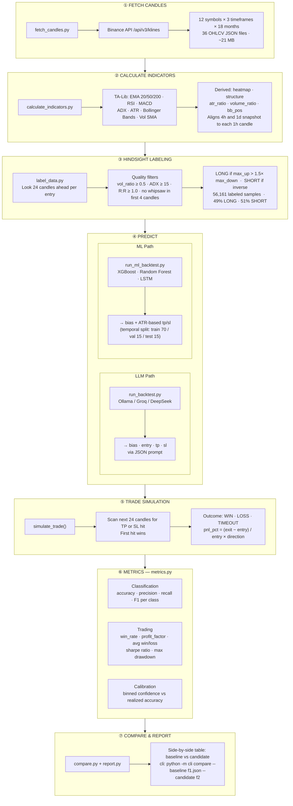
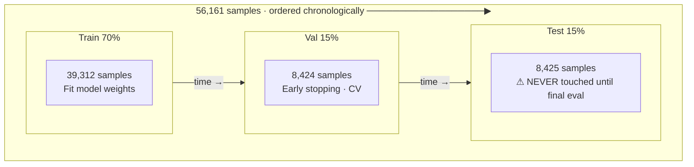
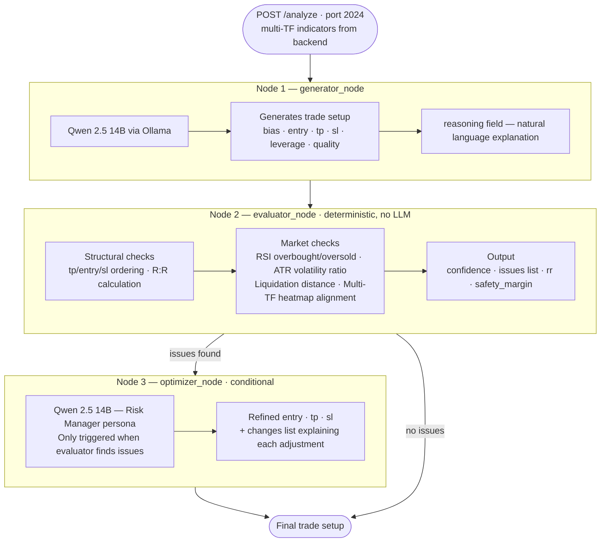
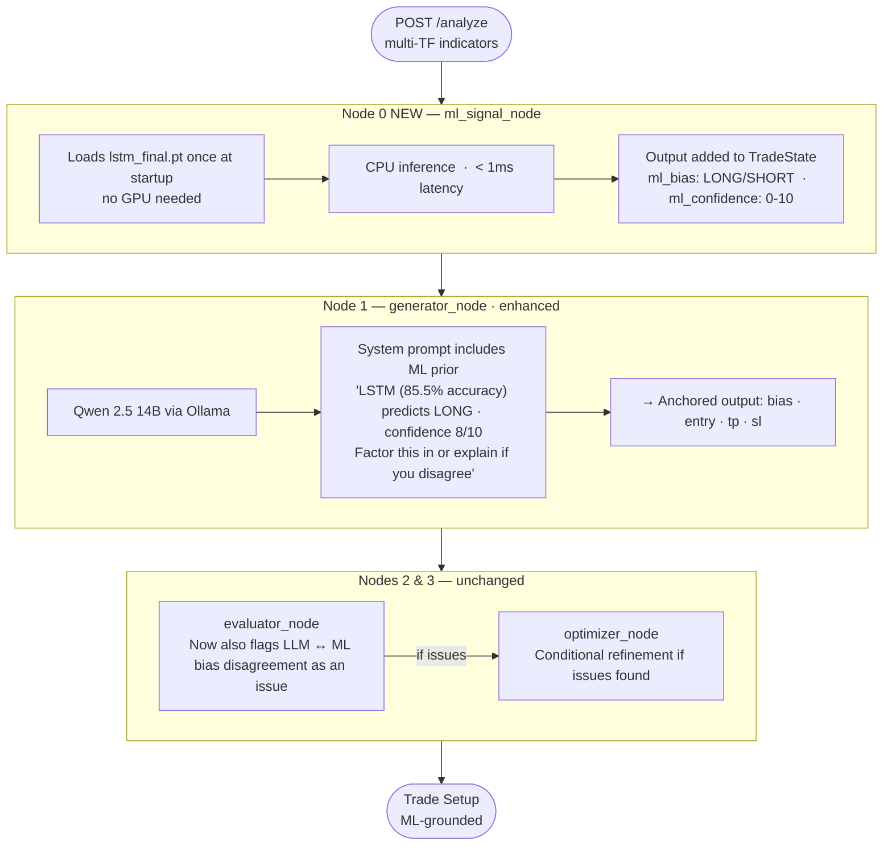
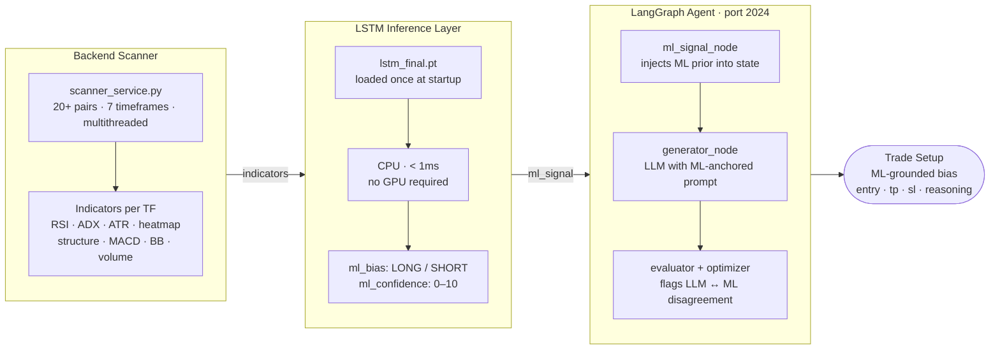

# ML Architecture — Models, Backtesting & LangGraph Integration

## Table of Contents
1. [ML Models vs Scanner Trend Metric](#1-ml-models-vs-scanner-trend-metric)
2. [How the Backtest Framework Works](#2-how-the-backtest-framework-works)
3. [How ML Models Improve Backtesting](#3-how-ml-models-improve-backtesting)
4. [LangGraph Integration — Current & Planned](#4-langgraph-integration--current--planned)

---

## 1. ML Models vs Scanner Trend Metric

### What the Scanner Does

The production scanner (`backend/app/services/scanner_service.py`) runs a multithreaded analysis across 20+ pairs and 7 timeframes. Its trend signal is a **deterministic, rule-based heatmap**:

```
EMA alignment (20/50/200) + ADX strength → heatmap
  STRONG_BULLISH | BULLISH | NEUTRAL | BEARISH | STRONG_BEARISH
```

This heatmap describes the **current market state** — it does not predict what will happen next. It is one input among many in the Quant Score ranking:

```
Quant Score (0-10):
  30% Volume  |  25% ATR (Volatility)  |  20% RSI (Momentum)
  15% ADX (Trend Strength)  |  10% Recent Move
```

### What the ML Models Do

The ML models (`langgraph/backtest/ml_models.py`) were trained specifically to answer one question:

> **"Given current multi-timeframe indicators, will the price go UP or DOWN in the next 24 candles?"**

They consume the **same indicators** the scanner produces — RSI, ADX, ATR, heatmap, structure, MACD, Bollinger Bands, volume — but across 3 timeframes simultaneously (1h, 4h, 1d), and learned from 56,161 labeled historical examples with hindsight.

### Head-to-Head Comparison

| Dimension | Scanner Heatmap | LSTM Model |
|-----------|----------------|------------|
| Purpose | Describe current state | Predict 24-candle direction |
| Logic | Deterministic rules | Learned from 56K examples |
| Multi-timeframe | 7 TFs (scanner) | 3 TFs (1h, 4h, 1d) |
| Output | State label | LONG / SHORT + confidence |
| Measured accuracy | No baseline | **85.5% on 8,425 unseen samples** |
| Knows when to override | No | Yes (RSI extremes, TF misalignment, volatility spikes) |

**Key insight**: The heatmap is an *input feature* of the LSTM — the model learned that EMA alignment matters, but also learned when to disagree with it. For example, if the heatmap says BULLISH but RSI is at 78 (overbought) on all 3 timeframes, the LSTM learned to predict SHORT.

### Test Set Results (8,425 samples never seen during training)

```
Direction Accuracy : 85.5%    ← vs ~50% random baseline
Win Rate           : 81.9%    ← trades that hit TP before SL
Profit Factor      : 7.02     ← gross gains / gross losses
Sharpe Ratio       : 18.16    ← simulation only, no fees/slippage
Max Drawdown       : 45.21%
LONG  F1           : 0.85
SHORT F1           : 0.86
```

> **Note for thesis / live use**: Sharpe and Profit Factor are from simulated trades with ATR-based TP/SL and no slippage or fees. These numbers serve for model comparison, not live P&L estimation.

### Model Ranking (CV scores, 56K samples, temporal split)

| Model | CV Accuracy | Test Accuracy | Overfitting Gap |
|-------|-------------|---------------|-----------------|
| **LSTM** | 84.29% | **85.5%** | None (generalizes) |
| XGBoost | 76.79% | TBD (round 2) | ⚠️ 0.187 |
| Random Forest | 74.89% | TBD (round 2) | ⚠️ 0.203 |
| Zero-shot LLM | TBD | — | — |
| Fine-tuned LLM (QLoRA) | TBD | — | — |

---

## 2. How the Backtest Framework Works

The backtest pipeline lives entirely in `langgraph/backtest/` and is orchestrated via `langgraph/cli.py`.

### Full Pipeline



### Temporal Split (critical — never shuffle)



Shuffling would cause data leakage — future candles would appear in the training set. All splits respect chronological order.

### CLI Commands

```powershell
# From langgraph/ with conda activate trading

# 1. Download candles
python -m cli fetch-candles --symbols BTCUSDT,ETHUSDT,... --interval 1h --months 18 --timeframes "1h,4h,1d"

# 2. Generate labeled dataset
python -m cli prepare-dataset --symbols BTCUSDT,ETHUSDT,... --interval 1h --timeframes "1h,4h,1d"

# 3a. LLM backtest
python -m cli run-backtest --dataset backtest/data/labeled/dataset.jsonl --provider ollama

# 3b. ML backtest (auto-loads best params from optimization JSON)
python -m cli train-ml --model lstm --dataset backtest/data/labeled/dataset.jsonl --serialize

# 4. Compare two results
python -m cli compare --baseline backtest/data/results/baseline.json --candidate backtest/data/results/ml-lstm.json
```

---

## 3. How ML Models Improve Backtesting

### Before ML Models (LLM-only backtest)

The original backtest called an LLM for every sample:
- **Slow**: 100ms-2s per prediction (Ollama latency × 56K samples = hours)
- **Non-deterministic**: same indicators → different response each run
- **Provider-dependent**: results change with model version

### With ML Models

| | LLM Backtest | ML Backtest |
|---|---|---|
| Speed | Hours (56K API calls) | Minutes (vectorized inference) |
| Deterministic | No | Yes (same model = same predictions) |
| Interpretable | Via reasoning field | Via feature importance |
| Accuracy | TBD | LSTM 85.5%, XGB 76.79%, RF 74.89% |
| Deployable | Requires Ollama running | Single `.pt` or `.pkl` file |

### The Real Contribution: Labeled Dataset

The backtest framework's most valuable output is **not the model** — it's the **56,161 labeled samples with hindsight ground truth**. This dataset:
- Defines objectively when a LONG or SHORT was correct (not an opinion)
- Filters low-quality setups (low volume, low ADX, whipsaw)
- Enables fair comparison of any model — LLM, ML, or rule-based
- Will be used for QLoRA fine-tuning of Qwen 2.5 7B

---

## 4. LangGraph Integration — Current & Planned

### Current Architecture (Production)

The LangGraph agent (`langgraph/agent/`) runs independently from the ML backtest system. It receives live indicator data from the backend and generates trade setups through 3 nodes:



**Current limitation**: The generator_node relies entirely on LLM intuition. There is no objective signal from the trained LSTM to anchor or validate the generated bias.

### Planned Integration — ML Model as Signal Node

The trained LSTM can be integrated as a **pre-generator validation step** or a **parallel signal node**:



**Why this matters**:
- LSTM runs in <1ms on CPU — zero latency cost
- Provides a statistically grounded prior to the LLM
- When LLM and LSTM agree → higher confidence signal
- When they disagree → evaluator flags this as an issue for optimizer

### Integration with the Scanner (Backend)

The scanner already collects live multi-TF indicators. The connection would be:



This would make the LSTM a live decision-support layer between the scanner and the LLM setup generator — combining the scanner's real-time market awareness, the LSTM's learned pattern recognition, and the LLM's reasoning and target generation.

### Implementation Steps (Planned)

1. **Add `ml_signal` to `TradeState`** in `agent/graph.py`
   ```python
   class TradeState(TypedDict):
       ...
       ml_signal: Optional[Dict[str, Any]]  # {"bias": "LONG", "confidence": 8}
   ```

2. **Create `ml_signal_node()`** in `agent/graph.py`
   ```python
   async def ml_signal_node(state: TradeState) -> dict:
       # Load LSTM model (cached at module level after first load)
       # Run inference on state["indicators"]
       # Return {"ml_signal": {"bias": "LONG", "confidence": 8}}
   ```

3. **Update generator prompt** to include ML signal as prior

4. **Update evaluator** to flag LLM vs ML bias disagreement as an issue

5. **Update `langgraph.json`** to add model path env var:
   ```json
   {"env": {"LSTM_MODEL_PATH": "optimization/results/lstm_final.pt"}}
   ```

### Research Value (Thesis)

This integration enables a key experiment for the thesis:

| Setup | Description |
|-------|-------------|
| Baseline | Zero-shot LLM alone (current) |
| ML-grounded | LSTM signal → LLM generator |
| Fine-tuned | QLoRA Qwen 2.5 7B alone |
| Hybrid | LSTM signal → Fine-tuned LLM |

The hypothesis: **ML-grounded LLM outperforms both zero-shot LLM and standalone ML** because it combines learned pattern recognition with explainable reasoning and dynamic target generation.

---

*Last updated: 2026-05-10*
*Dataset: 56,161 samples | 12 symbols | 18 months | 3 TFs*
*Best model: LSTM (85.5% test accuracy, Profit Factor 7.02)*
