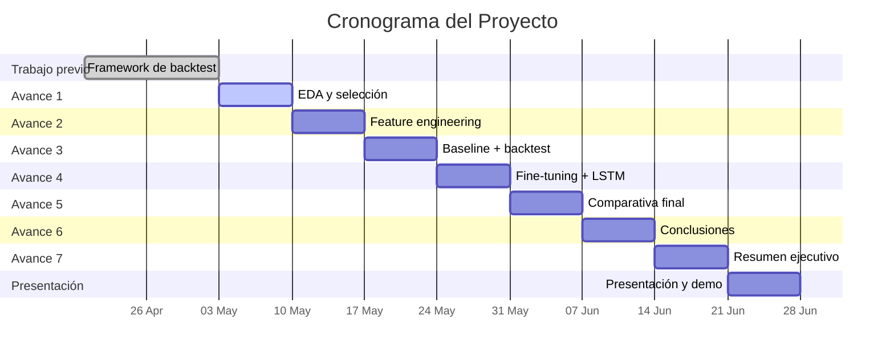
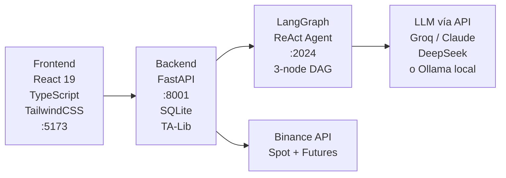
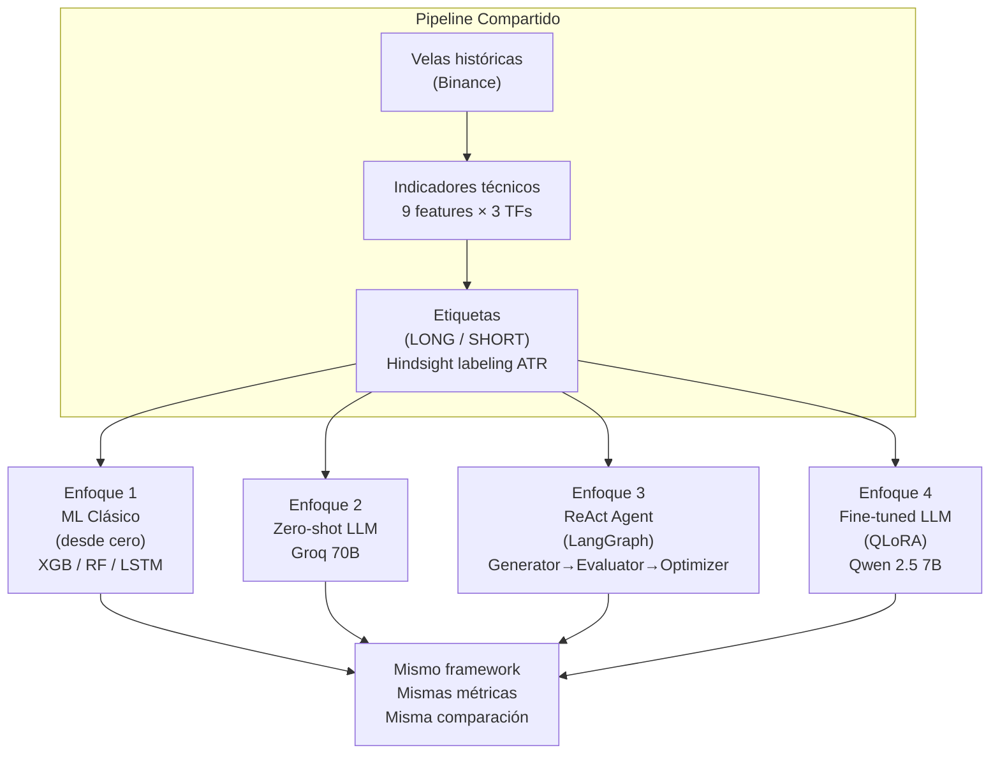
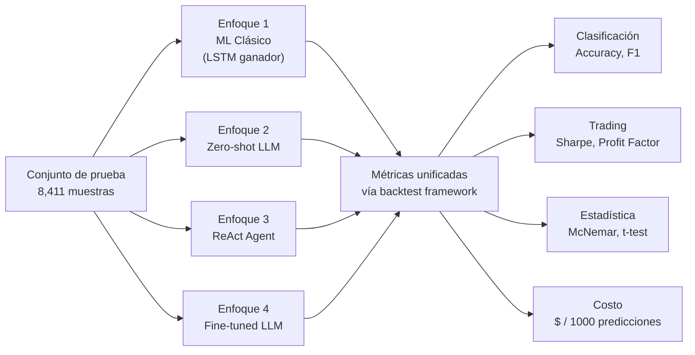
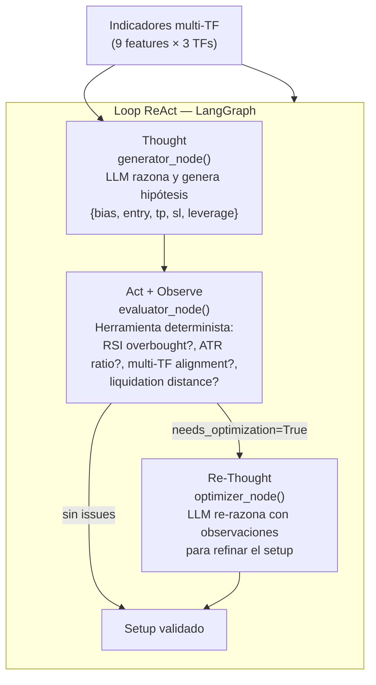
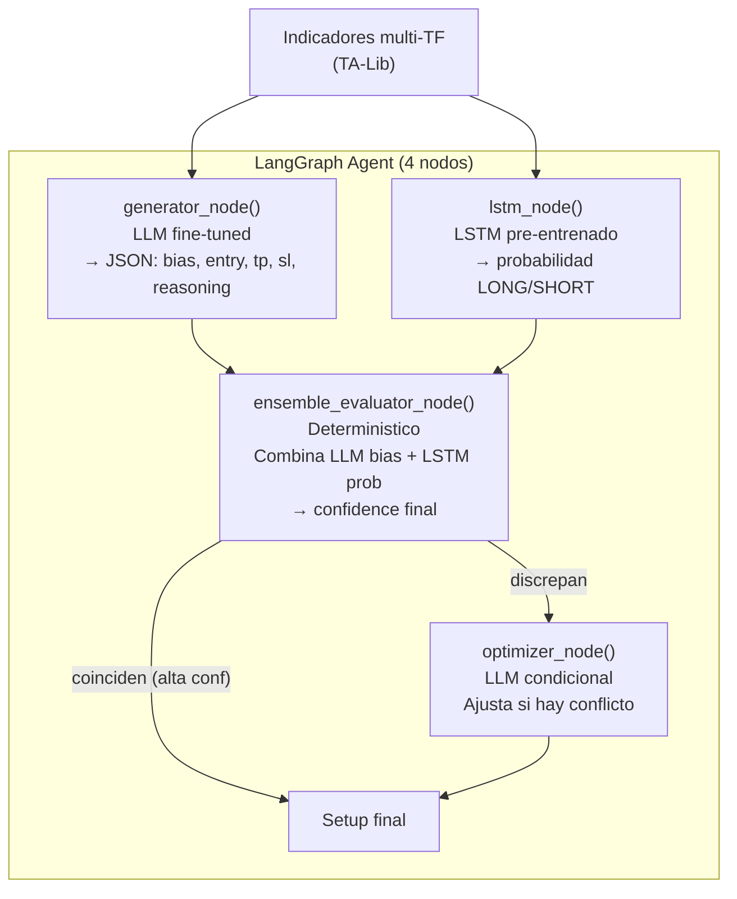

# Fase 0. Propuesta del Proyecto Integrador

**Proyecto**: Sistema Híbrido de Trading con Arquitectura Agéntica y Razonamiento ML-Fundamentado

**Profesor**: Dra. Alicia Fernanda Galindo Manrique

**Integrantes del equipo**:
- Alejandro González Almazán -- A00517113
- Luis Ángel González Almazán -- Colaborador técnico

**Maestría en Inteligencia Artificial Aplicada**
Tecnológico de Monterrey

**Fecha**: Mayo 2026

---

## Índice

1. [Antecedentes](#1-antecedentes)
2. [Entendimiento del Negocio](#2-entendimiento-del-negocio)
3. [Entendimiento de los Datos](#3-entendimiento-de-los-datos)
4. [Cronograma de Trabajo](#4-cronograma-de-trabajo)
5. [Bibliografía](#5-bibliografia)
6. [Anexos](#6-anexos)
7. [Stack Tecnológico](#7-stack-tecnologico)
8. [Fuentes de Datos](#8-fuentes-de-datos)
9. [Entregables](#9-entregables)
10. [Hipótesis](#10-hipotesis)
11. [Riesgos y Mitigaciones](#11-riesgos-y-mitigaciones)
12. [Fuera de Alcance](#12-fuera-de-alcance)
13. [Trabajo Futuro](#13-trabajo-futuro)
14. [Extensión: Ensemble LSTM + LLM en LangGraph](#14-extension-ensemble-lstm--llm-en-langgraph)

---

## 1. Antecedentes

### 1.1 Descripción del contexto

El trading algorítmico de criptomonedas ha experimentado un crecimiento exponencial en la última década. Según datos de CoinGecko (2025), el volumen diario de trading en exchanges centralizados supera los 80 mil millones de dólares, y se estima que entre el 70% y el 80% de este volumen es generado por sistemas automatizados (Aldridge & Krawciw, 2017). En este contexto, la capacidad de un sistema para interpretar indicadores técnicos y generar señales de trading con precisión representa una ventaja competitiva significativa.

Los modelos de lenguaje de gran escala (LLMs) han demostrado capacidades notables en tareas de razonamiento y generación de texto estructurado (Brown et al., 2020; Touvron et al., 2023). Sin embargo, su integración efectiva en sistemas de análisis técnico financiero plantea preguntas metodológicas abiertas: ¿es suficiente el *zero-shot prompting* con un modelo de frontera, o se requiere adaptación de dominio mediante fine-tuning? ¿Puede una arquitectura agéntica con acceso a herramientas deterministas superar a un LLM standalone sin necesidad de reentrenamiento? Estas preguntas motivan el presente trabajo.

Paralelamente, los modelos tradicionales de machine learning —XGBoost, Random Forest, LSTM— representan el estado del arte para predicción en series de tiempo financieras, pero operan como cajas negras que producen únicamente una etiqueta direccional, sin razonamiento explicativo ni parámetros operacionales (niveles de entrada, TP, SL). La tensión entre precisión y explicabilidad define el espacio de soluciones que este proyecto explora.

### 1.2 Descripción del sistema existente

El presente proyecto se desarrolla sobre una plataforma de trading de criptomonedas completamente funcional, construida como un sistema de cuatro componentes:

1. **Backend** (FastAPI, Python): Servicio de datos de mercado, cálculo de indicadores técnicos mediante TA-Lib, ejecución de órdenes en Binance (spot y futuros), y gestión del ciclo de vida de operaciones.
2. **Agente LangGraph** (Python, LangGraph 0.3+): Pipeline de análisis de 3 nodos — Generador (LLM), Evaluador (validación cuantitativa determinista) y Optimizador (LLM condicional). Este pipeline implementa el patrón **ReAct** (Yao et al., 2023): el nodo Generador ejecuta el paso de razonamiento (*Thought*), el nodo Evaluador actúa como herramienta determinista sobre el entorno (*Act + Observe*), y el nodo Optimizador re-razona condicionado a las observaciones del Evaluador (*Re-Thought*). A diferencia de implementaciones ReAct donde el LLM invoca herramientas libremente, esta variante delega el paso de acción a un módulo determinista, eliminando el riesgo de alucinaciones en la validación cuantitativa.
3. **Frontend** (React 19, TypeScript, TailwindCSS): Interfaz de usuario con gráficos de velas, panel de escaneo y gestión de operaciones.
4. **LLM vía API**: El sistema soporta múltiples proveedores LLM mediante una capa de abstracción (`llm_factory.py`): Groq (Llama 3.3 70B), Claude (Anthropic), DeepSeek, y Ollama local (Qwen 2.5 14B para producción).

El sistema escanea 12 pares de criptomonedas en 7 marcos temporales simultáneamente, calcula 9 indicadores técnicos por marco temporal, y utiliza el agente LangGraph para generar setups de trading estructurados en formato JSON que incluyen: dirección (LONG/SHORT), precio de entrada, take-profit (TP), stop-loss (SL), apalancamiento y razonamiento en lenguaje natural.

**Framework de backtest**: El sistema incluye un framework completo de evaluación histórica con 56,161 muestras etiquetadas (12 símbolos, 18 meses, 3 marcos temporales) que permite comparar cualquier motor de predicción —LLM, modelo ML, o agente— sobre el mismo conjunto de datos con las mismas métricas, garantizando comparabilidad científica entre enfoques.

### 1.3 Problema identificado

La integración de LLMs en sistemas de trading técnico presenta un espacio de decisiones con múltiples dimensiones: precisión direccional, capacidad de razonamiento explicativo, costo computacional por inferencia, y adaptabilidad a nuevos regímenes de mercado. La literatura actual no ofrece una comparación sistemática entre las cuatro estrategias principales de integración en un sistema de producción real:

1. **ML supervisado clásico** (XGBoost, Random Forest, LSTM): entrenados desde cero sobre datos del dominio, alta precisión en clasificación, sin explicabilidad.
2. **LLM zero-shot vía API**: razonamiento general sin adaptación al dominio, genera TP/SL y razonamiento, precisión direccional potencialmente limitada.
3. **LLM con arquitectura agéntica ReAct**: el LLM accede a herramientas de validación deterministas antes y después de razonar, combinando la flexibilidad del lenguaje con la precisión de módulos cuantitativos.
4. **LLM fine-tuneado** (QLoRA): adaptación supervisada del modelo al dominio del trading, busca combinar precisión y explicabilidad.

El presente proyecto evalúa estas cuatro estrategias sobre el mismo framework de backtest, el mismo conjunto de datos y las mismas métricas, para determinar qué enfoque ofrece el mejor balance entre precisión, explicabilidad y costo operativo.

---

## 2. Entendimiento del Negocio

### 2.1 Formulación del problema

¿Cuál es la estrategia óptima de integración de LLMs en un sistema de análisis técnico de criptomonedas — ML supervisado clásico, LLM zero-shot, arquitectura agéntica ReAct, o fine-tuning supervisado — considerando la precisión direccional, la calidad del razonamiento generado y el costo computacional por predicción?

### 2.2 Contexto y relevancia

La pregunta de investigación aborda una tensión fundamental en la aplicación de IA al trading que la literatura actual no ha resuelto:

- **Los modelos tradicionales de ML** (XGBoost, LSTM, Random Forest) son altamente precisos en clasificación direccional, pero funcionan como cajas negras. No generan niveles de precio, no explican su razonamiento, y su reentrenamiento requiere datos etiquetados. Los modelos ML de este proyecto son entrenados **desde cero** (*from scratch*) sobre el dataset de trading: aprenden únicamente de las 56,161 muestras históricas, sin conocimiento previo transferido.

- **Los LLMs en modo zero-shot** generan análisis ricos con razonamiento y parámetros específicos, pero su precisión direccional puede ser deficiente porque carecen de exposición específica al dominio del análisis técnico.

- **La arquitectura agéntica ReAct** representa un punto intermedio que la literatura reciente demuestra prometedor (Yao et al., 2023; Kambhampati et al., 2024): el LLM accede a herramientas deterministas que enriquecen su contexto y validan su razonamiento sin reentrenamiento. El sistema LangGraph de este proyecto implementa exactamente este patrón.

- **El fine-tuning supervisado** (QLoRA) adapta un LLM pre-existente al dominio mediante entrenamiento sobre una fracción pequeña de sus parámetros (~0.5% con LoRA), preservando el conocimiento general mientras incorpora patrones específicos del dominio. A diferencia de los modelos ML, el LLM fine-tuneado *ya conoce el lenguaje y el contexto financiero*; el fine-tuning solo refina su comportamiento para la tarea específica.

Esta comparación tiene relevancia práctica directa: determina si una organización debe invertir en infraestructura de fine-tuning o puede obtener resultados comparables con context engineering agéntico y acceso a modelos de frontera vía API.

### 2.3 Objetivos

**Objetivo general**: Evaluar y comparar cuatro estrategias de integración de LLMs en un sistema de análisis técnico de criptomonedas — ML supervisado clásico, LLM zero-shot, arquitectura agéntica ReAct (LangGraph), y LLM fine-tuneado (QLoRA) — para determinar cuál optimiza el balance entre precisión direccional, explicabilidad del razonamiento y costo operativo.

**Objetivos específicos**:

1. Construir un dataset etiquetado de alta calidad con 56,161 muestras (39,250 entrenamiento, 8,411 validación, 8,411 prueba) utilizando etiquetado por retrospectiva (*hindsight labeling*) con umbrales dinámicos basados en ATR.
2. Entrenar modelos de ML supervisado clásico (XGBoost, Random Forest, LSTM) desde cero sobre el dataset de trading y establecer baselines de precisión.
3. Evaluar un LLM de frontera en modo zero-shot (Groq Llama 3.3 70B) sobre el mismo conjunto de prueba como referencia de razonamiento sin adaptación de dominio.
4. Evaluar la arquitectura agéntica ReAct implementada en LangGraph (pipeline Generator→Evaluator→Optimizer, ya en producción) como estrategia de context engineering estructurado.
5. Realizar fine-tuning del modelo Qwen 2.5 7B mediante QLoRA (4-bit) y evaluar si la adaptación de dominio mejora la precisión sobre el baseline zero-shot y el agente ReAct.
6. Comparar los cuatro enfoques sobre el mismo conjunto de prueba utilizando métricas de clasificación (accuracy, F1) y métricas de trading (win rate, profit factor, Sharpe ratio, max drawdown), incluyendo análisis de significancia estadística y costo por predicción.

### 2.4 Preguntas clave

1. ¿La arquitectura agéntica ReAct (LangGraph) supera al LLM zero-shot sin ningún reentrenamiento, solo por el diseño del pipeline?
2. ¿El fine-tuning supervisado (QLoRA) mejora significativamente la precisión sobre el baseline zero-shot y sobre el agente ReAct? (Meta: >55% accuracy)
3. ¿Qué enfoque ofrece el mejor costo-eficiencia medido en precisión por dólar de inferencia?
4. ¿El modelo fine-tuneado generará razonamiento coherente y consistente con los indicadores de entrada?
5. ¿Existirá una diferencia estadísticamente significativa entre los cuatro enfoques?
6. ¿Qué enfoque es más robusto ante distintos regímenes de mercado (tendencia vs. lateral)?

### 2.5 Involucrados

**Tabla 1.** Participantes del proyecto y su nivel de involucramiento.

| Participante | Rol | Etapa | Tipo de participación |
|---|---|---|---|
| Alejandro González Almazán | Desarrollador principal, investigador | Todas las fases | Diseño, implementación, evaluación, documentación |
| Profesor de la materia | Asesor académico | Revisión de entregables | Retroalimentación metodológica y evaluación |
| Comunidad open-source (Qwen, Unsloth, LangGraph) | Proveedores de herramientas | Fase de implementación | Frameworks y modelos base utilizados |
| Binance | Proveedor de datos | Fase de datos | API pública de datos históricos (sin costo) |
| Groq / Anthropic / DeepSeek | Proveedores LLM vía API | Fases de evaluación | Inferencia de modelos de frontera para enfoques 2 y 3 |
| Together AI | Proveedor de infraestructura | Fase de fine-tuning | Fine-tuning en la nube como alternativa a entrenamiento local |

---

## 3. Entendimiento de los Datos

### 3.1 Descripción de los datos

Los datos provienen de la API pública de Binance (endpoint `/api/v3/klines`), que proporciona velas OHLCV (Open, High, Low, Close, Volume) históricas sin necesidad de autenticación. Se recopilaron datos de **12 pares de criptomonedas** durante **18 meses (1.5 años)** en intervalos de **1 hora**, generando un total de **56,161 muestras etiquetadas** después del proceso de filtrado.

**Tabla 2.** Composición del dataset.

| Dimensión | Valor |
|---|---|
| Pares de criptomonedas | 12 activos (BTCUSDT, ETHUSDT, SOLUSDT, BNBUSDT, XRPUSDT, entre otros) |
| Período temporal | 18 meses (noviembre 2024 -- mayo 2026) |
| Intervalo de velas | 1 hora |
| Velas crudas descargadas | ~250,000 (12 símbolos × 3 TFs) |
| Muestras etiquetadas (post-filtrado) | 56,161 |
| Distribución de clases | 49% LONG, 51% SHORT |
| División temporal | 39,250 entrenamiento / 8,411 validación / 8,411 prueba |

### 3.2 Variables de entrada (features)

Para cada vela en el tiempo *T*, se calculan 9 indicadores técnicos utilizando una ventana de 200 velas previas (*lookback window*). Estos indicadores se calculan en múltiples marcos temporales (1h, 4h, 1d) para capturar tendencias a diferentes escalas.

**Tabla 3.** Variables de entrada del modelo.

| Variable | Descripción | Rango típico | Biblioteca |
|---|---|---|---|
| `price` | Precio de cierre actual | Varía por par | -- |
| `heatmap` | Alineación de EMAs (20/50/200) + fuerza de tendencia | STRONG_BULLISH, BULLISH, NEUTRAL, BEARISH, STRONG_BEARISH | TA-Lib |
| `structure` | Estructura de mercado (posición relativa a máximos/mínimos recientes) | BREAKOUT, BULLISH, RANGE, BEARISH, BREAKDOWN | TA-Lib |
| `rsi` | Índice de Fuerza Relativa (14 períodos) | 0--100 | TA-Lib |
| `macd_hist` | Histograma MACD (12, 26, 9) | Varía | TA-Lib |
| `adx` | Índice Direccional Promedio (14 períodos) | 0--100 | TA-Lib |
| `volume_ratio` | Volumen actual / promedio de 20 períodos | 0.1--5.0+ | TA-Lib |
| `atr_ratio` | ATR actual / ATR promedio de 20 períodos | 0.5--3.0+ | TA-Lib |
| `bb_pos` | Posición dentro de las Bandas de Bollinger (20, 2) | 0.0--1.0 | TA-Lib |

Los tres marcos temporales (1h, 4h, 1d) son sintetizados en un **heatmap multi-temporal** que representa la alineación de tendencias a distintas escalas, un input crítico para el agente LangGraph.

### 3.3 Variable de salida (etiqueta)

La variable objetivo es la **dirección del trade** (LONG o SHORT), determinada mediante *hindsight labeling*: para cada vela en el tiempo *T*, se observa el comportamiento del precio en las siguientes 24 velas (24 horas) y se asigna la etiqueta según qué umbral se alcanzó primero.

**Algoritmo de etiquetado**:
1. Se calcula un umbral dinámico basado en 1.5x el ATR (Average True Range) del momento.
2. Se verifica si el precio alcanzó el take-profit (TP) antes que el stop-loss (SL) en la ventana de 24 horas.
3. Se aplican filtros de calidad: volumen mínimo (ratio > 0.5), tendencia mínima (ADX > 15), ratio riesgo/recompensa > 1:1, y filtro anti-*whipsaw* (sin reversión inmediata en las primeras 4 velas).
4. Las muestras ambiguas (movimiento < 1.5x ATR en ambas direcciones) se descartan.

Este enfoque produce etiquetas de alta calidad al eliminar el ruido de mercados laterales y señales falsas.

### 3.4 Técnica de ML

El proyecto emplea **aprendizaje supervisado** con cuatro enfoques comparados, organizados en un espectro de complejidad creciente:

**Tabla 4.** Enfoques de modelado comparados.

| # | Enfoque | Técnica | Modelo | Tipo de salida |
|---|---|---|---|---|
| 1 | ML Supervisado Clásico | Entrenamiento desde cero sobre dataset de trading | XGBoost, Random Forest, LSTM | Etiqueta: LONG / SHORT |
| 2 | Zero-shot LLM | Inferencia sin adaptación de dominio | Groq Llama 3.3 70B (vía API) | JSON: dirección, TP, SL, razonamiento |
| 3 | **ReAct Agent (LangGraph)** | **Context engineering + validación determinista** | **LLM vía API + evaluator node** | **JSON: dirección, TP, SL, razonamiento validado** |
| 4 | Fine-tuned LLM | Fine-tuning supervisado (QLoRA, 4-bit) sobre dataset de trading | Qwen 2.5 7B Instruct | JSON: dirección, TP, SL, razonamiento |

> **Nota sobre terminología**: Los modelos del Enfoque 1 (XGBoost, RF, LSTM) no constituyen *fine-tuning*. Son entrenados completamente desde cero: no poseen estado previo aprendido y todo su conocimiento proviene exclusivamente de las 56,161 muestras del dataset. El término *fine-tuning* se aplica únicamente al Enfoque 4, donde se parte de un modelo Qwen 2.5 7B que ya fue pre-entrenado sobre miles de millones de tokens de texto general, y se adaptan sus parámetros al dominio específico del trading mediante QLoRA.

### 3.5 Modelos a utilizar y justificación

**Enfoque 1 — ML Supervisado Clásico**

Los tres modelos son entrenados desde cero y sirven como línea base de referencia para la precisión direccional máxima alcanzable sin razonamiento en lenguaje natural.

*XGBoost* representa el estado del arte para datos tabulares (Chen & Guestrin, 2016) y establece el baseline competitivo principal. Resultados de la ronda de optimización completada: **76.79% accuracy** en validación. *Random Forest* (Breiman, 2001) se incluye como ensemble más simple para validar que XGBoost no sobreajusta: **74.89% accuracy**. *LSTM* (Hochreiter & Schmidhuber, 1997) captura dependencias temporales en secuencias de indicadores que los modelos de árbol no pueden detectar: **85.5% accuracy en test set**, Profit Factor 7.02 — mejor modelo de la familia ML.

**Enfoque 2 — Zero-shot LLM vía API**

Se seleccionó **Groq Llama 3.3 70B** por tres razones técnicas: (a) capacidad de razonamiento de 70B parámetros, comparable a modelos de frontera, garantizando un baseline zero-shot exigente y evitando el sesgo de comparar fine-tuning de 7B contra zero-shot de 7B; (b) latencia sub-segundo vía Groq, habilitando inferencia sobre el dataset completo a costo razonable; (c) versión documentada y fija (`llama-3.3-70b-versatile`) para reproducibilidad. El criterio de selección de versión es la disponibilidad al inicio del estudio (nov 2024) y la reproducibilidad — estándar metodológico en benchmarking de ML.

La inferencia vía API es metodológicamente más reproducible que un modelo local: la versión está documentada, el comportamiento es estable, y los resultados pueden ser replicados sin infraestructura GPU específica (Touvron et al., 2023; López-Lira & Tang, 2023).

**Enfoque 3 — ReAct Agent (LangGraph, ya en producción)**

El agente LangGraph implementa el patrón ReAct (Yao et al., 2023) en una variante estructurada:

```
Thought  →  generator_node()    LLM razona sobre indicadores multi-TF y genera hipótesis
Act      →  evaluator_node()    Herramienta determinista: valida RSI, ATR, multi-TF alignment, riesgo de liquidación
Observe  →  issues list         Resultado estructurado: lista de problemas cuantitativos detectados
Re-Thought → optimizer_node()  LLM re-razona condicionado a las observaciones para refinar el setup
```

La diferencia clave con ReAct clásico: el paso *Act* es ejecutado por un módulo determinista (no por el LLM mediante tool-calling), eliminando el riesgo de alucinaciones en la validación cuantitativa. Esta arquitectura sigue el principio de sistemas neuro-simbólicos: el componente neural (LLM) se combina con un componente simbólico (evaluador determinista) para mayor robustez (Kambhampati et al., 2024; Garcez & Lamb, 2023).

El agente está en producción y ha sido probado con múltiples proveedores LLM. Para el experimento de comparación se utilizará Groq Llama 3.3 70B (misma base que Enfoque 2) para aislar el efecto del pipeline agéntico vs. el modelo subyacente.

**Enfoque 4 — Fine-tuning supervisado (QLoRA)**

*Fine-tuning* significa partir de Qwen 2.5 7B Instruct —un modelo pre-entrenado sobre miles de millones de tokens de texto general— y continuar su entrenamiento sobre las muestras del dataset de trading en formato chat, ajustando únicamente adaptadores LoRA (~0.5% de los parámetros) mientras los pesos base permanecen congelados en cuantización de 4 bits.

Qwen 2.5 7B se seleccionó por: (a) compatibilidad con GPU de consumo (QLoRA 4-bit ≈ 8GB VRAM); (b) pertenencia a la misma familia del modelo en producción, facilitando integración; (c) capacidad superior para generar JSON estructurado (Yang et al., 2024). El fine-tuning se realizará en dos variantes: (a) local mediante QLoRA sobre GPU NVIDIA, y (b) en la nube mediante Together AI como alternativa escalable.

### 3.6 Estrategia de ajuste de hiperparámetros

El ajuste de hiperparámetros se realizará de manera sistemática para cada familia de modelos, utilizando siempre el conjunto de validación (15% de los datos, división temporal) y nunca el conjunto de prueba.

**ML Clásico — XGBoost** (completado, ronda 2 en progreso):
- Ronda 1: Grid search sobre max_depth, n_estimators, learning_rate con TimeSeriesSplit(n_splits=3)
- Ronda 2 (pendiente): regularización L1/L2 para reducir overfitting gap (actual: 18.7pp train-val)

**ML Clásico — LSTM** (completado, mejor resultado):
- hidden_size: [32, 64, 128], num_layers: [1, 2], sequence_length: [5, 10, 20]
- Early stopping (patience=10) sobre pérdida de validación
- Mejor configuración: 85.5% accuracy test, Profit Factor 7.02

**QLoRA (Qwen 2.5 7B):**
- Learning rate: [1e-4, 2e-4, 5e-4]
- Rango LoRA: [8, 16, 32]
- Épocas: [1, 2, 3]
- Selección del mejor checkpoint por pérdida mínima en validación

### 3.7 Metodología de evaluación

Todos los modelos serán evaluados sobre el mismo conjunto de prueba (último 15% de los datos, división estrictamente temporal) para garantizar una comparación justa y científicamente válida.

**Métricas de clasificación:**
- Precisión direccional (accuracy)
- Precision, recall y F1-score por clase (LONG/SHORT)

**Métricas de trading:**
- Tasa de acierto (win rate)
- Factor de beneficio (profit factor)
- Ratio de Sharpe
- Drawdown máximo

**Significancia estadística:**
- Prueba de McNemar para comparar clasificadores (zero-shot vs. ReAct, ReAct vs. fine-tuned, fine-tuned vs. LSTM)
- T-test pareado para comparar distribuciones de P&L entre modelos

**Análisis de robustez por régimen de mercado:**
- Segmentación del conjunto de prueba por ADX alto (>25, tendencia) vs. bajo (<20, lateral)
- Evaluación de qué enfoque es más estable ante cambios de régimen

**Costo-eficiencia:**

**Tabla 5.** Análisis de costo computacional por enfoque.

| Enfoque | Costo / 1000 predicciones (estimado) | Latencia promedio | Requiere GPU |
|---|---|---|---|
| ML Clásico (LSTM) | < $0.01 (inferencia CPU) | < 10 ms | No |
| Zero-shot LLM (Groq 70B) | ~$0.08 (API Groq free tier) | ~200 ms | No |
| ReAct Agent (LangGraph + Groq) | ~$0.10 (API + overhead pipeline) | ~600 ms | No |
| Fine-tuned LLM (Qwen 7B local) | ~$0.02 (amortizado GPU) | ~300 ms | Sí |

Esta dimensión de análisis es relevante para organizaciones que evalúen la viabilidad de producción de cada enfoque.

**Detección de sobreajuste:**
- Comparación de precisión entrenamiento vs. prueba para modelos ML clásicos
- Análisis de calibración de confianza para los modelos LLM (confianza reportada vs. precisión real por bin)

### 3.8 Formato de datos de entrenamiento (fine-tuning)

Los datos de entrenamiento del Enfoque 4 se estructuran en formato JSONL con estructura de chat, replicando exactamente la estructura de prompts utilizada en producción:

```json
{"messages":[
  {"role":"system","content":"You are a Senior Technical Analyst for a FUTURES trading system..."},
  {"role":"user","content":"Symbol: BTCUSDT\nIndicators: {\"1h\":{\"price\":67234.5,\"rsi\":62.3,...}}"},
  {"role":"assistant","content":"{\"bias\":\"LONG\",\"entry\":67234.5,\"tp\":69100.0,\"sl\":66400.0,...}"}
]}
```

*Figura 1.* Ejemplo de una muestra de entrenamiento en formato JSONL chat. El prompt del sistema, la estructura del prompt de usuario y el esquema JSON de la respuesta del asistente son idénticos a los utilizados en inferencia de producción.

---

## 4. Cronograma de Trabajo

**Tabla 6.** Cronograma de actividades del proyecto.



*Figura 2.* Diagrama de Gantt con la planificación temporal del proyecto.

**Tabla 7.** Detalle de actividades por fase.

| Semana | Avance | Actividades | Entregable | Estado |
|---|---|---|---|---|
| Previo | Framework de evaluación | Desarrollo del framework de backtest: CLI con fetch-candles, prepare-dataset, run-backtest, compare. Motor de simulación de trades con etiquetado por retrospectiva (ATR dinámico). Pipeline de optimización ML con 32 unit tests. | Framework de backtest funcional, modelos ML con resultados (LSTM 85.5%) | Completado |
| 3--10 may | Avance 1: EDA | Análisis exploratorio de 12 pares crypto, selección de features (indicadores técnicos multi-TF), análisis de distribución de clases LONG/SHORT, validación del algoritmo de etiquetado. | Reporte EDA con features seleccionados | En progreso |
| 10--17 may | Avance 2: Feature engineering | Preparación del dataset JSONL para fine-tuning (export_training_data.py), normalización de features para LSTM, validación de distribuciones train/val/test, serialización del modelo LSTM ganador. | Dataset enriquecido y modelo LSTM serializado | Pendiente |
| 17--24 may | Avance 3: Baselines | Evaluación zero-shot LLM (Groq Llama 3.3 70B) via backtest framework, evaluación del agente ReAct (LangGraph) via backtest framework, métricas de referencia (Sharpe, win rate, profit factor, accuracy). | Baselines documentados: ML clásico, zero-shot, ReAct | Pendiente |
| 24--31 may | Avance 4: Fine-tuning | Fine-tuning QLoRA de Qwen 2.5 7B (variante local + Together AI), búsqueda de hiperparámetros (lr, rango LoRA, épocas), evaluación en conjunto de validación. | Modelo fine-tuneado con hiperparámetros optimizados | Pendiente |
| 31 may--7 jun | Avance 5: Modelo final | Comparativa de 4 enfoques via backtest (Sharpe, win rate, profit factor, max drawdown, accuracy), análisis por régimen de mercado, pruebas de significancia estadística (McNemar, t-test pareado), tabla de costo-eficiencia. | Reporte comparativo con mejor estrategia identificada | Pendiente |
| 7--14 jun | Avance 6: Conclusiones | Evaluación de viabilidad de despliegue, análisis de errores por régimen de mercado, calibración de confianza de los modelos LLM, propuesta de integración del enfoque ganador en el sistema de trading en vivo. | Documento de evaluación y plan de producción | Pendiente |
| 14--21 jun | Avance 7: Resumen ejecutivo | Análisis costo-beneficio (API costs vs señales generadas), riesgos (overfitting, cambio de régimen), limitaciones del dataset de 18 meses. | Resumen ejecutivo con ROI estimado | Pendiente |
| 21--28 jun | Presentación | Preparación de presentación final, demo del sistema de trading con el enfoque seleccionado integrado en producción, defensa del proyecto. | Presentación y demo | Pendiente |

---

## 5. Bibliografía

Aldridge, I., & Krawciw, S. (2017). *Real-Time Risk: What Investors Should Know About FinTech, High-Frequency Trading, and Flash Crashes*. John Wiley & Sons.

Breiman, L. (2001). Random forests. *Machine Learning*, 45(1), 5--32.

Brown, T. B., Mann, B., Ryder, N., Subbiah, M., Kaplan, J., Dhariwal, P., ... & Amodei, D. (2020). Language models are few-shot learners. *Advances in Neural Information Processing Systems*, 33, 1877--1901.

Chen, T., & Guestrin, C. (2016). XGBoost: A scalable tree boosting system. *Proceedings of the 22nd ACM SIGKDD International Conference on Knowledge Discovery and Data Mining*, 785--794.

Dettmers, T., Pagnoni, A., Holtzman, A., & Zettlemoyer, L. (2023). QLoRA: Efficient finetuning of quantized language models. *Advances in Neural Information Processing Systems*, 36.

Garcez, A. d'Avila, & Lamb, L. C. (2023). Neurosymbolic AI: The 3rd wave. *Artificial Intelligence Review*, 56(11), 12387--12406.

Hochreiter, S., & Schmidhuber, J. (1997). Long short-term memory. *Neural Computation*, 9(8), 1735--1780.

Hu, E. J., Shen, Y., Wallis, P., Allen-Zhu, Z., Li, Y., Wang, S., ... & Chen, W. (2021). LoRA: Low-rank adaptation of large language models. *arXiv preprint arXiv:2106.09685*.

Kambhampati, S., Valmeekam, K., Guan, L., Stechly, K., Verma, M., Bhambri, S., ... & Murthy, A. (2024). LLMs can't plan, but can help planning in LLM-modulo frameworks. *arXiv preprint arXiv:2402.01817*.

López de Prado, M. (2018). *Advances in Financial Machine Learning*. John Wiley & Sons.

López-Lira, A., & Tang, Y. (2023). Can ChatGPT forecast stock price movements? Return predictability and large language models. *arXiv preprint arXiv:2304.07619*.

Touvron, H., Martin, L., Stone, K., Albert, P., Almahairi, A., Babaei, Y., ... & Scialom, T. (2023). Llama 2: Open foundation and fine-tuned chat models. *arXiv preprint arXiv:2307.09288*.

Yang, A., Yang, B., Hui, B., Zheng, B., Yu, B., Zhou, C., ... & Lin, J. (2024). Qwen2 technical report. *arXiv preprint arXiv:2407.10671*.

Yao, S., Zhao, J., Yu, D., Du, N., Shafran, I., Narasimhan, K., & Cao, Y. (2023). ReAct: Synergizing Reasoning and Acting in Language Models. *International Conference on Learning Representations (ICLR)*.

---

## 6. Anexos

### Anexo A. Arquitectura del sistema



*Figura 3.* Arquitectura de alto nivel del sistema de trading. El agente LangGraph opera como componente ReAct con soporte para múltiples proveedores LLM, permitiendo comparar enfoques sin cambios de infraestructura.

### Anexo B. Los cuatro enfoques sobre el mismo pipeline



*Figura 4.* Los cuatro enfoques comparten el mismo pipeline de datos, etiquetado y evaluación. La única variable es el motor de predicción, garantizando comparabilidad científica.

### Anexo C. Distribución del dataset

**Tabla 8.** Distribución de clases y división temporal del dataset.

| Conjunto | Muestras | LONG | SHORT | Período |
|---|---|---|---|---|
| Entrenamiento | 39,250 | 49% | 51% | Meses 1--12 |
| Validación | 8,411 | 43% | 57% | Meses 13--15 |
| Prueba | 8,411 | 50% | 50% | Meses 16--18 |
| **Total** | **56,161** | **49%** | **51%** | **18 meses** |

La división es estrictamente temporal (no aleatoria) para prevenir fuga de información futura (*data leakage*) a través de regímenes de mercado autocorrelacionados. En series de tiempo financieras, un split aleatorio permitiría que muestras temporalmente adyacentes aparezcan en conjuntos distintos, inflando artificialmente las métricas. El split temporal garantiza que el modelo se evalúe exclusivamente sobre un período futuro que nunca observó durante el entrenamiento, simulando las condiciones reales de operación (López de Prado, 2018).

### Anexo D. Flujo de evaluación comparativa



*Figura 5.* Flujo de evaluación. Los cuatro enfoques se evalúan sobre el mismo conjunto de prueba con métricas idénticas. La dimensión de costo computacional complementa las métricas de precisión para un análisis completo.

### Anexo E. El agente LangGraph como implementación ReAct

El pipeline LangGraph implementa el patrón ReAct (Yao et al., 2023) en una variante estructurada donde el paso de acción es ejecutado por un módulo determinista:



**Componentes agénticos del sistema actual:**

| Componente | Equivalente agéntico |
|---|---|
| `generator_node` | Reasoning step / Thought |
| `evaluator_node` | Tool execution / Act + Observe |
| `needs_optimization` (conditional edge) | Reflection gate — auto-evaluación |
| `optimizer_node` | Re-reasoning condicionado a observación |
| `audit_trail` en `TradeState` | Agent memory / scratchpad |
| Scanner multi-TF | Environment perception module |
| JSON parse retry (2x) | Self-correction loop primitivo |
| Framework de backtest | Offline policy evaluation |

La diferencia respecto al ReAct clásico es que el paso *Act* está implementado como un módulo determinista (no como tool-calling del LLM), lo que garantiza corrección cuantitativa y elimina el riesgo de alucinaciones en la validación de riesgo — una propiedad deseable en un sistema financiero de producción.

---------

Comentarios del profesor:

Buen trabajo. Me surgen algunas dudas que podrían ayudar a fortalecer la propuesta: ¿por qué se decidió trabajar con Qwen2.5 y Llama 3.3 si actualmente ya existen versiones más recientes?,

¿en qué ambiente o infraestructura se tiene contemplado realizar el fine-tuning?, considerando que es una tarea demandante en recursos computacionales,

¿cuál fue el criterio técnico para seleccionar esos LLMs?,

y ¿por qué no se incluye una comparación contra un enfoque basado en ReAct Agents, es decir, context engineering + herramientas?

Esta comparación podría aportar valor para evaluar si realmente es necesario realizar fine-tuning o si una arquitectura agéntica con buen diseño de contexto y uso de herramientas podría resolver el problema con menor costo y complejidad.

---

*Respuesta a comentarios del profesor (para discusión):*

**Sobre versiones de modelos**: El criterio de selección es la disponibilidad y estabilidad al inicio del proyecto (noviembre 2024). En benchmarking de ML es estándar fijar las versiones de los modelos al inicio para garantizar reproducibilidad. Versiones más recientes pueden incorporarse en la Sección de Trabajo Futuro como línea de investigación.

**Sobre infraestructura de fine-tuning**: Se contempla una estrategia dual — (a) entrenamiento local con QLoRA 4-bit sobre GPU NVIDIA (≈8GB VRAM, hardware disponible), y (b) Together AI como alternativa cloud para la variante de mayor escala. Ambas variantes se compararán para aislar el efecto de la infraestructura.

**Sobre criterio técnico de selección de LLMs**: Qwen 2.5 7B fue seleccionado por compatibilidad con hardware disponible, capacidad de JSON estructurado, y alineación con el modelo en producción. Groq Llama 3.3 70B fue seleccionado por representar la mejor capacidad de razonamiento accesible vía API a costo investigación-viable, garantizando un baseline zero-shot exigente.

**Sobre ReAct Agent**: El Enfoque 3 de este documento es precisamente la comparación ReAct que el profesor sugiere. El agente LangGraph ya implementado en producción constituye esta variante, permitiendo evaluar si el context engineering agéntico (ya construido) supera al fine-tuning (por construir) o si ambos son complementarios.

---

## 7. Stack Tecnológico

**Tabla 9.** Capas tecnológicas del sistema.

| Capa | Tecnología | Función |
|------|-----------|---------|
| Extracción de datos | Binance API (pública), Python | Descarga de velas históricas OHLCV |
| Indicadores técnicos | TA-Lib, Pandas, NumPy | RSI, MACD, EMAs, ADX, ATR, Bollinger Bands, Volume Ratio |
| Generación de dataset | Python | Etiquetado por retrospectiva, filtrado, serialización JSONL |
| Fine-tuning local | QLoRA (Unsloth/PEFT), BitsAndBytes, GPU NVIDIA | Entrenamiento con cuantización 4-bit |
| Fine-tuning cloud | Together AI / AWS SageMaker | Entrenamiento en la nube como alternativa escalable |
| Modelo base | Qwen 2.5 7B Instruct | LLM a especializar |
| Evaluación | Python, matplotlib, scikit-learn | Métricas de clasificación, backtest, gráficas |
| Inferencia | Ollama, GPU NVIDIA local | Serving del modelo fine-tuned vía GGUF |
| Agente | LangGraph 0.3+ (3 nodos) | Orquestación de la lógica de decisión ReAct |
| Backend | FastAPI, SQLAlchemy, SQLite (WAL) | API REST, persistencia de operaciones |
| Frontend | React 19, TypeScript, TailwindCSS | Dashboard de visualización y operación en tiempo real |
| Infraestructura local | Docker Compose (4 servicios), GPU NVIDIA | Orquestación de contenedores |
| Infraestructura cloud | AWS SageMaker (entrenamiento), Lightsail (deploy) | GPU cloud + despliegue productivo |

---

## 8. Fuentes de Datos

**Tabla 10.** Fuentes de datos utilizadas.

| Fuente | Tipo | Acceso | Costo |
|--------|------|--------|-------|
| Binance API (`/api/v3/klines`) | Velas históricas OHLCV | Pública, sin autenticación | Gratuito |
| Binance API (`/api/v3/ticker/24hr`) | Estadísticas 24h en tiempo real | Pública, sin autenticación | Gratuito |

Pares objetivo: BTCUSDT, ETHUSDT, BNBUSDT, SOLUSDT, XRPUSDT, DOGEUSDT, ADAUSDT, AVAXUSDT, DOTUSDT, LINKUSDT, MATICUSDT, NEARUSDT.

---

## 9. Entregables

### 9.1 Entregables comprometidos

**Tabla 11.** Entregables del proyecto.

| No. | Entregable | Descripción |
|-----|-----------|-------------|
| 1 | Data Pipeline | Script reproducible: descarga velas de Binance, calcula indicadores con TA-Lib, genera labels por retrospectiva |
| 2 | Dataset JSONL | 56,161 ejemplos etiquetados, split temporal 70/15/15, balanceado (49% LONG / 51% SHORT) |
| 3 | Fine-tuning local (QLoRA) | Modelo Qwen 2.5 7B entrenado con QLoRA en GPU local, adapters + GGUF, curvas de entrenamiento |
| 4 | Fine-tuning cloud | Modelo entrenado en AWS SageMaker / Together AI como variante escalable, documentación de costos |
| 5 | Evaluación comparativa | Tabla de métricas de los 4 enfoques, backtest simulado, gráficas, pruebas estadísticas (McNemar + t-test) |
| 6 | Integración LangGraph | Modelo fine-tuned operando en `generator_node()` del agente LangGraph vía Ollama |
| 7 | Reporte técnico | Documento formal con metodología, resultados y conclusiones (Avance 6 PDF) |
| 8 | Video demostrativo | Demostración del sistema end-to-end (3–5 minutos) |
| 9 | Presentación final | Material para la sesión de cierre del trimestre |

### 9.2 Entregables adicionales (sujetos a disponibilidad de tiempo)

| No. | Entregable | Descripción | Valor académico |
|-----|-----------|-------------|----------------|
| 10 | Análisis exploratorio | Notebook con visualizaciones del dataset (distribución de clases, indicadores, regímenes) | Fortalece la sección de ingeniería de datos |
| 11 | Pipeline reproducible | Script único que ejecuta el flujo completo | Reproducibilidad científica |
| 12 | Dashboard comparativo | Vista en el frontend con métricas lado a lado | Visualización de resultados para la presentación |
| 13 | Despliegue en nube | Infraestructura como código (AWS CDK + Lightsail) con CI/CD | Competencia en MLOps |
| 14 | Reporte de experimentación | Tabla completa de experimentos con hiperparámetros | Rigor experimental |
| 15 | Ensemble LSTM + LLM | Nodo adicional en LangGraph que combina probabilidad LSTM con bias del LLM | Combina precisión ML con explicabilidad LLM |

---

## 10. Hipótesis

Un modelo de lenguaje fine-tuned con datos históricos etiquetados del mercado de criptomonedas —donde los labels se derivan del comportamiento real del precio en Binance— superará al modelo genérico (zero-shot) en:

1. **Accuracy de clasificación de dirección** (LONG / SHORT)
2. **Calidad de los niveles de entrada, take-profit y stop-loss** (ratio riesgo/recompensa, distancia al ATR)
3. **Coherencia y fundamentación del razonamiento técnico generado** (calibración de confianza)

Un resultado negativo —en el que ningún modelo fine-tuned supere al baseline— se considera académicamente válido, siempre que se documente el análisis de causas, las limitaciones identificadas y las lecciones aprendidas.

---

## 11. Riesgos y Mitigaciones

**Tabla 12.** Riesgos del proyecto y estrategias de mitigación.

| Riesgo | Probabilidad | Impacto | Mitigación |
|--------|-------------|---------|-----------|
| Dataset insuficiente en calidad o diversidad | Media | Alto | Ampliar cobertura de pares y timeframes; ajustar umbrales de filtrado del etiquetador |
| Overfitting al dataset de entrenamiento | Media | Medio | Early stopping (patience=3); monitoreo de validation loss; test set separado temporalmente con embargo |
| Modelo fine-tuned no supera al baseline | Media | Alto | Documentar análisis causal; iterar en diseño del dataset; resultado negativo es académicamente válido |
| GPU local insuficiente para entrenamiento | Baja | Medio | Usar modelo de 7B con QLoRA 4-bit (≈8 GB VRAM); delegar a SageMaker o RunPod si necesario |
| Tiempo insuficiente para completar todas las fases | Media | Alto | La integración LangGraph (Entregable 6) es prescindible; el núcleo son los Entregables 1–5 |
| Cambio de régimen de mercado durante evaluación | Media | Bajo | El dataset cubre 18 meses con distintos regímenes; el análisis por régimen (ADX alto vs. bajo) está en el plan |
| Leakage de datos por split incorrecto | Baja (ya corregido) | Alto | `_temporal_split` ahora ordena globalmente por timestamp + embargo; el split positional fue corregido en Jun 2026 |

---

## 12. Fuera de Alcance

| Elemento | Justificación |
|----------|--------------|
| Desarrollo de nuevos indicadores técnicos | Los 9 indicadores existentes (RSI, ADX, MACD, ATR, EMA, BB, Volume Ratio, heatmap, structure) son suficientes para el alcance |
| Desarrollo adicional de frontend | El dashboard existente cumple su función como plataforma de evaluación y demostración |
| Reentrenamiento continuo del modelo | Se contempla como trabajo futuro; el alcance actual es un modelo estático evaluado en backtest |
| Trading con capital real | La evaluación es exclusivamente con datos históricos (backtest simulado); no se requiere inversión de capital |
| Nuevos mercados (acciones, forex) | El dominio está acotado a criptomonedas en Binance |

---

## 13. Trabajo Futuro

- Despliegue en infraestructura cloud (AWS Lightsail) con CI/CD automatizado
- Reentrenamiento periódico del modelo con datos recientes del mercado (detección de drift)
- Expansión a mercados adicionales (acciones, forex, commodities)
- Implementación de sistema de monitoreo de drift del modelo con alertas automáticas
- Validación en paper trading sobre Binance Testnet antes de capital real
- Trading con capital real utilizando el modelo fine-tuned validado en entorno controlado
- Incorporar versiones más recientes de Qwen y Llama a medida que se estabilicen
- Data augmentation y curriculum learning para mejorar el fine-tuning
- RLHF con señales de P&L real como reward signal

---

## 14. Extensión: Ensemble LSTM + LLM en LangGraph

> Entregable opcional (No. 15 del §9.2). Aplicable si el QLoRA fine-tuned produce resultados competitivos y hay tiempo disponible.

### Motivación

Los modelos ML (LSTM: ~81–85% accuracy en test) son superiores en predicción pura de dirección, pero no generan razonamiento ni niveles de TP/SL. El LLM fine-tuned genera razonamiento explicable y niveles de precio, pero puede tener menor accuracy pura. Un ensemble combina lo mejor de ambos enfoques.

### Arquitectura propuesta



### Lógica del `ensemble_evaluator_node`

```python
def ensemble_evaluator_node(state: TradeState) -> TradeState:
    llm_bias = state["original"]["bias"]         # "LONG" or "SHORT"
    lstm_prob = state["lstm_prediction"]           # e.g. {"LONG": 0.85, "SHORT": 0.15}
    lstm_bias = "LONG" if lstm_prob["LONG"] > 0.5 else "SHORT"

    if llm_bias == lstm_bias:
        # Both agree → high confidence
        combined_confidence = (state["original"]["confidence"] + lstm_prob[lstm_bias] * 10) / 2
        state["needs_optimization"] = False
    else:
        # Disagree → low confidence, trigger optimizer or skip trade
        state["issues"].append(
            f"LLM says {llm_bias} but LSTM says {lstm_bias} (prob={lstm_prob[lstm_bias]:.2f})"
        )
        state["needs_optimization"] = True
        combined_confidence = 3

    state["evaluation"]["combined_confidence"] = combined_confidence
    return state
```

### Métricas adicionales a reportar

| Métrica | Qué mide |
|---------|----------|
| Accuracy del ensemble vs LLM solo | ¿Gana precisión al combinar? |
| Accuracy del ensemble vs LSTM solo | ¿Gana explicabilidad sin perder precisión? |
| Tasa de conflictos (LLM ≠ LSTM) | ¿Qué tan seguido discrepan los dos modelos? |
| Accuracy cuando coinciden | ¿La coincidencia predice éxito? |
| Accuracy cuando discrepan | ¿El conflicto predice fracaso? |
