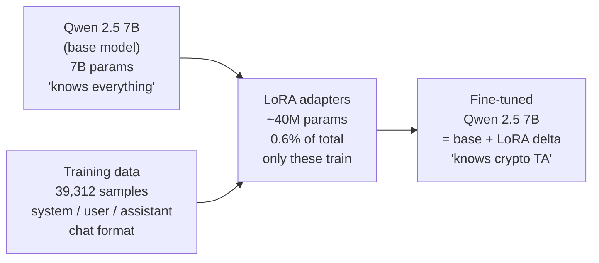
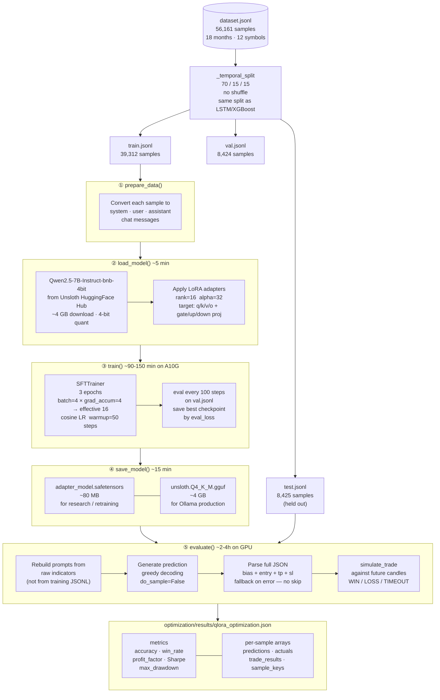
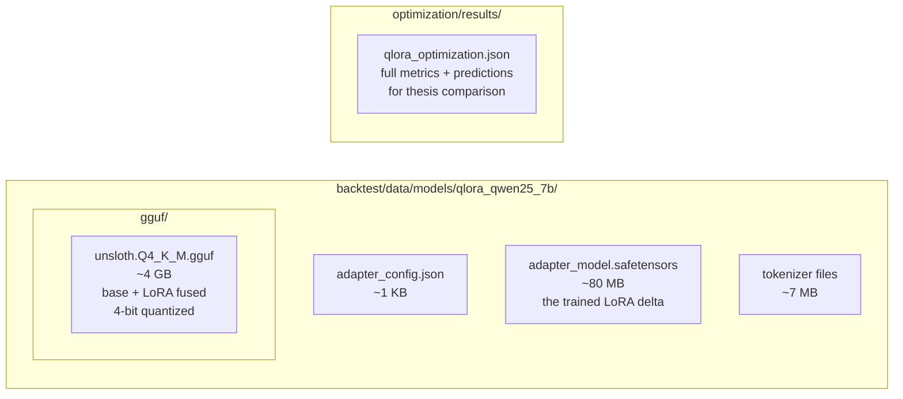
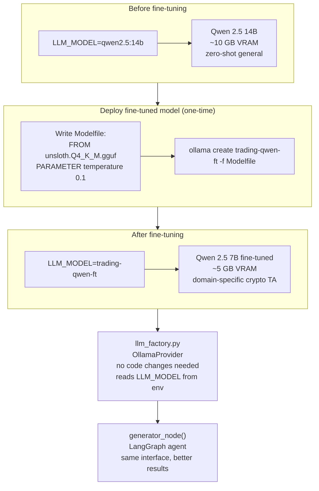
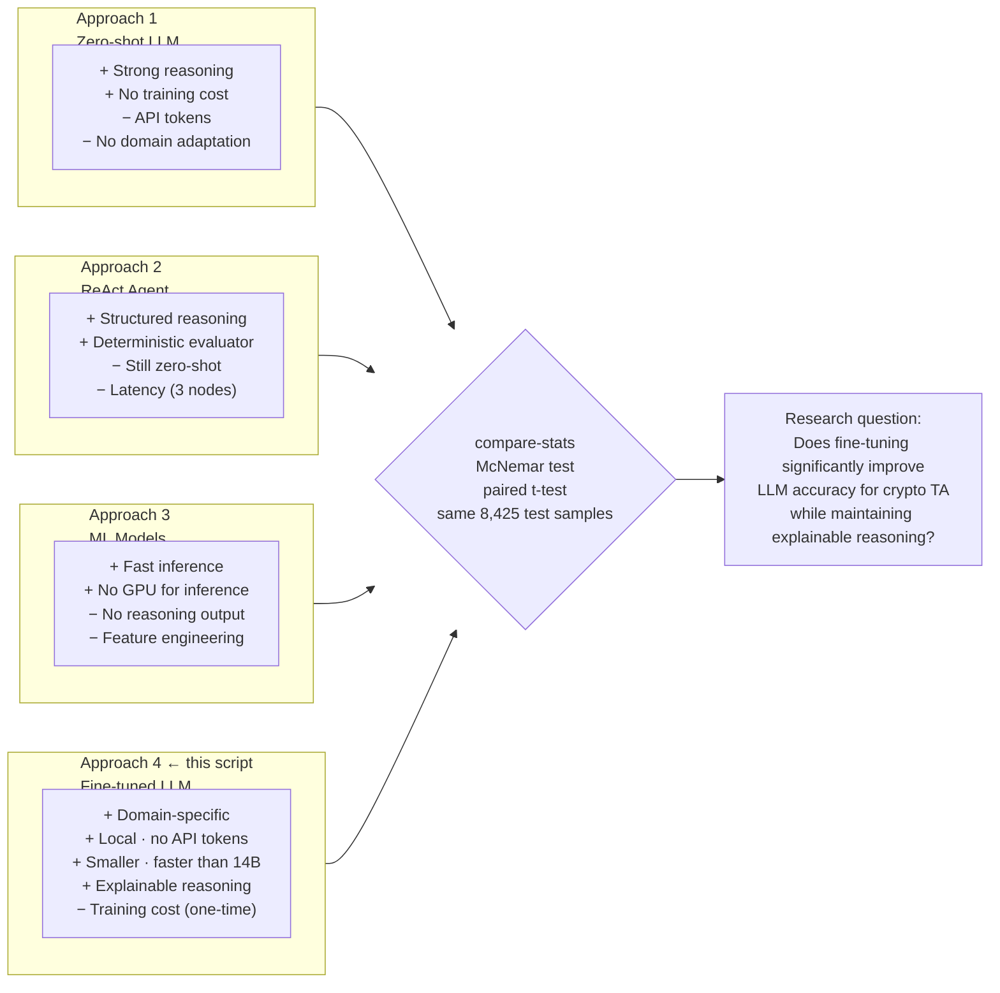
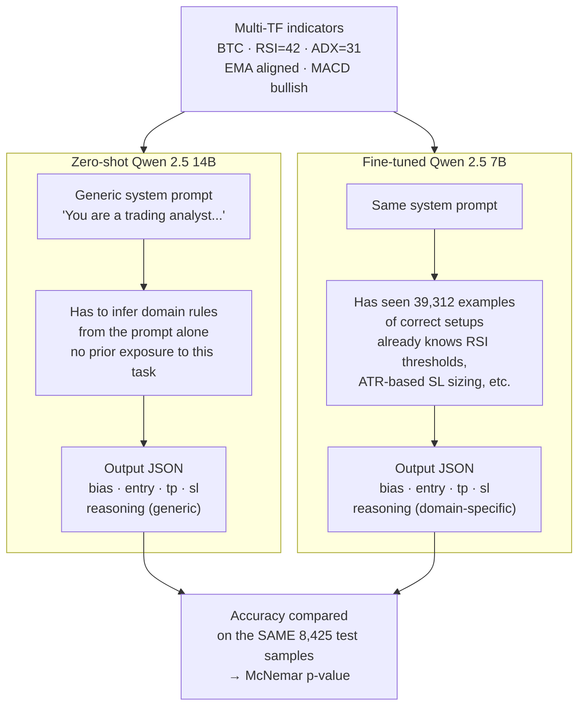

# QLoRA Fine-Tuning — Qwen 2.5 7B

Diagrams explaining what fine-tuning produces, how the pipeline runs, and how the result plugs into production.

> **Operational how-to** (commands, constraints, timing) lives in
> [`.claude/rules/qlora-training.md`](../.claude/rules/qlora-training.md).
> **SageMaker guide** lives in [`optimization/qlora/SAGEMAKER_GUIDE.md`](../langgraph/optimization/qlora/SAGEMAKER_GUIDE.md).
> This file is the **conceptual + status/roadmap** reference.

---

## 0. Where we are now & where we're going (updated 2026-06-10)

### Current state — no usable fine-tuned model yet
- [DONE] **Step-0 crash fixed** (`max_seq_length` 512 → 1024). The bug was deterministic
  (every sample is ~877–933 tokens; Unsloth padding-free batching truncated
  `input_ids` but not `labels`). It cannot recur — if step 0 passes, every later
  step does the identical op on same-shaped data. Committed in `0ae0953`.
- [STALLED] **Last local run stalled at step 92 / 2457** (~46 min in, `--epochs 1`,
  Jun 9 23:23). Only `checkpoint-3` (from the smoke test) is on disk — **no
  trained adapters, no `gguf/`, no `qlora_optimization.json` yet.**
- [SLOW] **Local is the bottleneck, not the code:** RTX 5070 Ti 16 GB forces
  `batch_size=1`, and FlashAttention-2 won't install on Windows (`FA2 = False`,
  eager attention). ~28 s/step → **~15–19 h per epoch.**

### Target — decided
| Decision | Choice | Why |
|----------|--------|-----|
| **Compute** | SageMaker **Notebook instance**, `ml.g6e.xlarge` (L40S 48 GB) | More VRAM → `batch_size=8`; Linux → FA2 works. ~1–2 h/epoch, a few dollars. Same `train_qlora.py` runs in the instance terminal — **no `.ipynb` needed.** |
| **Scope** | **One** best config, **multi-epoch (2–3)** | Fastest path to a thesis-ready fine-tuned LLM. Not a full sweep. |
| **Config** | `lora_rank=16, lora_alpha=32, lr=2e-5, epochs=3, batch_size=8` | The balanced combo from `optimization/configs/qlora.yaml` `recommended_configs`. |

The end product is a single fine-tuned model **evaluated on the same 8,425 test
samples** as LSTM/XGBoost/zero-shot, producing `qlora_optimization.json` for
`compare-stats` (McNemar + paired t-test). See §7.

### Roadmap — step by step

**Phase 0 · Harden the script (before any paid run)**
- [x] **`--resume`** → `trainer.train(resume_from_checkpoint=...)`. Checkpoints
  already save every 250 steps (`save_total_limit=3`, `load_best_model_at_end`);
  the new `--resume` flag finds the latest `checkpoint-N` in `output_dir` and
  continues from it (falls back to a fresh start with a warning if none exists).
  This is the real "don't break mid-run" safety net. Done.

**Phase 1 · SageMaker setup (one-time)**
- [ ] Launch `ml.g6e.xlarge` Notebook instance (set an idle-shutdown lifecycle so it
  can't bill 24/7 if you forget to stop it).
- [ ] `git clone` repo, build a Linux venv, `pip install unsloth` (pulls a *working* FA2).
- [ ] Confirm the startup banner shows **`FA2 = True`** — that's the speedup.

**Phase 2 · Validate on the instance (cheap, ~$0.30)**
- [ ] Smoke: `train_qlora.py --max-steps 3 --max-eval 10` → confirms venv + model load + step 0 passes.
- [ ] Short: `--epochs 1 --batch-size 8` → watch first eval at step 250, confirm a `checkpoint-250/` actually writes and `eval_loss` drops.

**Phase 3 · The real run**
- [ ] `--epochs 3 --batch-size 8` (single best config). ~1–2 h/epoch → **~3–6 h, a few dollars.**
- [ ] If interrupted, re-launch with `--resume` — picks up from the last `checkpoint-N`.

**Phase 4 · Evaluate + integrate**
- [ ] `evaluate()` runs on the held-out test split → `optimization/results/qlora_optimization.json`.
- [ ] `python -m cli compare-stats --a results/qlora_optimization.json --b backtest/data/results/ml-lstm.json`.
- [ ] *(optional)* Deploy the GGUF to Ollama (§6) and point `LLM_MODEL` at it.

### Time / cost at a glance
| Path | Per epoch | 3 epochs | $ | Frees machine? |
|------|-----------|----------|---|----------------|
| Local RTX 5070 Ti | ~15-19 h | ~2 days | "free" | No (ties up PC) |
| **SageMaker g6e.xlarge** | **~1-2 h** | **~3-6 h** | **~$6-12** | **Yes** |

> NOTE: The diagrams below (§4) show the *original* `batch=4 / grad_accum=4 / eval-100 / A10G`
> plan. The **live local** config is `batch=1 / grad_accum=16 / eval-250` (16 GB limit);
> on **g6e** we go back up to `batch=8`. Treat §4 as conceptual flow, not exact values.

---

## 1. How fine-tuning works

A pretrained LLM (Qwen 2.5 7B) already "knows" language, reasoning, and JSON formatting.
But it has never seen our specific task: given multi-TF crypto indicators, output a trade
setup JSON. Fine-tuning = showing it 39,312 correct examples until it learns the mapping.

### What we're training (LoRA adapters)

The model has 7 billion parameters. We **freeze all of them** and inject tiny "adapter"
matrices into each transformer layer:

```
Original layer (frozen):     W = [7B params, untouched]
LoRA adapter (trainable):    dW = A x B   where A is [dim x rank], B is [rank x dim]

Effective weight at inference: W + dW
```

Target modules: `q_proj`, `k_proj`, `v_proj`, `o_proj` (attention) + `gate_proj`,
`up_proj`, `down_proj` (MLP). That's 7 matrices per layer x 28 layers = 196 adapter
pairs. Total trainable: ~40M params (0.6% of 7B).

### What one training step does

1. Take a training example (system/user/assistant chat turn)
2. Feed the entire conversation to the model
3. Model predicts the next token at every position, but loss is ONLY computed on the
   assistant's tokens (the answer we want it to learn)
4. Loss = cross-entropy (how wrong was the prediction vs the actual tokens?)
5. Backpropagate gradient — update ONLY the LoRA adapter matrices (A, B). The 7B base
   weights never change.
6. Repeat x ~2,457 steps/epoch x 3 epochs = ~7,371 total weight updates

### Why 4-bit quantization (the "Q" in QLoRA)

The frozen base weights are stored in 4 bits instead of 16:
- Normal: 7B x 16 bits = ~14 GB VRAM (just the model)
- 4-bit: 7B x 4 bits = ~3.5 GB VRAM (fits on consumer GPUs)
- LoRA adapters still compute in bf16 for gradient accuracy

### What the model learns

| Before (zero-shot) | After (fine-tuned) |
|---------------------|-------------------|
| Inconsistent JSON formatting | Always valid `{"bias", "entry", "tp", "sl", "reasoning"}` |
| Generic stop-loss guesses | SL at entry +/- 1xATR (learned from labels) |
| Can't combine multi-TF signals | Multi-TF alignment drives bias decisions |
| Sometimes hallucinates reasoning | Reasoning matches indicator patterns it's seen |

### The training loop across epochs

- **Epoch 1**: Model sees all 39,312 samples once. Loss drops fast on easy patterns
  (RSI>70 = overbought), then refines subtler ones (multi-TF alignment, ATR sizing).
- **Epoch 2**: Same samples, different order. Refines learned patterns.
- **Epoch 3**: Diminishing returns. Overfitting risk starts. We track eval_loss and
  keep the BEST checkpoint, not the last.

---

## 2. Hyperparameters explained

### Learning rate (lr=2e-5)

How much each gradient update changes the adapter weights.
- Too high (1e-3): weights oscillate, loss spikes, model diverges
- Too low (1e-6): barely learns in 3 epochs, wastes compute
- 2e-5 is the sweet spot for QLoRA on instruction-tuned models

Combined with **cosine schedule**: LR starts at 2e-5, decays smoothly to ~0 by the end
of training. Prevents large updates in late training when the model is already good.

### LoRA rank (rank=16)

The bottleneck dimension of the adapter matrices (A is `[dim x rank]`, B is `[rank x dim]`).
- rank=4: very few trainable params, underfits complex tasks
- rank=16: good balance — 40M params, enough capacity for our JSON task
- rank=64: more capacity but more VRAM, slower, risk of overfitting on 39K samples

Think of it as: "how many independent directions can the adapter adjust the model's
behavior in?" 16 is plenty for a single well-defined task.

### LoRA alpha (alpha=32)

Scaling factor applied to the adapter output: `dW = (alpha/rank) x A x B`.
With alpha=32 and rank=16, the multiplier is 2x. This means the adapter's contribution
is amplified relative to the frozen weights.

Rule of thumb: `alpha = 2 x rank` is a safe default.

### Epochs (epochs=3)

How many times the model sees the full training set.
- 1 epoch: learns the basics, might underfit edge cases
- 3 epochs: good for 39K samples — enough repetition without memorizing
- 5+ epochs: risk of overfitting (model memorizes training data, fails on test)

We mitigate overfitting with `load_best_model_at_end=True` — even if epoch 3 overfits,
we keep the best checkpoint from any point during training.

### Batch size and gradient accumulation

```
effective_batch = batch_size x gradient_accumulation_steps
```

| Setting | batch_size | grad_accum | effective | Where |
|---------|-----------|------------|-----------|-------|
| Local (16GB) | 1 | 16 | 16 | RTX 5070 Ti |
| SageMaker (48GB) | 8 | 2 | 16 | ml.g6e.xlarge |

- **batch_size**: how many samples the GPU processes in parallel per step. Limited by
  VRAM (each 1024-token sample needs ~2-4GB of activations at batch=1).
- **gradient_accumulation**: accumulates gradients over N mini-batches before updating
  weights. Gets the benefits of a large batch without the VRAM cost.
- **effective batch**: larger = smoother gradients, more stable training, but each epoch
  has fewer weight updates.

### Warmup steps (warmup=50)

LR ramps linearly from 0 to 2e-5 over the first 50 steps. Prevents early instability
when the model hasn't calibrated its gradients yet. After warmup, the cosine decay
takes over.

### Weight decay (weight_decay=0.01)

L2 regularization — penalizes large adapter weights slightly. Prevents any single
adapter from dominating. 0.01 is mild and standard for LLM fine-tuning.

### max_seq_length (max_seq_length=1024)

Maximum token length per training example. Our samples are 877-933 tokens. 1024 fits
everything with headroom. Lowering below 1024 truncates examples and causes a crash
(Unsloth padding-free batching bug — truncates input_ids but not labels).

### Seed (seed=42)

Deterministic initialization for LoRA adapters, data shuffling, and dropout. Ensures
reproducible results across runs.

### Sensitivity ranking (what matters most to tune)

| Param | Sensitivity | Notes |
|-------|------------|-------|
| **learning_rate** | HIGH | Most impactful. Too high = diverges, too low = undertrained. |
| **epochs** | MEDIUM | More helps up to a point, then overfits. |
| **lora_rank** | LOW-MEDIUM | 8 vs 16 vs 32 rarely changes accuracy by more than 1-2%. |
| **lora_alpha** | LOW | Usually just set to 2x rank. |
| **batch_size** | NEGLIGIBLE | Affects speed, not quality (if effective batch >= 16). |
| **warmup/weight_decay** | NEGLIGIBLE | Standard values work universally. |

---

## 3. What fine-tuning produces



The base model weights are **frozen** — only the small LoRA matrices are updated.
This is why it fits in 16 GB VRAM and trains in a few hours instead of weeks.

---

## 4. Full pipeline — one script, five steps



---

## 5. Output files



**Only the GGUF goes to production.** The adapters are kept for future retraining rounds.

---

## 6. How the result plugs into production



---

## 7. Why this matters for the thesis



---

## 8. Zero-shot vs fine-tuned — what changes


