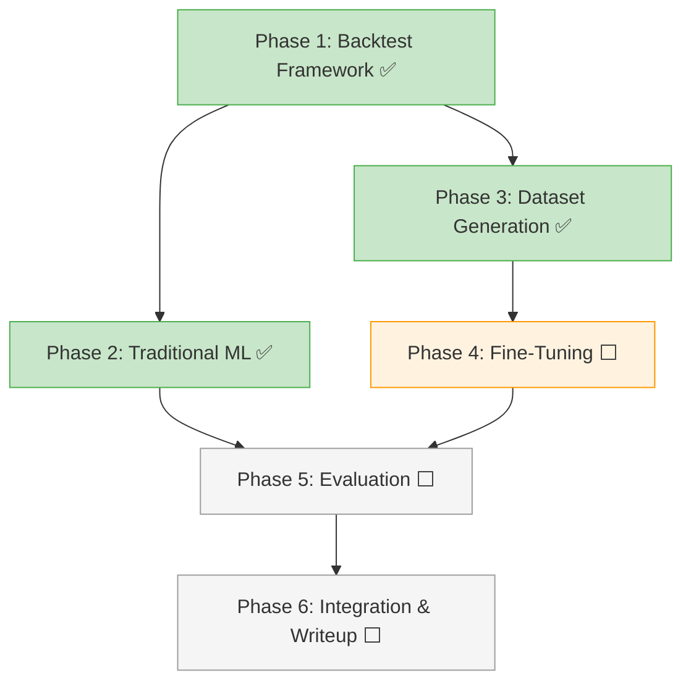

# Action Plan

**Project**: Trading Management System — Maestría en IA Aplicada, Tec de Monterrey
**Author**: Alejandro González Almazán

For context on the 3 approaches being compared, see [three-approaches.md](./three-approaches.md).

---

## Current Progress

```
✅ Phase 1: Backtest Framework          — DONE
✅ Phase 2: Traditional ML Models       — DONE
✅ Phase 3: Dataset Generation          — DONE (17,353 samples)
⬜ Phase 4: Fine-Tuning                 — NEXT
⬜ Phase 5: Evaluation & Comparison
⬜ Phase 6: Integration & Thesis Writeup
```

---

## Phase 1: Backtest Framework ✅

**Goal**: Build the shared evaluation pipeline so any model can be measured fairly.

**Completed**:
- Binance candle downloader with auto-pagination
- Batch indicator calculation (9 indicators via TA-Lib)
- Hindsight labeling with ATR-based thresholds and quality filters
- Trade simulation (TP/SL hit detection, timeout handling)
- Metrics engine (accuracy, win rate, profit factor, Sharpe, drawdown, calibration)
- Comparison tool (side-by-side delta reports)
- CLI with `fetch-candles`, `prepare-dataset`, `run-backtest`, `compare` commands

See [backtest-framework.md](./backtest-framework.md) for full details.

---

## Phase 2: Traditional ML Models ✅

**Goal**: Establish the upper-bound comparison baseline using classic ML.

**Completed**:
- XGBoost classifier — **81.5% accuracy**, 75.1% win rate, 4.89 profit factor
- Random Forest classifier — **79.9% accuracy**, 73.5% win rate, 4.43 profit factor
- LSTM neural network — **81.1% accuracy**, 74.5% win rate, 4.46 profit factor
- CLI `train-ml` command for all three models
- Full backtest on 2,603 test samples for each

---

## Phase 3: Dataset Generation ✅

**Goal**: Generate labeled training data for fine-tuning.

**Completed**:
- 17,353 labeled samples (45.5% LONG, 54.5% SHORT)
- 20 crypto pairs, 6 months of 1h candles
- Temporal split: 12,147 train / 2,603 val / 2,603 test
- Chat-format JSONL export for Together AI fine-tuning
- Zero-shot baseline captured: **41.5% accuracy** on 200 samples

---

## Phase 4: Fine-Tuning ⬜ (NEXT)

**Goal**: Train Qwen 2.5 7B on the labeled dataset.

| # | Task | Est. | Status |
|---|------|------|--------|
| 4.1 | Set up Unsloth environment, verify GPU access | 0.5 day | ⬜ |
| 4.2 | First QLoRA training run (1 epoch, default hyperparams) | 0.5 day | ⬜ |
| 4.3 | Hyperparameter search (lr, LoRA rank, epochs) | 2 days | ⬜ |
| 4.4 | Final QLoRA training + export to GGUF for Ollama | 1 day | ⬜ |
| 4.5 | Upload dataset to Together AI, launch cloud fine-tuning | 0.5 day | ⬜ |
| 4.6 | Monitor Together AI training, iterate if needed | 1–2 days | ⬜ |

**Dependencies**: Phase 3 complete ✅

See [fine-tuning-strategy.md](./fine-tuning-strategy.md) for technical details.

---

## Phase 5: Evaluation & Comparison ⬜

**Goal**: Rigorous comparison of all approaches on the same test set.

| # | Task | Est. | Status |
|---|------|------|--------|
| 5.1 | Run test set through fine-tuned models (QLoRA + Together) | 1 day | ⬜ |
| 5.2 | Classification metrics (accuracy, precision, recall, F1) | 0.5 day | ⬜ |
| 5.3 | Backtest simulation on all predictions | 0.5 day | ⬜ |
| 5.4 | Confidence calibration analysis | 0.5 day | ⬜ |
| 5.5 | Statistical significance tests (McNemar's, paired t-test) | 0.5 day | ⬜ |
| 5.6 | Error analysis — 20 examples where fine-tuned model failed | 1 day | ⬜ |
| 5.7 | Generate all charts (confusion matrix, equity curve, calibration) | 1 day | ⬜ |

**Dependencies**: Phase 4 complete.

---

## Phase 6: Integration & Thesis Writeup ⬜

**Goal**: Deploy best model, document everything, present results.

| # | Task | Est. | Status |
|---|------|------|--------|
| 6.1 | Load best model in Ollama, update production config | 0.5 day | ⬜ |
| 6.2 | A/B comparison in live system | 1 day | ⬜ |
| 6.3 | Record demo video (3–5 min) | 1 day | ⬜ |
| 6.4 | Clean up code, add READMEs | 1 day | ⬜ |
| 6.5 | Write technical report / thesis chapter | 3 days | ⬜ |
| 6.6 | Prepare presentation slides | 1 day | ⬜ |

**Dependencies**: Phase 5 complete.

---

## Dependency Graph



---

## Timeline

```
Weeks 1–2:  Phase 1 — Backtest framework                    ✅ DONE
Week 2:     Phase 2 — Traditional ML models                  ✅ DONE
Week 2–3:   Phase 3 — Dataset generation + baseline capture  ✅ DONE
Week 3–4:   Phase 4 — Fine-tuning (QLoRA + Together AI)      ⬜ NEXT
Week 5:     Phase 5 — Full evaluation                        ⬜
Week 6:     Phase 6 — Integration, demo, documentation       ⬜
Week 7:     Buffer — iteration, polish, presentation prep
```

---

## Risk Mitigation

| Risk | Impact | Mitigation |
|------|--------|------------|
| Overfitting | Good on train, bad on test | Early stopping, validation monitoring, reduce LoRA rank |
| Market regime change | Model trained in one regime fails in another | Diverse training data (6 months covers multiple regimes) |
| Together AI pricing | Budget exceeded | Fireworks AI as backup (same API format) |
| Fine-tuned model worse than base | Negative result | Valid academically — document why and analyze failure modes |
| GPU issues (local training) | Can't train locally | Together AI as primary path |
