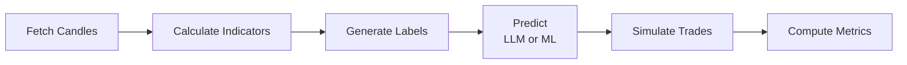

# Backtest Framework

**The shared evaluation pipeline that all 3 approaches use.**

For a high-level overview of the approaches, see [three-approaches.md](./three-approaches.md).

---

## What This Framework Does

Every approach — zero-shot LLM, fine-tuned LLM, and traditional ML — feeds into the same backtest pipeline. This ensures a fair, apples-to-apples comparison.



---

## 1. Data Pipeline

### Fetching Candles

Historical OHLCV (Open, High, Low, Close, Volume) data from Binance's public API. No API key required.

```bash
python -m cli fetch-candles --symbols BTCUSDT,ETHUSDT --interval 1h --months 6
```

This downloads up to 1,000 candles per request, auto-paginating to cover the full time range. Data is saved as JSON in `backtest/data/candles/`.

### Calculating Indicators

Nine technical indicators computed per candle using TA-Lib:

| Indicator | What It Measures |
|-----------|-----------------|
| **Heatmap** | EMA alignment across timeframes (STRONG_BULLISH → STRONG_BEARISH) |
| **Structure** | Market structure (BREAKOUT, UPTREND, DOWNTREND, RANGE) |
| **RSI** | Momentum oscillator (0–100; <30 oversold, >70 overbought) |
| **MACD Histogram** | Trend momentum (positive = bullish, negative = bearish) |
| **ADX** | Trend strength (>25 = trending, <15 = no trend) |
| **Volume Ratio** | Current volume vs 20-period average (>1.5 = high activity) |
| **ATR Ratio** | Current volatility vs 14-period average |
| **BB Position** | Price position within Bollinger Bands (0 = lower, 1 = upper) |
| **ATR Raw** | Absolute ATR value in price units (used for thresholds) |

Requires 200 candles of lookback before the first valid indicator.

```bash
python -m cli prepare-dataset --symbols BTCUSDT,ETHUSDT --interval 1h
```

### Generating Labels (Hindsight Labeling)

For each candle at time T, we look ahead 24 candles to determine what *actually happened*. This creates ground-truth labels that the model tries to predict.

**How it works**:

1. Calculate the ATR-based threshold: `threshold = 1.5 × ATR / entry_price`
2. Measure the maximum upward and downward moves in the next 24 candles
3. If the upward move exceeds the threshold AND is 1.5× larger than the downward move → **LONG**
4. If the downward move exceeds the threshold AND is 1.5× larger than the upward move → **SHORT**
5. Otherwise → **discard** (ambiguous — not included in the dataset)

**Why ATR-based thresholds?** A 1% move on BTC is noise; a 1% move on a low-cap altcoin is significant. ATR adapts to each pair's volatility automatically.

**Why no NEUTRAL class?** Markets are neutral 60–70% of the time. Including NEUTRAL would create massive class imbalance and teach the model to default to "no trade" — the safe but useless answer. Instead, ambiguous candles are simply excluded.

### Quality Filters

Candles are discarded if any of these conditions are true:

| Filter | Threshold | Why |
|--------|-----------|-----|
| Movement too small | < 1.5× ATR | Below this is noise, not a tradeable signal |
| Direction unclear | Up < 1.5× Down (or vice versa) | Ambiguous moves teach nothing useful |
| Low volume | Volume ratio < 0.5 | Low-volume moves are unreliable |
| No trend | ADX < 15 | Random walk — no pattern to learn |
| Bad risk/reward | R:R < 1:1 | Not worth trading even if direction is correct |
| Whipsaw | Direction reverses within 4 candles | False signal that would stop out |

After filtering, the current dataset has **17,353 labeled samples** (45.5% LONG, 54.5% SHORT) from 20 pairs over 6 months.

---

## 2. How Each Approach Uses the Framework

### LLM Backtest (Approaches 1 & 2)

The indicators are formatted as text and sent to the LLM with a prompt asking for a JSON trade setup. The LLM returns `{bias, entry, tp, sl, leverage, reasoning, quality}`. The trade is then simulated against actual future candles.

```bash
# Zero-shot baseline
python -m cli run-backtest --tag baseline --max-samples 200

# Fine-tuned model (after training)
python -m cli run-backtest --provider together --model your-model --tag finetuned
```

### ML Backtest (Approach 3)

The indicators are converted to a flat numerical vector. The ML model outputs only a direction (LONG/SHORT). TP and SL are calculated from ATR after the fact (TP = 2× ATR, SL = 1.5× ATR). The trade is simulated the same way.

```bash
python -m cli train-ml --model xgboost --tag ml-xgboost
python -m cli train-ml --model random_forest --tag ml-rf
python -m cli train-ml --model lstm --tag ml-lstm
```

The `train-ml` command trains the model on the training split and automatically runs the backtest on the test split.

---

## 3. Trade Simulation

For each prediction, the simulator replays future candles to determine the outcome:

1. **Entry** at the predicted price
2. Check each subsequent candle (up to 24):
   - If price hits **TP** first → **WIN** (profit = TP − entry)
   - If price hits **SL** first → **LOSS** (loss = entry − SL)
3. If neither TP nor SL is hit within 24 candles → **TIMEOUT** (close at last candle's price)

For LONG trades, SL is below entry and TP is above. For SHORT trades, the reverse. The simulator checks both high and low of each candle to detect hits.

---

## 4. Metrics

### Classification Metrics

| Metric | Formula | What It Tells You |
|--------|---------|-------------------|
| **Direction Accuracy** | correct / total | How often LONG/SHORT was right |
| **Precision** (per class) | TP / (TP + FP) | When it says LONG, how often is it actually LONG? |
| **Recall** (per class) | TP / (TP + FN) | Of all actual LONGs, how many did it catch? |
| **F1 Score** | 2 × Precision × Recall / (P + R) | Balanced measure of precision and recall |

### Trading Metrics

| Metric | Formula | What's Good |
|--------|---------|-------------|
| **Win Rate** | wins / total trades | > 50% |
| **Profit Factor** | gross profit / gross loss | > 1.5 (>1 = profitable) |
| **Avg Win / Avg Loss** | mean win PnL / mean loss PnL | Win > \|Loss\| |
| **Sharpe Ratio** | mean(returns) / std(returns) × √N | > 1.0 (risk-adjusted return) |
| **Max Drawdown** | largest peak-to-trough equity drop | < 20% (worst losing streak) |

### Confidence Calibration

Bins predictions by confidence level and compares predicted confidence to actual accuracy. A well-calibrated model's "80% confidence" predictions should be correct ~80% of the time.

---

## 5. Comparing Two Runs

```bash
python -m cli compare \
  --baseline backtest/data/results/baseline-groq.json \
  --candidate backtest/data/results/finetuned-v1.json
```

Produces a side-by-side table with deltas and ✅/❌ indicators for every metric. Both runs must use the same dataset for the comparison to be valid.

---

## 6. Dataset Splits

The dataset uses a **temporal split** (not random) to prevent data leakage:

| Split | Portion | Samples | Purpose |
|-------|---------|---------|---------|
| Train | First 70% | 12,147 | Model training (fine-tuned LLM and ML) |
| Validation | Next 15% | 2,603 | Hyperparameter tuning, early stopping |
| Test | Final 15% | 2,603 | Final evaluation (never seen during training) |

Random splits would leak future market patterns into training data through autocorrelated market regimes. Temporal splits prevent this.

---

## 7. CLI Reference

All commands run from the `langgraph/` directory:

```bash
# Download candles
python -m cli fetch-candles --symbols BTCUSDT,ETHUSDT --interval 1h --months 6

# Generate labeled dataset
python -m cli prepare-dataset --symbols BTCUSDT,ETHUSDT --interval 1h

# Run LLM backtest
python -m cli run-backtest --tag my-test --max-samples 100
python -m cli run-backtest --provider deepseek --model deepseek-chat --tag deepseek-baseline

# Train and backtest ML model
python -m cli train-ml --model xgboost --tag ml-xgboost
python -m cli train-ml --model lstm --tag ml-lstm
python -m cli train-ml --model random_forest --tag ml-rf

# Compare two runs
python -m cli compare --baseline results/A.json --candidate results/B.json

# Export training data for fine-tuning (chat-format JSONL)
python -m cli export-training-data
```

---

## 8. File Structure

```
langgraph/backtest/
├── fetch_candles.py            ← Download OHLCV from Binance
├── calculate_indicators.py     ← Batch indicator calculation (TA-Lib)
├── label_data.py               ← Hindsight labeling with quality filters
├── run_backtest.py             ← LLM backtest: send to LLM, simulate trades
├── run_ml_backtest.py          ← ML backtest: train model, simulate trades
├── ml_models.py                ← XGBoost, Random Forest, LSTM implementations
├── export_training_data.py     ← Convert labeled data to chat-format JSONL
├── metrics.py                  ← All metric calculations
├── compare.py                  ← Side-by-side comparison of two runs
├── report.py                   ← Terminal tables + matplotlib charts
├── config.py                   ← Shared configuration
└── data/
    ├── candles/                ← Raw OHLCV JSON files
    ├── labeled/                ← JSONL datasets with indicators + labels
    │   └── training/           ← Train/val/test splits for fine-tuning
    └── results/                ← Backtest output JSON per model run
```

---

## Related Docs

- [The 3 Approaches](./three-approaches.md) — What each approach is and how they compare
- [Fine-Tuning Strategy](./fine-tuning-strategy.md) — Training plan for Approach 2
- [Action Plan](./action-plan.md) — Implementation timeline
