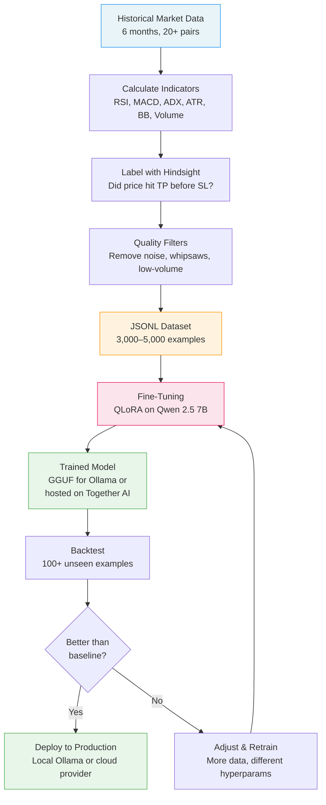
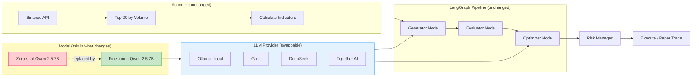

# Fine-Tuning Explainer

**What fine-tuning is, why it works, and what it changes in the trading system.**

For implementation details, see [fine-tuning-strategy.md](./fine-tuning-strategy.md).

---

## 1. What is Fine-Tuning?

Think of it like training a junior analyst. The base LLM (Qwen 2.5 7B) has broad knowledge — it understands language, math, and general reasoning — but it knows nothing specific about reading crypto technical indicators and producing actionable trade setups.

Fine-tuning feeds the model thousands of historical examples: "given these indicators, here's what a good trade setup looks like." After training, the model recognizes patterns it couldn't before — not because we changed the rules, but because we taught it what good analysis looks like in *this specific domain*.

**Key point:** fine-tuning doesn't change which cryptos are analyzed. It changes how good the analysis is.

---

## 2. Why It Works for Any Trading Pair

A common concern: "If you train on BTC and ETH, will it work on SOL or DOGE?"

Yes — because the model learns **technical patterns**, not coin-specific behavior:

- **Indicators are pair-agnostic.** RSI at 30 means oversold whether it's BTC, ETH, or SOL. A bullish MACD crossover is a bullish MACD crossover on any chart.
- **Training on 12+ diverse pairs teaches generalization.** The model sees breakouts on large-caps, mean-reversions on mid-caps, and high-volatility setups on small-caps. It learns the *pattern vocabulary*, not "BTC goes up on Tuesdays."
- **ATR-based thresholds adapt automatically.** A 1% move on BTC is noise; a 1% move on a low-cap alt is significant. The training labels use ATR-relative thresholds, so the model learns proportional reasoning.
- **The production scanner still discovers pairs dynamically.** The top-20-by-volume list changes every cycle. Fine-tuning doesn't lock us into specific pairs — it makes the model better at analyzing *whatever* the scanner finds.

---

## 3. What Exactly Improves?

Fine-tuning targets four measurable dimensions:

### Direction Prediction (LONG / SHORT)
The most important metric. The zero-shot baseline essentially guesses — 36% accuracy on a binary task (worse than a coin flip because it also produces unusable outputs). The target is 55–65%, which is where consistent profitability begins.

### TP/SL Quality
The base model sets take-profit and stop-loss levels that are often unrealistic — TP too far, SL too tight, or both disconnected from actual volatility. Fine-tuned models learn ATR-proportional levels that the market can actually reach.

### Calibrated Confidence
When the base model says "80% confidence," it's right about 36% of the time. After fine-tuning, 80% confidence should mean roughly 80% actual accuracy. This lets the system size positions and filter trades meaningfully.

### Reasoning Quality
Instead of generic statements ("bullish momentum detected"), the fine-tuned model produces reasoning grounded in the actual indicators: "RSI at 28 indicates oversold conditions, confirmed by bullish MACD crossover on 4h with ADX at 32 showing trend strength."

---

## 4. End-to-End Flow

From raw market data to a deployed model:

The critical insight: labels are generated **with hindsight** (we know what price did next), but the model only sees the indicators available **at decision time**. This is how it learns to predict.

---

## 5. What Does NOT Change

Fine-tuning is a **surgical upgrade** — it replaces one component (the LLM weights) without touching the rest of the system:

| Component | Changes? | Why |
|---|---|---|
| **Scanner** | ❌ No | Still discovers top-20 pairs by volume dynamically |
| **Indicator calculation** | ❌ No | Same RSI, MACD, ADX, ATR, Bollinger, volume ratios |
| **Evaluator** | ❌ No | Deterministic code — scores setups by R:R, confluence, risk |
| **Optimizer** | ❌ No | Same corrective layer (uses the same model weights though) |
| **LangGraph pipeline** | ❌ No | Same nodes, same flow, same architecture |
| **Risk management** | ❌ No | Same position sizing, max exposure, portfolio limits |
| **SQLite database** | ❌ No | Backend only — stores trades, orders, audit logs. Not used by LLM or backtest |
| **LLM weights** | ✅ Yes | The only thing that changes — a better "brain" in the same body |

The model is a **swappable component**. Switching from zero-shot to fine-tuned is changing one model name in the provider configuration. The system supports multiple LLM providers (Ollama, Groq, DeepSeek, Together AI) via `llm_factory.py` — the same interface regardless of backend.

---

## 6. Success Metrics

Baseline numbers from the 100-sample Groq backtest (zero-shot Qwen 2.5 7B):

| Metric | Baseline (zero-shot) | Target (fine-tuned) | What it means |
|---|---|---|---|
| **Direction Accuracy** | 36% | >55% | How often LONG/SHORT is correct |
| **Win Rate** | 4% | >50% | Trades that hit TP before SL |
| **Profit Factor** | 0.38 | >1.2 | Gross profit ÷ gross loss (>1 = profitable) |
| **F1 Score** | 0.36 | >0.55 | Balanced accuracy across LONG and SHORT |
| **Avg R:R** | — | >1.5 | Average reward-to-risk on winning trades |
| **Confidence Calibration** | Uncalibrated | ±10% | 80% confidence ≈ 80% actual accuracy |

The baseline is essentially random — 36% on a binary task, 4% win rate, profit factor well below 1. The bar for "meaningful improvement" is clear.

---

## 7. Architecture Diagram

Where fine-tuning fits in the overall system:

The fine-tuned model is a drop-in replacement. The Generator and Optimizer nodes call the LLM through `llm_factory.py`, which supports Ollama (local), Groq, DeepSeek, and Together AI via a unified interface. Everything upstream (scanner, indicators) and downstream (evaluator, risk manager) remains identical.

---

## Summary

Fine-tuning is not magic — it's supervised learning on domain-specific examples. We show the model thousands of "here's what the indicators looked like → here's what a good trade setup was" pairs, and it learns to recognize those patterns on new, unseen data.

The system architecture doesn't change. The trading pairs don't change. The risk management doesn't change. What changes is the quality of the LLM's analysis — from random guessing (36% accuracy) to informed prediction (target 55–65%).
