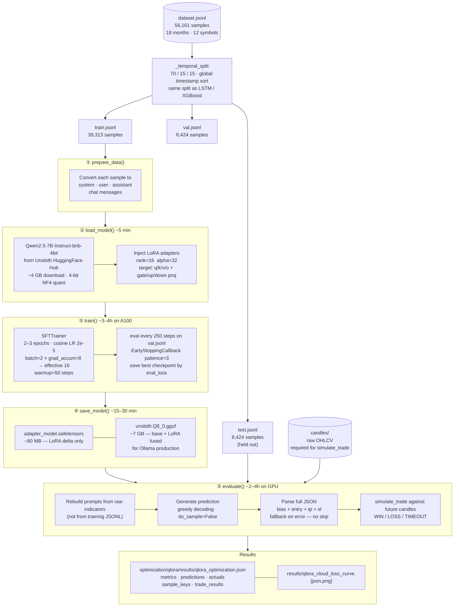
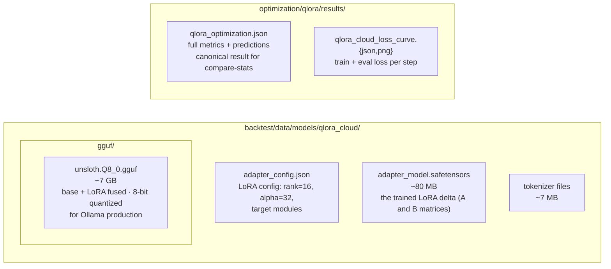
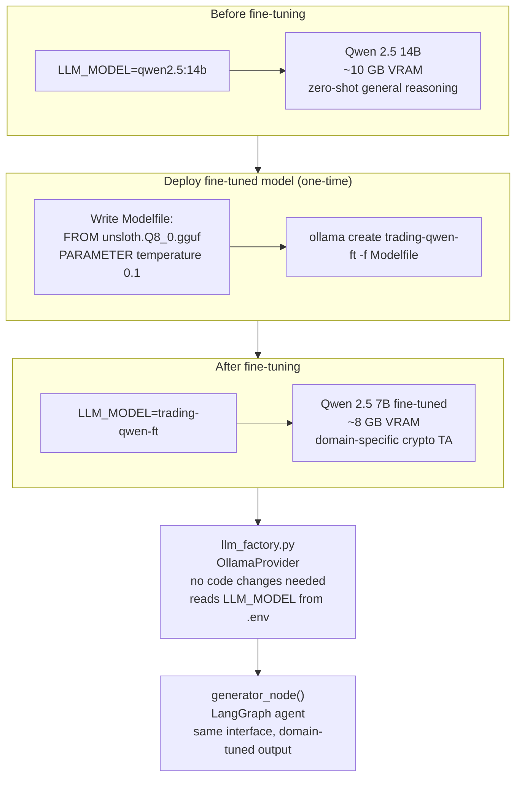
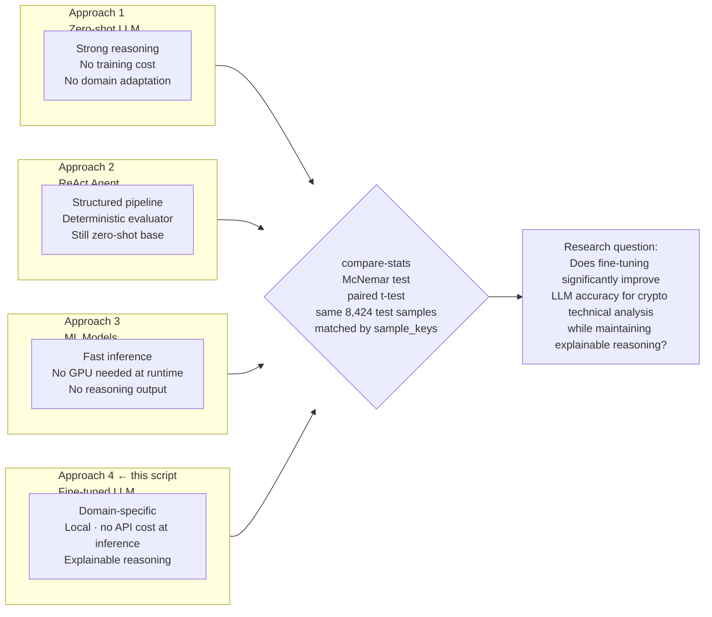

# QLoRA Fine-Tuning — Qwen 2.5 7B

Reference for the fine-tuning run: current status, decided configuration,
hyperparameter explanations, hard constraints, pipeline diagrams, and the
step-by-step runbook.

---

## Current Status (2026-06-13)

**No usable fine-tuned model exists yet.**

The prior config-1 result (92% accuracy) is **invalid** and archived:

| Problem | Detail |
|---------|--------|
| Contaminated split | `_temporal_split` cut by file position, not timestamp — a per-symbol split, not a true time holdout |
| Single-symbol evaluation | `--max-eval 2000` restricted the test set to ~2,000 LINKUSDT rows, not the full 8,425-sample temporal test |
| Financial metrics zero | `candles/` was not pulled via DVC, so `simulate_trade()` had no data; win rate, profit factor, and Sharpe were all 0 |

Invalid results archived at: `optimization/qlora/results/archive/`

**What is fixed now:**
- `_temporal_split` sorts all samples globally by timestamp and applies a 24h embargo at each boundary (see `../ml/DATA_PIPELINE.md §4`)
- `train_qlora.py` emits: real `EarlyStoppingCallback` (patience=3), train/val/test accuracy + gap, heuristic baseline, and a persisted loss curve (`<tag>_loss_curve.{json,png}`)
- `run_cloud.sh` uses no `--max-eval`, so evaluation covers the full temporal test split

**Goal:** one defensible model evaluated on the same ~8,424-sample temporal test
as LSTM and XGBoost, producing `qlora_optimization.json` for paired McNemar /
t-test comparison.

---

## Decided Configuration

Single run — no hyperparameter sweep.

| Hyperparameter | Cloud (RunPod / SageMaker) | Local (RTX 5070 Ti) |
|---------------|--------------------------|---------------------|
| `lora_rank` | 16 | 8 |
| `lora_alpha` | 32 | 16 |
| `lr` | 2e-5 | 5e-5 |
| `epochs` | 3 (cloud) / 2 (RunPod) | 1 |
| `batch_size` | 2 | 1 |
| `grad_accum` | 8 | 16 |
| Effective batch | 16 | 16 |
| `max_seq_length` | 1024 | 1024 |
| `warmup_steps` | 50 | 50 |
| `weight_decay` | 0.01 | 0.01 |
| `seed` | 42 | 42 |

The old 3-/5-config sweep was dropped — the thesis needs one defensible model.

---

## Hyperparameter Reference

### Learning rate — `lr = 2e-5`

Controls how much each gradient step moves the adapter weights. Too high (1e-3)
and the loss spikes and diverges; too low (1e-6) and the model barely learns in
three epochs. 2e-5 is the established sweet spot for QLoRA on instruction-tuned
models. Combined with a **cosine schedule**: LR starts at 2e-5 after a 50-step
warmup and decays smoothly to ~0 at the end of training, preventing large
destabilizing updates once the model is nearly converged.

*Sensitivity: HIGH — the single most impactful hyperparameter.*

---

### LoRA rank — `rank = 16`

The bottleneck dimension of the adapter matrices. Each adapter pair is two
matrices A: `[dim × rank]` and B: `[rank × dim]`; their product `A×B` is the
weight correction. rank=16 yields ~40M trainable parameters — enough capacity
for a well-defined single task (JSON output from structured indicators) without
risking overfitting on 39K samples.

```
rank = 4  → underfits, misses subtler indicator relationships
rank = 16 → good balance for this task size
rank = 64 → more VRAM, slower, marginal gain over 16 for 39K samples
```

*Sensitivity: LOW-MEDIUM — 8 vs 16 vs 32 rarely changes accuracy by more than 1–2%.*

---

### LoRA alpha — `alpha = 32`

Scaling factor on the adapter output: `ΔW = (alpha / rank) × A × B`. With
alpha=32 and rank=16, the multiplier is 2×. This amplifies the adapter's
influence relative to the frozen base weights. The standard rule of thumb is
`alpha = 2 × rank`.

*Sensitivity: LOW — standard values work universally; leave at 2× rank.*

---

### Epochs — `epochs = 3`

The number of complete passes over the 39,313 training samples. One epoch
≈ 2,452 steps at effective batch 16.

```
1 epoch → learns basic patterns (RSI thresholds, output JSON schema)
3 epochs → refines subtler patterns (multi-TF alignment, ATR-based SL sizing)
5+ epochs → overfitting risk; eval_loss starts rising
```

`EarlyStoppingCallback(patience=3)` stops if `eval_loss` fails to improve for
3 consecutive evaluations, so a 3-epoch run may end early.
`load_best_model_at_end=True` keeps the checkpoint with lowest `eval_loss`, not
the final one.

*Sensitivity: MEDIUM — more helps up to a point, then hurts.*

---

### Batch size and gradient accumulation

```
effective_batch = batch_size × gradient_accumulation_steps
```

`batch_size` sets how many 1024-token samples the GPU processes in parallel —
limited by VRAM (each sample needs ~2–4 GB of activations at batch=1).
`grad_accum` accumulates gradients over N mini-batches before updating weights,
giving the benefit of a larger effective batch without the VRAM cost.

Both configs above target effective batch = 16.

*Sensitivity: NEGLIGIBLE for quality — affects speed, not accuracy (if effective batch ≥ 16).*

---

### Warmup steps — `warmup = 50`

LR ramps linearly from 0 → 2e-5 over the first 50 steps, preventing large
destabilizing updates before the optimizer has estimated gradient statistics.
After step 50, the cosine decay takes over.

---

### Weight decay — `weight_decay = 0.01`

Mild L2 regularization on the adapter weights. Prevents any single adapter
element from growing very large and dominating the output. 0.01 is the standard
default for LLM fine-tuning.

---

### max_seq_length — `max_seq_length = 1024`

Every chat example in this project is 877–933 tokens (prompt alone ≈ 820 tokens).
`max_seq_length` must be ≥ 1024. Setting it lower causes a crash at step 0:
Unsloth's padding-free batching truncates `input_ids` but not `labels`, creating
a shape mismatch in the fused cross-entropy loss. This is a hard constraint, not
a tunable parameter.

---

### Seed — `seed = 42`

Fixed seed for LoRA adapter initialization, data shuffling order, and dropout.
Ensures the run is reproducible.

---

### Sensitivity summary

| Parameter | Sensitivity | Notes |
|-----------|------------|-------|
| `learning_rate` | HIGH | Most impactful; diverges if too high, undertrained if too low |
| `epochs` | MEDIUM | Overfits past ~5 epochs for this dataset size |
| `lora_rank` | LOW-MEDIUM | Rarely changes accuracy by more than 1–2% |
| `lora_alpha` | LOW | Set to 2× rank and leave it |
| `batch_size` | NEGLIGIBLE | Affects speed; quality depends on effective batch, not batch alone |
| `warmup / weight_decay` | NEGLIGIBLE | Standard values work universally |

---

## Hard Constraints

Constraints learned from failed runs. Violating any of these causes a crash or
silently produces wrong results.

| Constraint | Why |
|-----------|-----|
| `max_seq_length` ≥ 1024 | Samples are 877–933 tokens; Unsloth padding-free batching crashes at step 0 if truncation occurs |
| `batch_size` ≤ 2 on L40S / A100 | batch=4 OOMs during the backward pass at 1024-token sequences |
| `per_device_eval_batch_size = 1` | HuggingFace default of 8 OOMs on 900-token eval samples |
| No `--max-eval` on real runs | Caps the test set to ~2,000 samples of one symbol (LINK); use it only for smoke tests |
| `dvc pull candles` before eval | Without `candles/`, `simulate_trade()` returns no results; win rate, profit factor, and Sharpe are all 0 |
| No `--system-site-packages` in venv | SageMaker's base environment has TensorFlow / Keras 3 which conflicts with transformers |
| `FlashAttention-2` pre-installed on `unsloth/unsloth:latest` | Do not rebuild; the image ships FA2 2.8.3. On bare torch images, FA2 requires `FLASH_ATTENTION_FORCE_BUILD=TRUE` |
| Never cut split by file position | `dataset.jsonl` is grouped by symbol; a positional cut is a per-symbol split that leaks market regime |
| Check `nvidia-smi` before launch | Zombie processes from failed runs can hold 35 GB of VRAM; kill them before starting |
| `--resume` for crash recovery | Checkpoints save every 250 steps (`save_total_limit=3`); re-launch with `--resume` to pick up from the last `checkpoint-N` |

---

## Full Pipeline — One Script, Five Steps



---

## Output Files



Only the GGUF goes to production. The adapters are kept for future retraining.

---

## Production Deployment



---

## Thesis Comparison



All four approaches share the same temporal test split via `_temporal_split`.
Results are aligned by `sample_keys` so McNemar and t-test are genuinely paired.

---

## Runbook

```bash
# ── Step 1: Pull data (required before any eval run) ──────────────────────────
dvc pull backtest/data/labeled/dataset.jsonl backtest/data/candles

# ── Step 2: Smoke test (confirms venv + model load + step 0 pass, ~2 min) ─────
python3 optimization/qlora/train_qlora.py --max-steps 3 --max-eval 10

# ── Step 3: Full training run ──────────────────────────────────────────────────
# Check for zombie processes first
nvidia-smi

# Launch (nohup keeps it alive after SSH disconnect)
nohup bash optimization/qlora/run_cloud.sh \
  > optimization/qlora/logs/run_cloud.log 2>&1 &
echo "PID: $!"

# ── Step 4: Monitor ────────────────────────────────────────────────────────────
python3 optimization/qlora/monitor_training.py --watch
tail -f optimization/qlora/logs/run_cloud.log

# ── Step 5: If interrupted, resume from last checkpoint ───────────────────────
nohup bash optimization/qlora/run_cloud.sh --resume \
  > optimization/qlora/logs/run_cloud.log 2>&1 &

# ── Step 6: Back up to S3 ─────────────────────────────────────────────────────
aws s3 cp --recursive backtest/data/models/qlora_cloud/ \
  s3://trading-management-dvc/models/qlora_cloud/

# ── Step 7: Statistical comparison ───────────────────────────────────────────
python -m cli compare-stats \
  --a optimization/qlora/results/qlora_optimization.json \
  --b backtest/data/results/ml-lstm.json

# ── Step 8: (Optional) Deploy to Ollama ──────────────────────────────────────
ollama create trading-qwen-ft \
  -f backtest/data/models/qlora_cloud/Modelfile
# Then set LLM_MODEL=trading-qwen-ft in .env
```

---

## Cost and Time Reference

| GPU | VRAM | FA2 | batch_size | s/step | Epochs | Total time | Cost |
|-----|------|-----|-----------|--------|--------|-----------|------|
| RTX 5070 Ti (local) | 16 GB | No (Windows) | 1 | ~28s | 1 | ~15–19h | "free" (ties up PC) |
| **RunPod A100 80GB** | **80 GB** | **Yes** | **8** | **~1.5–2s** | **2** | **~3–4h** | **~$5** |
| SageMaker ml.g6e.xlarge | 48 GB | Yes | 2 | ~3.7s | 3 | ~5–7h | ~$10–14 |

RunPod with the `unsloth/unsloth:latest` image is the recommended path: FA2 is
pre-installed, no venv setup needed (`/opt/venv` is pre-activated), and the A100
80GB eliminates OOM risk at any batch size.

---

## Files Referenced

| File | Role |
|------|------|
| `optimization/qlora/train_qlora.py` | Main training + evaluation script |
| `optimization/qlora/run_cloud.sh` | Single cloud run on the fixed split (no `--max-eval`) |
| `optimization/qlora/run_local.sh` | Single local run (RTX 5070 Ti), optional |
| `optimization/qlora/setup_unsloth_pod.sh` | RunPod setup for `unsloth/unsloth:latest` image |
| `optimization/qlora/monitor_training.py` | Live progress table from `run_cloud.log` |
| `optimization/qlora/RUNPOD_GUIDE.md` | Full RunPod walkthrough + cost analysis |
| `optimization/qlora/results/qlora_optimization.json` | Canonical result file for `compare-stats` |
| `optimization/qlora/results/archive/` | Invalid old sweep results — do not cite |
| `backtest/data/models/qlora_cloud/` | Adapters + GGUF (DVC-tracked) |
| `backtest/models/features.py` | `_temporal_split` — shared split used by all models |
| `agent/prompts.py` | System + user prompt templates (shared with training) |
| `backtest/export.py` | Converts `dataset.jsonl` → chat-format JSONL |
