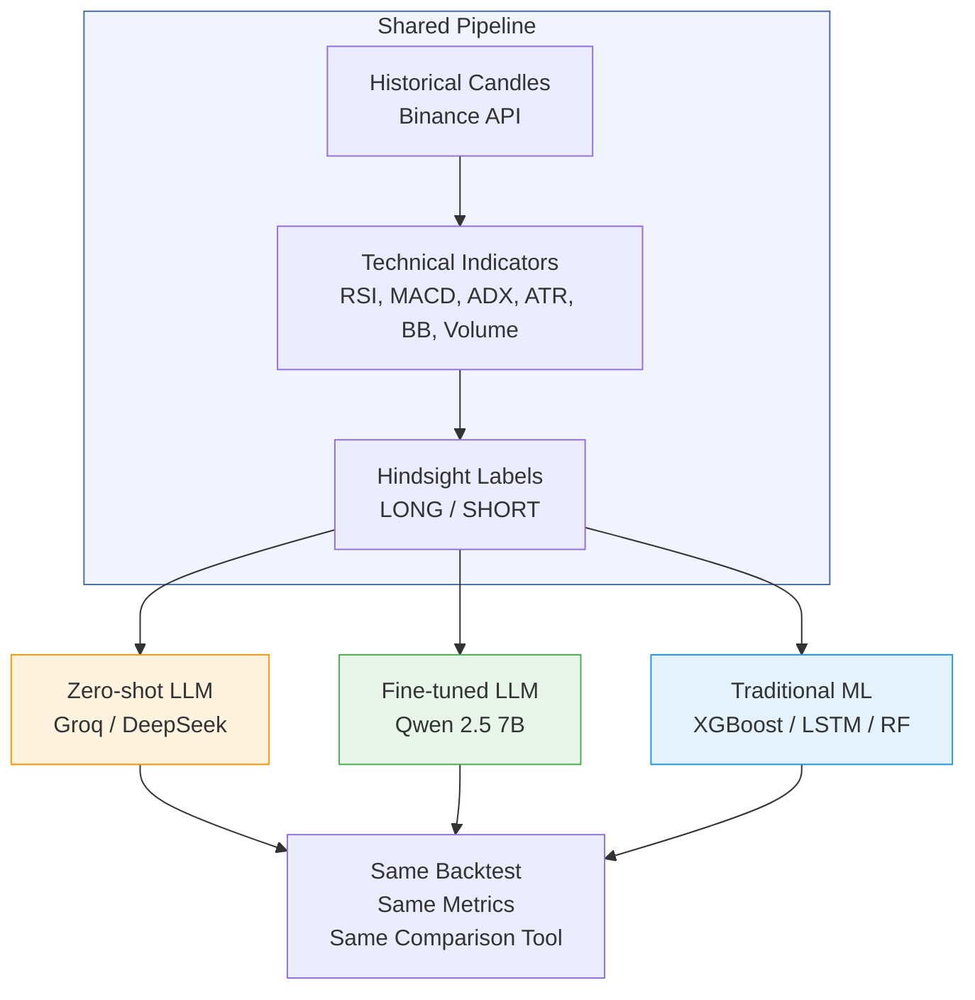

# The 3 Approaches to Crypto Trading Prediction

**Project**: Trading Management System — Maestría en IA Aplicada, Tec de Monterrey
**Author**: Alejandro González Almazán

---

## Overview

This project compares three fundamentally different approaches to predicting crypto trade direction (LONG or SHORT). All three use the **same data, same indicators, same labels, and same backtest framework** — the only thing that changes is the prediction engine.



---

## Approach 1: Zero-shot LLM (Baseline)

**What it is**: A general-purpose large language model that reads technical indicators as text and writes a trade setup as JSON. No training on trading data — just prompt engineering.

**How it works**: The LLM receives a prompt like "You are a Senior Technical Analyst" along with the current indicators (RSI, MACD, ADX, etc.) formatted as text. It responds with a JSON object containing direction (LONG/SHORT), entry price, take-profit, stop-loss, leverage, and a reasoning sentence.

**Strengths**:
- Generates human-readable reasoning explaining *why* it chose a direction
- Produces specific TP/SL price levels (not just direction)
- Flexible — works with any LLM provider (Groq, DeepSeek, Together AI, OpenAI)
- No training required — immediate results

**Weakness**: 41.5% accuracy on a binary task (LONG/SHORT) — worse than a coin flip. The model has broad knowledge but no trading-specific pattern recognition.

**How to run**:
```bash
cd langgraph
python -m cli run-backtest --tag baseline --max-samples 200
```

---

## Approach 2: Fine-tuned LLM (The Thesis Experiment)

**What it is**: Take the same type of LLM (Qwen 2.5 7B), but train it on 12,147 historical examples where we know the correct answer. The model learns to recognize indicator patterns that precede profitable trades.

**How it works**: QLoRA fine-tuning adjusts ~0.5% of the model's weights using labeled training data. The input/output format is identical to the zero-shot approach (text in, JSON out), but the model has internalized thousands of "when indicators look like X, the market tends to do Y" patterns.

**Key difference from traditional ML**: The fine-tuned LLM still generates reasoning and specific TP/SL levels — it's not just a direction classifier. It explains its decisions in natural language.

**Target accuracy**: 55–65%. The research question is whether fine-tuning can close the gap with traditional ML while retaining the LLM's ability to generate reasoning and trade parameters.

**Status**: Dataset ready (12,147 training examples, 2,603 validation, 2,603 test). Training not yet started.

**How to run** (after training):
```bash
cd langgraph
python -m cli run-backtest \
  --provider together --model your-finetuned-model-id \
  --tag finetuned-v1
```

For full details on the training plan, see [fine-tuning-strategy.md](./fine-tuning-strategy.md).

---

## Approach 3: Traditional ML (Comparison Baseline)

**What it is**: Classic machine learning models — XGBoost, Random Forest, and LSTM — trained from scratch on the same labeled dataset. These take numbers in and output a direction.

**How it works**: The indicator values (RSI, MACD histogram, ADX, volume ratio, etc.) are converted into a flat numerical vector. A classifier is trained to predict LONG or SHORT. No text, no prompts, no reasoning — pure pattern matching on numbers.

**Models tested**:
- **XGBoost**: Gradient-boosted decision trees — 81.5% accuracy
- **LSTM**: Recurrent neural network with memory — 81.1% accuracy
- **Random Forest**: Ensemble of decision trees — 79.9% accuracy

**Strengths**: Fast, accurate, well-understood, reproducible.

**Weakness**: No reasoning output (it can't explain *why*). No TP/SL generation — those are calculated from ATR after the fact. Essentially a black box.

**How to run**:
```bash
cd langgraph
python -m cli train-ml --model xgboost --tag ml-xgboost
python -m cli train-ml --model random_forest --tag ml-rf
python -m cli train-ml --model lstm --tag ml-lstm
```

---

## Results Comparison

All models evaluated on the same 2,603-sample test set (temporal split — the model never saw this data during training).

| Model | Accuracy | Win Rate | Profit Factor | Sharpe | Max DD | Generates Reasoning? | Generates TP/SL? |
|-------|----------|----------|---------------|--------|--------|---------------------|-----------------|
| Zero-shot LLM | 41.5% | 11.5% | 1.91 | 2.47 | 16.6% | ✅ Yes | ✅ Yes |
| Fine-tuned LLM | TBD | TBD | TBD | TBD | TBD | ✅ Yes | ✅ Yes |
| XGBoost | 81.5% | 75.1% | 4.89 | 14.69 | 35.2% | ❌ No | ❌ No (ATR-based) |
| LSTM | 81.1% | 74.5% | 4.46 | 13.82 | 31.5% | ❌ No | ❌ No (ATR-based) |
| Random Forest | 79.9% | 73.5% | 4.43 | 13.69 | 35.2% | ❌ No | ❌ No (ATR-based) |

**Notes**:
- The zero-shot LLM's high Sharpe ratio (2.47) despite low accuracy comes from its TP/SL levels — when it wins, it wins big. But it only wins 11.5% of the time.
- Traditional ML models have higher max drawdown because they trade on every sample (2,603 trades vs 200 for the LLM baseline).
- The zero-shot baseline was run on 200 samples due to API rate limits; ML models ran on the full 2,603 test set.

---

## The Research Question

> **Can a fine-tuned LLM close the accuracy gap with traditional ML while retaining the ability to generate reasoning and trade parameters?**

Traditional ML wins on raw accuracy (81.5% vs 41.5%), but it's a black box that only outputs direction. An LLM that achieves 55–65% accuracy while also explaining its reasoning and generating specific TP/SL levels would be more useful in practice — traders want to understand *why* a signal was generated, not just *what* direction.

The fine-tuned LLM doesn't need to beat XGBoost. It needs to demonstrate that domain-specific training meaningfully improves LLM prediction quality (from ~41% toward 55–65%) while preserving the qualitative advantages that make LLMs uniquely useful for trading analysis.

---

## How They Connect

All three approaches share the same infrastructure:

1. **Same data**: Historical candles from Binance (20 pairs, 6 months, 1h interval)
2. **Same indicators**: RSI, MACD, ADX, ATR, Bollinger Bands, volume ratio, EMA heatmap, market structure
3. **Same labels**: Hindsight labeling with ATR-based thresholds (see [backtest-framework.md](./backtest-framework.md))
4. **Same backtest**: Trade simulation with TP/SL hit detection, same metrics
5. **Same comparison tool**: `python -m cli compare --baseline X --candidate Y`

The only variable is the prediction engine. This makes the comparison fair and scientifically valid.

---

## Related Docs

- [Backtest Framework](./backtest-framework.md) — The shared pipeline: data, labels, simulation, metrics
- [Fine-Tuning Strategy](./fine-tuning-strategy.md) — Technical plan for Approach 2
- [Action Plan](./action-plan.md) — Implementation timeline and current progress
