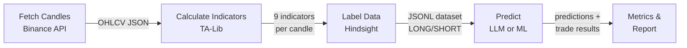

# Backtest Module

> For a high-level overview of the 4 approaches (zero-shot LLM, fine-tuned LLM, traditional ML), see [docs/three-approaches.md](../../docs/three-approaches.md).

Evaluates trading signal quality by replaying historical data and comparing predictions against hindsight-labeled ground truth.

## Pipeline



## Quick Start

```bash
cd langgraph
conda activate trading

# 1. Fetch 18 months of candles for 5 timeframes
python -m cli fetch-candles --symbols BTCUSDT,ETHUSDT --months 18 --timeframes "15m,1h,4h,1d,1w"

# 2. Calculate indicators + generate labeled dataset
python -m cli prepare-dataset --symbols BTCUSDT,ETHUSDT --timeframes "15m,1h,4h,1d,1w"

# 3. Run LLM backtest (zero-shot baseline)
python -m cli run-backtest --dataset data/labeled/dataset.jsonl --provider mock --tag baseline

# 4. Train and backtest ML model
python -m cli train-ml --model xgboost --dataset data/labeled/dataset.jsonl --serialize

# 5. Export training data for fine-tuning
python -m cli export-training-data --dataset data/labeled/dataset.jsonl --output training_data/

# 6. Compare two runs
python -m cli compare \
  --baseline backtest/data/results/baseline.json \
  --candidate backtest/data/results/ml-xgboost.json
```

## Package Structure

```
backtest/
├── config.py              # Symbols, timeframes, default settings
├── pipeline.py            # DataPipeline class — orchestrates the full data flow
├── export.py              # Fine-tuning data export (chat-format JSONL)
│
├── ingestion/             # Data acquisition and preparation
│   ├── fetcher.py         # Binance candle download (async, concurrent TFs, retry)
│   ├── indicators.py      # TA-Lib batch calculation + multi-TF alignment
│   └── labeler.py         # Hindsight labeling with quality/whipsaw/drawdown filters
│
├── models/                # ML model implementations
│   ├── features.py        # Feature extraction + shared dataset utilities
│   ├── sklearn_models.py  # XGBoostPredictor, RandomForestPredictor
│   └── lstm.py            # LSTMPredictor (sequence model, early stopping)
│
└── evaluation/            # Backtesting and analysis
    ├── runner.py           # LLMBacktestRunner, MLBacktestRunner
    ├── simulate.py         # _parse_prediction(), simulate_trade()
    ├── metrics.py          # Accuracy, win rate, Sharpe, drawdown, calibration
    ├── compare.py          # Side-by-side comparison of two result files
    └── report.py           # Terminal tables + matplotlib equity curves
```

## Programmatic Usage

```python
from backtest.pipeline import DataPipeline
from backtest.evaluation.runner import LLMBacktestRunner, MLBacktestRunner
import asyncio

# Fetch + label in one call
pipe = DataPipeline(symbols=["BTCUSDT"], timeframes=["15m", "1h", "4h", "1d"])
pipe.run()

# LLM backtest
runner = LLMBacktestRunner(dataset_path="data/labeled/dataset.jsonl", provider="groq", tag="zero-shot")
result = asyncio.run(runner.run())

# ML backtest (trains + evaluates on test split)
runner = MLBacktestRunner(dataset_path="data/labeled/dataset.jsonl", model_type="lstm", serialize=True)
result = runner.run()
```

## Data Directories

```
backtest/data/
├── candles/          # Raw OHLCV JSON files (e.g. BTCUSDT_1h.json)
├── labeled/          # JSONL datasets with indicators + LONG/SHORT labels
│   └── training/     # Train/val/test splits for fine-tuning (temporal split)
├── models/           # Serialized trained models
└── results/          # Backtest output JSON per model run
```

## Configuration

Copy `.env.example` to `.env` and set your provider:

```bash
LLM_PROVIDER=groq
LLM_MODEL=llama-3.3-70b-versatile
GROQ_API_KEY=gsk_...
```

The `mock` provider returns random predictions — useful for testing the pipeline without API calls.

## Feature Vector

Each sample is encoded as a flat vector of size `n_timeframes × 9 + 3`:
- **9 features per TF**: price, rsi, macd_hist, adx, volume_ratio, atr_ratio, bb_pos, heatmap (encoded), structure (encoded)
- **3 cross-TF features**: bullish TF count, RSI divergence across TFs, volume spread across TFs

The TF order is inferred from the dataset and stored with each serialized model so train/inference vectors are always consistent.
