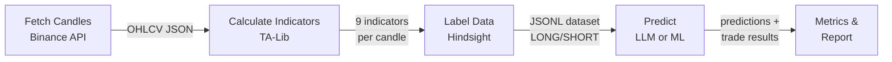

# Backtest Module

> For a high-level overview of the 3 approaches (zero-shot LLM, fine-tuned LLM, traditional ML), see [docs/three-approaches.md](../../docs/three-approaches.md).
> For the full framework documentation, see [docs/backtest-framework.md](../../docs/backtest-framework.md).

Evaluates trading signal quality by replaying historical data and comparing predictions against hindsight-labeled ground truth.

## Pipeline



## Quick Start

```bash
cd langgraph

# 1. Fetch 6 months of hourly candles
python -m cli fetch-candles --symbols BTCUSDT,ETHUSDT --interval 1h --months 6

# 2. Calculate indicators + generate labeled dataset
python -m cli prepare-dataset --symbols BTCUSDT,ETHUSDT --interval 1h

# 3. Run LLM backtest (zero-shot baseline)
python -m cli run-backtest --tag baseline --max-samples 100

# 4. Train and backtest ML model
python -m cli train-ml --model xgboost --tag ml-xgboost

# 5. Export training data for fine-tuning
python -m cli export-training-data

# 6. Compare two runs
python -m cli compare \
  --baseline backtest/data/results/baseline.json \
  --candidate backtest/data/results/ml-xgboost.json
```

## Module Reference

| File | Purpose |
|------|---------|
| `fetch_candles.py` | Downloads OHLCV candles from Binance with auto-pagination |
| `calculate_indicators.py` | Batch indicator calculation (EMA, RSI, MACD, ADX, ATR, BB) |
| `label_data.py` | Hindsight labeling with quality/whipsaw/drawdown filters |
| `run_backtest.py` | LLM backtest: send indicators to LLM, parse JSON, simulate trades |
| `run_ml_backtest.py` | ML backtest: train model on training split, evaluate on test split |
| `ml_models.py` | XGBoost, Random Forest, LSTM implementations |
| `export_training_data.py` | Convert labeled data to chat-format JSONL for fine-tuning |
| `metrics.py` | Accuracy, win rate, profit factor, Sharpe, drawdown, calibration |
| `compare.py` | Side-by-side comparison of two result files |
| `report.py` | Terminal tables + matplotlib equity curves |
| `config.py` | Shared configuration |

## Data Directories

```
backtest/data/
├── candles/          # Raw OHLCV JSON files (e.g. BTCUSDT_1h.json)
├── labeled/          # JSONL datasets with indicators + LONG/SHORT labels
│   └── training/     # Train/val/test splits (temporal, not random)
└── results/          # Backtest output JSON per model run
```

## Configuration

Copy `.env.example` to `.env` and set your provider:

```bash
LLM_PROVIDER=groq
LLM_MODEL=llama-3.3-70b-versatile
GROQ_API_KEY=gsk_...
```

The `mock` provider returns random predictions — useful for testing the pipeline without API calls.
