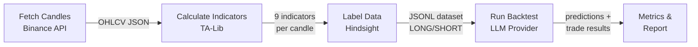
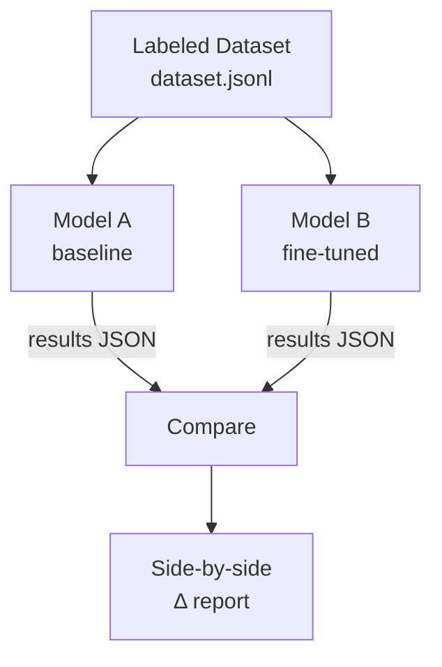

# Backtest Module

Evaluates LLM trading signal quality by replaying historical data and comparing predictions against hindsight-labeled ground truth. The primary use case is measuring whether a fine-tuned model outperforms the baseline.

## Pipeline



**Step 1 — Fetch Candles**: Downloads historical OHLCV data from Binance, auto-paginating in 1000-candle chunks.

**Step 2 — Calculate Indicators**: Computes 9 indicators per candle using TA-Lib: heatmap (EMA alignment), structure (breakout/trend), RSI, MACD histogram, ADX, volume ratio, ATR ratio, and Bollinger Band position. Requires 200 candles of lookback.

**Step 3 — Label Data**: Looks ahead 24 candles to determine LONG/SHORT ground truth using ATR-based thresholds. Filters out ambiguous, low-volume, low-ADX, and whipsaw candles. Only high-clarity setups survive.

**Step 4 — Run Backtest**: Sends each labeled sample's indicators to the LLM (same prompt format as the live agent), parses the JSON prediction, and simulates the trade against actual future candles.

**Step 5 — Metrics & Report**: Computes accuracy, win rate, profit factor, Sharpe ratio, max drawdown, and per-class precision/recall/F1.

## Comparison Flow



Both models receive the exact same samples. The comparison report shows deltas for every metric with ✅/❌ indicators.

## Quick Start

```bash
cd langgraph

# 1. Fetch 6 months of hourly candles
python -m cli fetch-candles --symbols BTCUSDT,ETHUSDT --interval 1h --months 6

# 2. Calculate indicators + generate labeled dataset
python -m cli prepare-dataset --symbols BTCUSDT,ETHUSDT --interval 1h

# 3. Run baseline backtest (e.g. Groq)
python -m cli run-backtest \
  --dataset backtest/data/labeled/dataset.jsonl \
  --tag baseline-groq \
  --max-samples 100

# 4. Run fine-tuned model
python -m cli run-backtest \
  --dataset backtest/data/labeled/dataset.jsonl \
  --provider together \
  --model your-finetuned-model-id \
  --tag finetuned-v1

# 5. Compare
python -m cli compare \
  --baseline backtest/data/results/baseline-groq.json \
  --candidate backtest/data/results/finetuned-v1.json
```

## Module Reference

| File | Purpose |
|------|---------|
| `fetch_candles.py` | Downloads OHLCV candles from Binance with auto-pagination |
| `calculate_indicators.py` | Batch TA-Lib indicator calculation (EMA, RSI, MACD, ADX, ATR, BB) |
| `label_data.py` | Hindsight labeling with quality/whipsaw/drawdown filters |
| `run_backtest.py` | Feeds samples to LLM, parses predictions, simulates trades |
| `metrics.py` | Computes accuracy, win rate, profit factor, Sharpe, drawdown, calibration |
| `compare.py` | Loads two result files and produces a delta comparison |
| `report.py` | Terminal-formatted tables and optional matplotlib equity curves |

## Metrics

| Metric | What it measures | Good value |
|--------|-----------------|------------|
| Direction Accuracy | % of correct LONG/SHORT calls | > 55% |
| Win Rate | % of trades that hit TP | > 50% |
| Profit Factor | Gross profit / gross loss | > 1.5 |
| Avg Win / Avg Loss | Mean PnL% for wins vs losses | Win > |Loss| |
| Sharpe Ratio | Risk-adjusted return (annualized) | > 1.0 |
| Max Drawdown | Largest peak-to-trough equity drop | < 20% |
| LONG/SHORT Precision | Correct calls / total calls per class | > 50% |
| LONG/SHORT Recall | Correct calls / actual occurrences per class | > 50% |
| Confidence Calibration | Predicted confidence vs actual accuracy per bin | Monotonically increasing |

## Configuration

Copy `.env.example` to `.env` and set your provider:

```bash
# Provider: groq, deepseek, together, openai, mock, etc.
LLM_PROVIDER=groq
LLM_MODEL=llama-3.3-70b-versatile

# API key for your chosen provider
GROQ_API_KEY=gsk_...
DEEPSEEK_API_KEY=sk-...
TOGETHER_API_KEY=...
```

The `mock` provider returns random predictions — useful for testing the pipeline without API calls.

## Data Directories

```
backtest/data/
├── candles/          # Raw OHLCV JSON files (e.g. BTCUSDT_1h.json)
├── labeled/          # JSONL datasets with indicators + LONG/SHORT labels
└── results/          # Backtest output JSON (metrics, predictions, trades)
```
